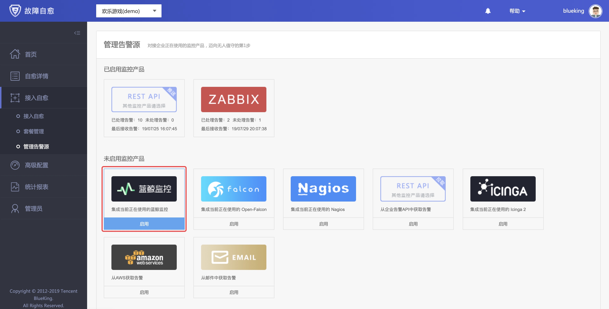
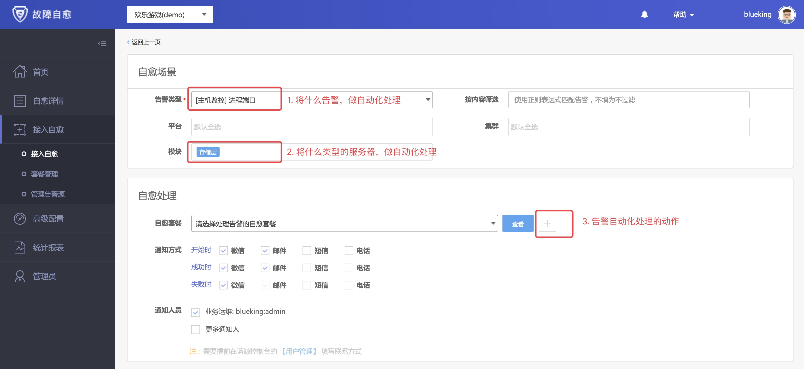
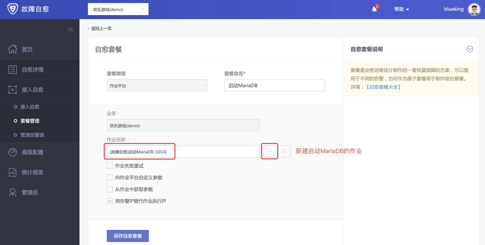
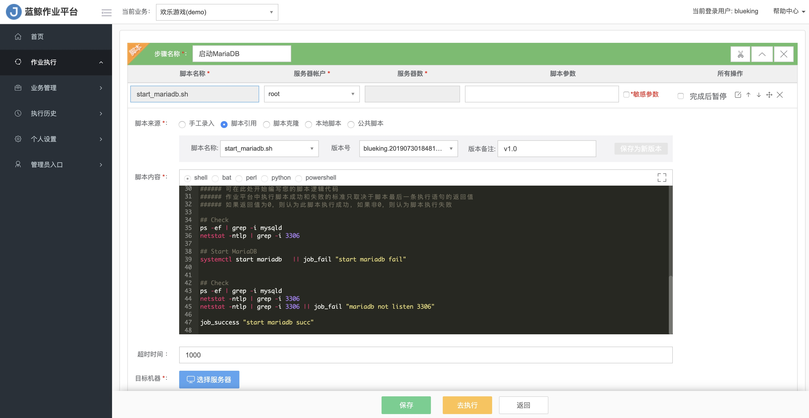
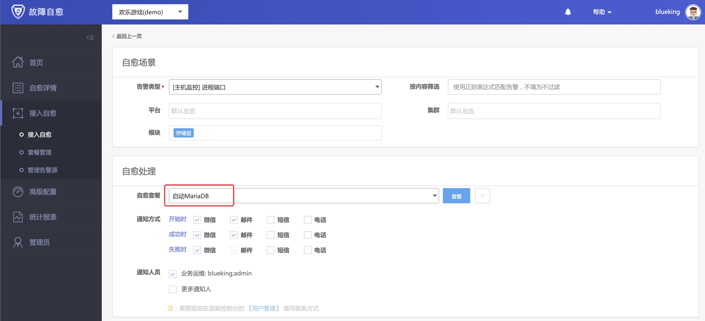
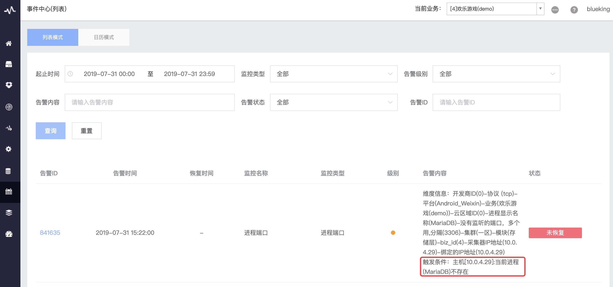
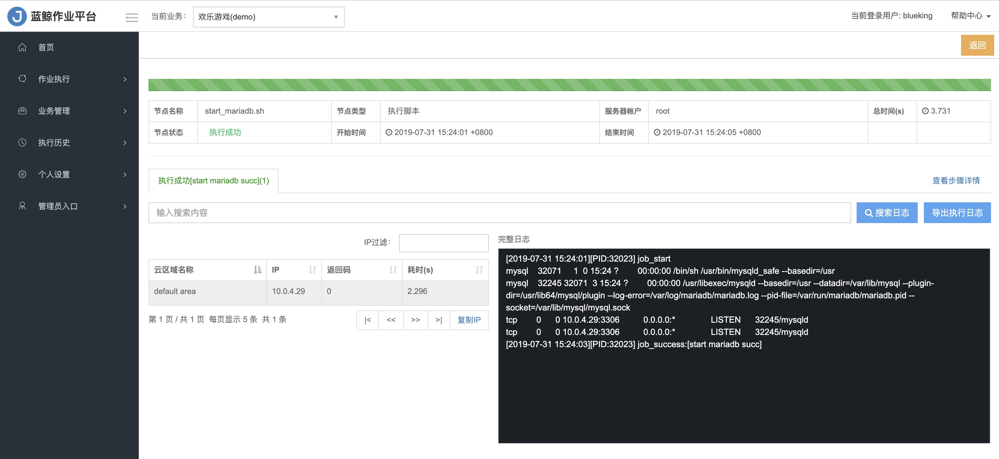
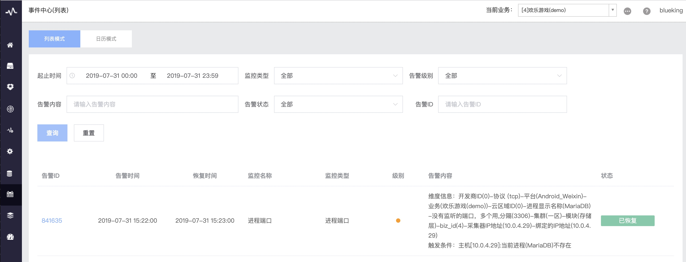

## 蓝鲸监控告警自动处理

#### 情景 
故障处理是运维的职能之一，人工登录服务器处理告警，存在 2 个问题：`故障处理效率低` 和 `操作疏忽时可能影响生产环境`，例如删除文件输入绝对路径时，在根目录和日志目录间误敲空格，导致根目录删除。

接下来通过 “**蓝鲸监控的进程告警接入故障自愈**”这个案例 ，来了解故障自愈是如何解决这 2 个痛点。

#### 前提条件 

- [蓝鲸配置平台纳管了主机](/bk_solutions/CD/CMDB/CMDB_management_hosts.html)
- [蓝鲸配置平台纳管了进程](/bk_solutions/CD/CMDB/CMDB_management_process.html)
- [作业平台新建一个作业](/bk_solutions/CD/CMDB/Massive_host_control.html#New_job)

**术语解释**
 - **自愈套餐** : 告警的处理动作，如拉起进程的作业；
 - **自愈方案** : 关联 告警 和 处理动作的一个组合；


#### 操作步骤 

- [1. 启用蓝鲸监控告警源](#Enable_restapi)
- [2. 接入自愈方案](#New_fta_solutions)
- [3. 自愈测试](#Test_fta)


## 1. 启用蓝鲸监控告警源 

在菜单 `[接入自愈]` -> `[管理告警源]`中，启用`蓝鲸监控`。




## 2. 接入自愈方案 

在菜单 [接入自愈] 中，点击 `接入自愈` , 告警类型选择 `[主机监控]进程端口`，模块选择`存储层`，因为不同类型服务器拉起进程的作业不一样。

点击新建`自愈套餐`的按钮，准备新建拉起进程的作业。



在套餐中，套餐类型选择 `作业平台`，新建 `启动MariaDB的作业` 。



点击`新建作业的按钮`后，跳转至作业平台，在菜单 `[作业执行]` -> `[新建作业]` 中，新建如下作业：



```plain
## Check
ps -ef | grep -i mysqld
netstat -ntlp | grep -i 3306

## Start MariaDB
systemctl start mariadb   || job_fail "start mariadb fail"


## Check 
ps -ef | grep -i mysqld
netstat -ntlp | grep -i 3306
netstat -ntlp | grep -i 3306 || job_fail "mariadb not listen 3306"

job_success "start mariadb succ"
```

保存`启动MariaDB`的套餐后，自动回到接入自愈的页面，保存自愈方案即可。



回到接入自愈列表，在列表中可以找到刚刚创建的自愈方案。


## 3. 自愈测试 

接下来将停止 MariaDB 进程，来验证是否可以自动启动进程，以恢复 DB 服务。

```plain
# ps -ef | grep -i mysqld
mysql      926     1  0 10:47 ?        00:00:00 /bin/sh /usr/bin/mysqld_safe --basedir=/usr
mysql     1159   926  0 10:47 ?        00:00:09 /usr/libexec/mysqld --basedir=/usr --datadir=/var/lib/mysql --plugin-dir=/usr/lib64/mysql/plugin --log-error=/var/log/mariadb/mariadb.log --pid-file=/var/run/mariadb/mariadb.pid --socket=/var/lib/mysql/mysql.sock
root     16763  7429  0 19:40 pts/1    00:00:00 grep --color=auto -i mysqld
# systemctl stop mariadb
```

稍等片刻，收到蓝鲸监控的进程端口告警。



在故障自愈的自愈详情中，找到了该条告警的自愈记录，耗时 21 秒。


跳转到作业平台的执行历史，可以看到 MariaDB 已经启动成功。



回到监控的事件中心，可以看到 告警已经恢复。




**告警自动处理，如此简单**。

以上为主机监控的告警自动化处理，其他类型告警请参考对应文档：[组件监控的告警自动化处理](https://docs.bk.tencent.com/product_white_paper/bk_monitor/Component_Monitor_Fault_Auto-recovery.html)、[自定义采集的告警自动化处理](https://docs.bk.tencent.com/product_white_paper/bk_monitor/Custom_Monitor_Auto-recovery.html)。

故障自动处理是把双刃剑，需要考虑因为网络波动等场景导致的假告警，这时可以用到故障自愈的`异常防御需审批`功能。具体请参照 [故障自愈的收敛防护](../Function_Introduction/Alarm_Convergence.md) 。

故障自愈，在**安全的前提下完成告警的自动化处理**。

