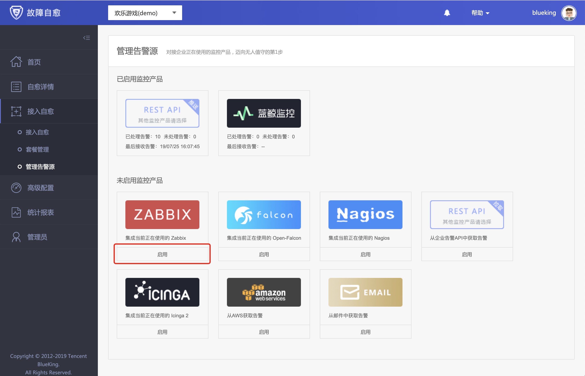
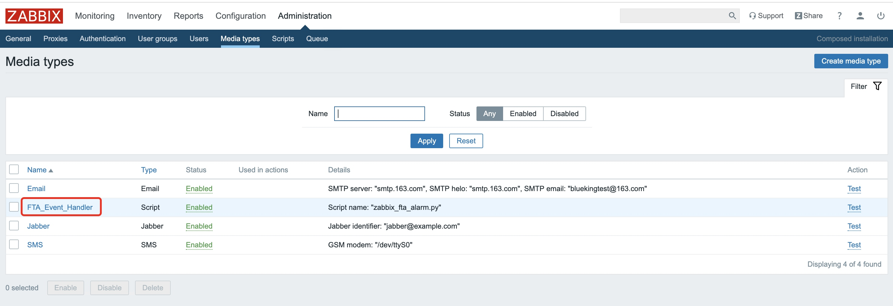
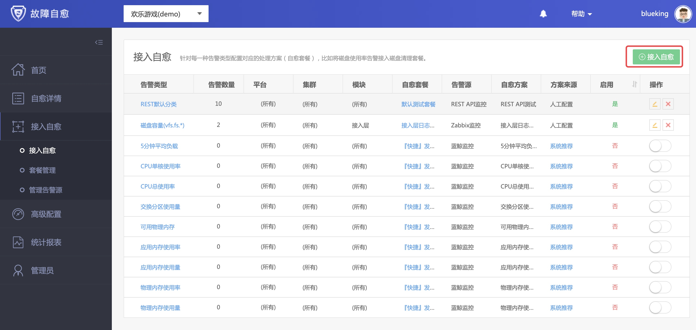
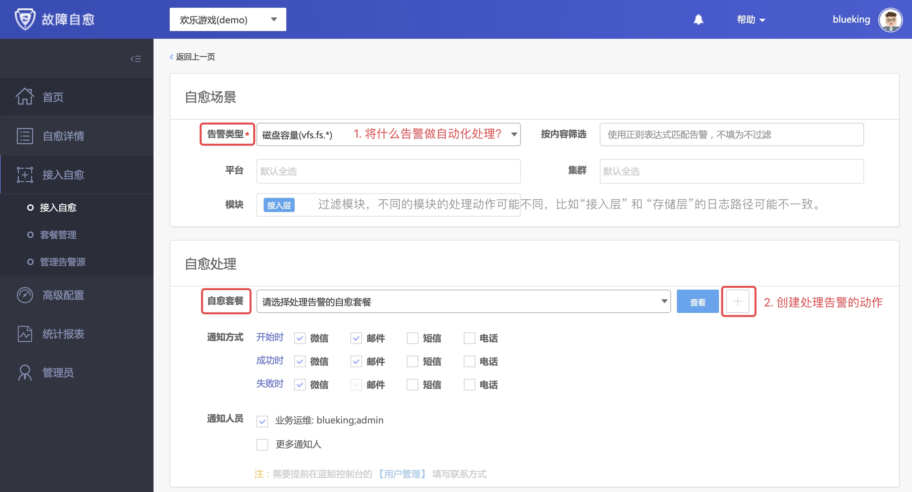
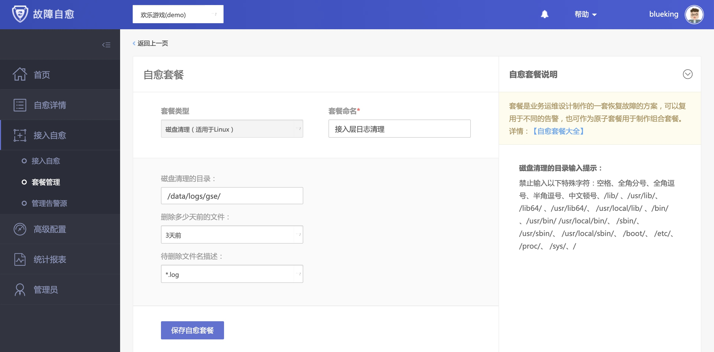
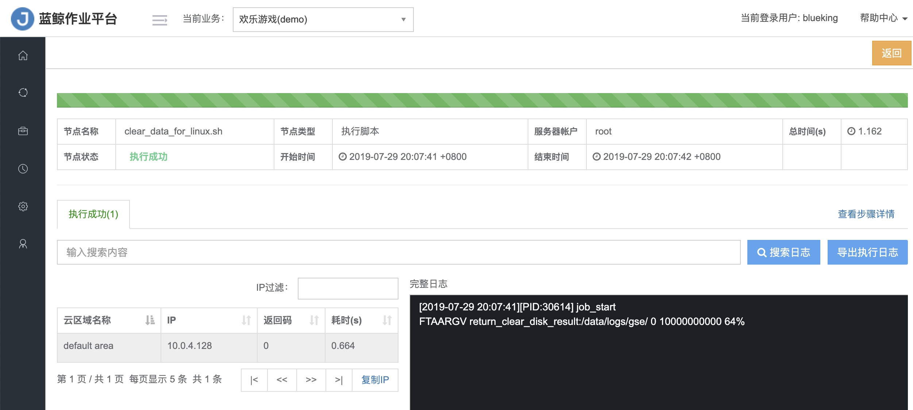
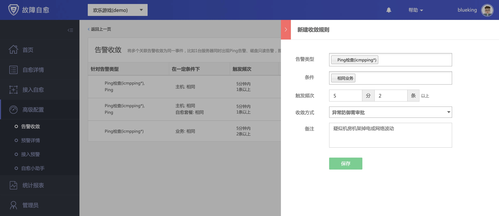
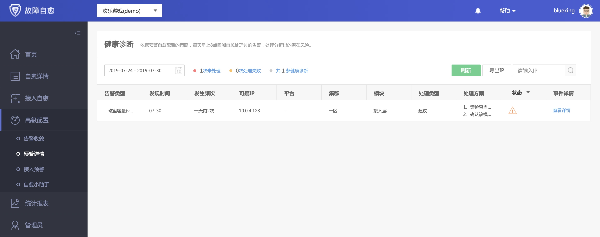
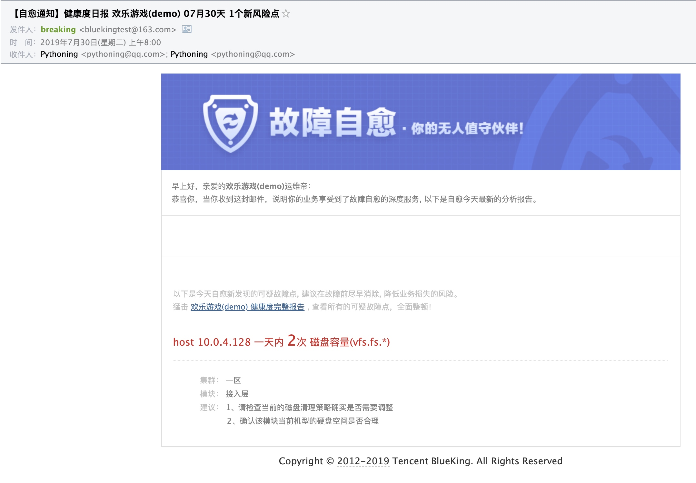

## Zabbix 告警自动处理

#### 情景 
故障处理是运维的职能之一，`Zabbix` 自带 `ActionScript`虽然可以实现告警自动处理，但存在 2 个问题：`无法集中管理自动处理的脚本`、`没有收敛防护，安全性无法保障`。

接下来我们通过将 “**Zabbix 中磁盘使用率（vfs.fs.*）告警接入故障自愈**”这个案例 ，来了解故障自愈是如何解决这 2 个痛点。

#### 前提条件 

- [蓝鲸配置平台纳管了 Zabbix 监控的对象](/bk_solutions/CD/CMDB/CMDB_management_hosts.md)
- 拥有 Zabbix 管理员账号，用于注册 Zabbix Action

**术语解释**
 - **自愈套餐** : 告警的处理动作，等同于 Zabbix 的 Action；
 - **自愈方案** : 关联 告警 和 处理动作的一个组合；


#### 操作步骤 

- [1. 接入 Zabbix 告警源](#Integration_zabbix)
- [2. 接入自愈方案](#New_fta_solutions)
- [3. 自愈测试](#Test_fta)

#### 视频教程 

media/zabbix_fta.mp4


## 1. 接入 Zabbix 告警源 

在菜单 [接入自愈] -> [管理告警源] 中，点击 **启用** Zabbix。



跳转到接入流程页面


Zabbix 接入故障自愈的逻辑是，告警产生时，执行`Action`，将告警推送至故障自愈接收告警的回调接口。

接下来，我们下载并初始化该`Action`。


### 1.1 下载初始化脚本

参照上图，进入 Zabbix Action 的目录 `/usr/lib/zabbix/alertscripts`，下载初始化脚本 `zabbix_fta_alarm.py`。


```bash
[root@37ae504b6646 alertscripts]# wget 'http://${PaaS_Host}/o/bk_fta_solutions/0/alarm_source/scripts/zabbix_fta_alarm.py?fta_application_id=66fdfe50-3075-49bf-8101-d97386030c9b&fta_application_secret=EfgBbXD25N6870j9nkgf3ns8eOEsH2Sk' -O /usr/lib/zabbix/alertscripts/zabbix_fta_alarm.py --no-check-certificate
```

> 注：请直接复制故障自愈页面的命令，其中包含故障自愈的页面 URL 以及账号信息。


### 1.2 初始化 Zabbix 告警配置

执行初始化 Zabbix 告警配置脚本 `zabbix_fta_alarm.py`，参数依次为 `--init`、`Zabbiz API URL`、`Zabbix账号`、`Zabbix密码`

```bash
[root@37ae504b6646 alertscripts]# chmod  +x zabbix_fta_alarm.py
[root@37ae504b6646 alertscripts]# ./zabbix_fta_alarm.py --init http://${Zabbix_Host}/api_jsonrpc.php  Admin zabbix
[2019-07-30 10:51:45,374] INFO fta: get auth token: 136b14f3b8fe226bc02bc5eb4dfd7ac6
[2019-07-30 10:51:45,455] INFO fta: action_get success: {u'jsonrpc': u'2.0', u'result': [{u'actionid': u'8'}], u'id': 1}
[2019-07-30 10:51:45,572] INFO fta: action_delete success: {u'jsonrpc': u'2.0', u'result': {u'actionids': [u'8']}, u'id': 1}
[2019-07-30 10:51:45,640] INFO fta: user_get success: {u'jsonrpc': u'2.0', u'result': [{u'userid': u'6'}], u'id': 1}
[2019-07-30 10:51:45,809] INFO fta: user_delete success: {u'jsonrpc': u'2.0', u'result': {u'userids': [u'6']}, u'id': 1}
[2019-07-30 10:51:45,902] INFO fta: mediatype_get success: {u'jsonrpc': u'2.0', u'result': [{u'mediatypeid': u'7'}], u'id': 1}
[2019-07-30 10:51:45,984] INFO fta: mediatype_delete success: {u'jsonrpc': u'2.0', u'result': {u'mediatypeids': [u'7']}, u'id': 1}
[2019-07-30 10:51:46,077] INFO fta: mediatype_create success: {u'jsonrpc': u'2.0', u'result': {u'mediatypeids': [u'8']}, u'id': 1}
[2019-07-30 10:51:46,174] INFO fta: user_create success: {u'jsonrpc': u'2.0', u'result': {u'userids': [u'7']}, u'id': 1}
[2019-07-30 10:51:46,274] INFO fta: action_create success: {u'jsonrpc': u'2.0', u'result': {u'actionids': [9]}, u'id': 1}
```

该脚本会创建一个名为`FTA_Event_Handler`的 Media Type，名为 `FTA_Act` 的 Action，名为 `FTA_Mgr` 的用户。




## 2. 接入自愈方案 

Zabbix 告警源 接入成功后，接下来关联告警 和 告警的处理动作。

将 Zabbix 中磁盘容量告警**关联**一个磁盘清理的**处理动作**。

选择菜单 [接入自愈] -> [接入自愈]，点击**接入自愈**



进入**接入自愈**页面，告警类型选择`磁盘容量(vfs.fs.*)`，自愈套餐点击 `+号` 新建 磁盘清理自愈套餐。



跳转至磁盘清理的自愈套餐页面。



保存自愈套餐后，自动回到接入自愈页面。添加完自愈方案后，在接入自愈列表页可以找到刚才创建的自愈方案。


## 3. 自愈测试 

生成一个大文件，使磁盘剩余空间低于 20%（ Zabbix 中默认设定的 Trigger 是<20% ）


```bash
[root@access_layer_breaking gse]# pwd
/data/logs/gse
[root@access_layer_breaking gse]# touch -d "10 days ago" agent-20190726-00001.log
[root@access_layer_breaking gse]# ll
总用量 3906980
-rw-r--r-- 1 root root 4000000000 7月  20 11:38 agent-20190726-00001.log
-rw-r--r-- 1 root root     196795 7月  26 23:59 agent-20190726-00002.log
-rw-r--r-- 1 root root     194952 7月  27 23:59 agent-20190727-00003.log
-rw-r--r-- 1 root root     198532 7月  28 23:59 agent-20190728-00004.log
-rw-r--r-- 1 root root     142948 7月  29 17:33 agent-20190729-00005.log
[root@access_layer_breaking gse]# dd if=/dev/zero of=4gb.log bs=1GB count=4
记录了4+0 的读入
记录了4+0 的写出
4000000000字节(4.0 GB)已复制，34.0365 秒，118 MB/秒
```

稍等片刻，收到 Zabbix 邮件告警，以及故障自愈的处理通知。


在故障自愈的 [自愈详情]菜单中也可以找到自愈记录。


可以查看详情执行记录。




从告警产生到处理结束，耗时 30 秒。

**告警自动处理，如此简单**，不要再手动登录到服务器上处理告警了。

## 扩展阅读 

### 1. 告警收敛确保安全的告警自动处理  

选择菜单 `[高级配置]` -> `[告警收敛]`，新增高危告警的收敛规则，比如 Ping 告警。

一般网络波动时，可能触发假的 Ping 告警，这时不能直接重启服务器，可以通过告警收敛，让运维审批。



具体执行记录，请参照[故障自愈的收敛防护](/CO/REST_API_PUSH_Alarm_processing_automation.html#Safe)

### 2. 健康度日报  

如果服务器频繁触发自愈，那么需要去思考本质问题是什么，是磁盘使用率的告警策略不合适，还是主板故障，亦或是程序运行异常。

这时可以使用 预警功能。

我们在做该教程的时候，在同一天触发了 2 条磁盘使用率的自愈记录，所以产生了一条健康诊断记录。



在邮件中也可以找到。




可在菜单 `[高级配置]` -> `[接入预警]`中设置。