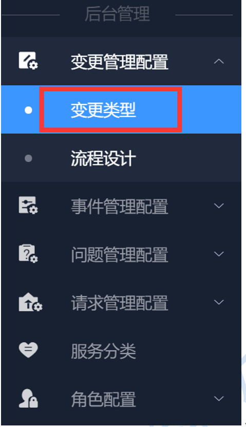

### 变更管理 {#change}

变更是对IT生产环境中的软硬件及相关文档所作的增加、修改或移除。变更管理的目的在于管理和控制好变更（如变更的分类、审批、实施、回顾等），最小化变更所带来的风险。

#### 应用逻辑 {#application}

- 服务分类管理员/系统管理员配置好“服务分类”。服务分类作为IT整体服务场景的类别管理。
- 管理员对所有流程可能涉及到的人员角色进行配置更新。
- 变更管理员/系统管理员进行变更类型的管理。
- 基于“服务分类”+“变更类型”的组合标识，确定唯一的变更流程。变更管理员/系统管理员进行相应的流程设计。

#### 变更类型（后台） {#change_type}

主要用于管理不同的变更类型。比如紧急变更，例行变更，常规变更。也可以定义配置变更，版本变更等不同场景的变更类型。视乎企业的实际工作场景自行设定。可对变更类型进行新增，编辑，删除等操作。
权限开放角色：系统管理员，角色配置中设置的相应模块管理员。

#### 流程设计（后台） {#process}

用户针对符合自身业务环境的变更服务场景进行流程自定义设计。可对流程的各环节，以及每个环节中的操作字段、字段格式等进行自定义，并支持表单预览。

在流程应用后，后续使用过程中，支持随时对流程的更新维护。

#### 提交变更申请（前台） {#application_change}

完成变更后台的配置之后，流程设计完成并开启应用后，用户则可以在前台入口进行变更申请提单操作。

