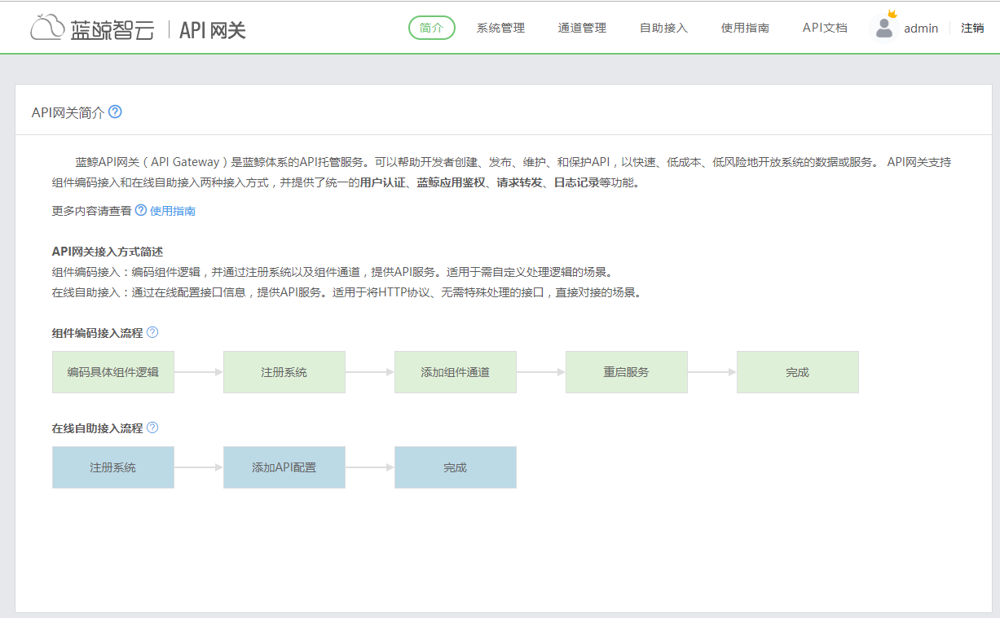

### 企业服务总线（ESB和API Gateway） {#EnterpriseServiceBus}

企业服务总线有两个作用：其一，为整个蓝鲸体系服务，蓝鲸的其他平台，如：配置平台、作业平台、数据平台、容器管理平台、AI 平台，均可以将各平台的特性以 API 的形式对接到组件中，便于 PaaS 平台上的 SaaS 调用，整合各个平台的强大功能，发挥最实用的价值。其二，第三方系统，如微信公众号/企业号、邮件系统、OA 系统、AD 系统、财务系统等非蓝鲸体系内的运营系统，同样以 API 的形式将特性对接到组件，丰富和完善整个 PaaS 平台企业服务总线的服务。从而使 PaaS 平台之上的 SaaS 可以调度一些，连接一切。

“API 网关”仅限于“管理员”角色操作，从“开发者中心”—>“API 网关”进入使用。

“API 网关”给出了详细的使用文档，分为以下几个部分：

(1)简介：概述 API 网关，并指出 API 网关接入的两种方式：编码方式（采用 Python 语法）和自助接入方式（又称 API Gateway）

(2)系统管理：API 来自于哪个系统，可以看成是API的分类

(3)通道管理：API 访问的路径管理

(4)自助接入：目前仅支持 http 请求形式的自助接入

(5)使用指南：详细的 API 接入、使用教程，以及如何为新加入的组件生产/更新“组件文档”

(6)API 文档：查询蓝鲸官方，自己接入组件的使用样例

>注：[蓝鲸组件在线API文档](http://bk.tencent.com/document/bkapi)。
