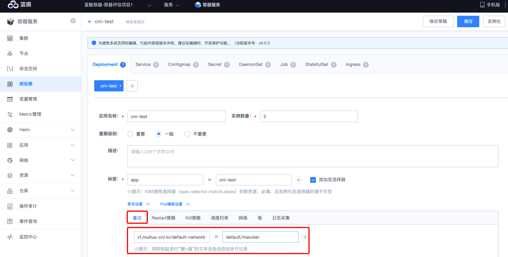

## Kubernetes 网络设置

如果针对容器网络，没有额外设计需求，BCS 建议采用 Kubernetes 社区建议的网络方案。

Kubernetes 与 BCS 集成可以参考 [这里](https://github.com/Tencent/bk-bcs/blob/master/docs/install/Deploy_BCS_in_K8S_HA_Cluster.md)

## 1. CNI 扩展

Kubernetes node 节点默认安装 CNI 工具的目录

* 二进制目录：/opt/cni/bin/
* 配置目录: /etc/cni/net.d/

如果已经针对网络进行 CNI 扩展，则需要进行扩展 CNI 工具进行部署。

**手动部署**

* CNI 部署，将编译好的 CNI 工具部署到所有 Node 节点 /opt/cni/bin
* 配置部署，编写对应的 CNI 配置，放置到 /etc/cni/net.d/ ，注意配置文件字母序要为第一。

**镜像部署**

社区采用方案，将扩展好的 CNI 工具与 CNI 社区提供的所有工具整合成 CNI 工具镜像，默认在每个节点启动 Daemonset，实现 CNI 工具部署。

细节可以参考 [Flannel-CNI 项目](https://github.com/coreos/flannel-cni)

kubelet 在 /etc/cni/net.d 目录下读取 CNI 的配置文件时，是按文件名的字母顺序来的。在这个目录下可以放多个配置文件，kubelet 会读取字母顺序排第一的配置文件。

## 2. 多网络集成

针对部分复杂的场景，容器可能需要多网络设置与集成，由于 Kubernetes 默认不支持 CNI 链式
调用，BCS 建议在以下场景，可以采用链式 CNI 插件实现多 CNI 插件集成。

* 多网络栈配置
* 网络带宽限制
* 额外路由配置
* IP 端口映射
* 网络内核参数调整

社区当前有多重链式 CNI 插件可以选择：

* [multus-CNI](https://github.com/intel/multus-cni)
* [CNI-genie](https://github.com/cni-genie/CNI-Genie)

插件安装方式请参照上述链接。

## 3. SaaS 插件使用

完成 multus-CNI 安装之后，multus-CNI 在 bcs-saas 相关页面设置：

> 模板集--Deployment 设置--更多设置--备注，完成 annotation 的 KV 填写

> 如下图：

