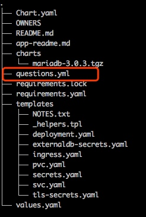
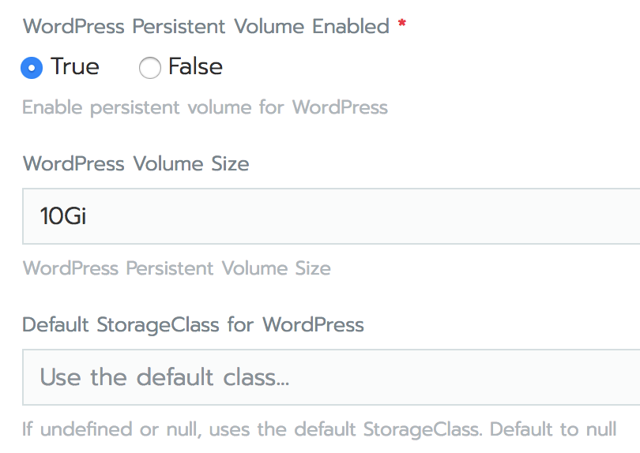

## 如何编写 Helm `questions.yaml`

## 1. Helm questions.yaml 是什么
Helm 是一个软件包管理器，提供了一种简单的方法来查找、共享和使用为 Kubernetes 而构建的软件。它提供 key-value 或者 `values.yaml` 用于设置 Helm 应用的实例化参数。

`questions.yaml` 是为了提高蓝鲸容器服务中 Helm 功能的易用性，参考开源产品 `Rancher` 提供的一种动态表单生成技术。

用户可在 Chart 中提供 `questions.yaml` 文件，在蓝鲸容器服务产品中实例化 helm 应用的时候，蓝鲸容器服务会根据 `questions.yaml` 生成表单供用户输入实例化参数。

如下图所示，即为一个包含了 `questions.yaml` 的 Chart：



## 2. 可以干什么
为了说明 `questions.yaml` 可以提供什么样的动态表单，下面先展示一个 `questions.yaml` 内容段用于说明。

```yaml
- variable: persistence.enabled
  default: "false"
  description: "Enable persistent volume for WordPress"
  type: boolean
  required: true
  label: WordPress Persistent Volume Enabled
  show_subquestion_if: true
  group: "WordPress Settings"
  subquestions:
  - variable: persistence.size
    default: "10Gi"
    description: "WordPress Persistent Volume Size"
    type: string
    label: WordPress Volume Size
  - variable: persistence.storageClass
    default: ""
    description: "If undefined or null, uses the default StorageClass. Default to null"
    type: storageclass
    label: Default StorageClass for WordPress
```

上面这段配置在用户创建或者更新 helm 应用的时候一个如下表单，




该表单包含一个 radio 用于设置是否使用可持久化存储。如果用户选中使用可持久化存储，`storage class` 和 `volume size` 就可以用来供用户填写对应的存储类和卷大小。

## 3. 使用场景
- 业务相对稳定之后，把常规发布经常修改的参数项设置成 Form 表单
- 产品自助，如果希望让产品自行发布，表单是个不错的选择
- 防止错误输入，为了尽量减少拼写错误，您可以为输入项设置校验规则


## 4. 如何编写

| Variable  | Type | Required | Description |
| ------------- | ------------- | --- |------------- |
| 	variable          | string  | true    |  申明该表单值对应于 `values.yaml` 中的字断, 及联字段使用 `.` 进行隔开，比如 `persistence.enabled`. |
| 	label             | string  | true      |  表单项的标签 `label`. |
| 	description       | string  | false      |  关于变量的特别说明.|
| 	type              | string  | false      | 表单值的字断类型，默认是 `string` 类型 (当前支持的字断的类型为： string, boolean, int, enum, password, storageclass and hostname).|
| 	required          | bool    | false      |  申明该字断是否是必填项 (真/假)|
| 	default           | string  | false      |  设置默认值. |
| 	group             | string  | false      |  输入项所属的组. |
| 	min_length        | int     | false      | 最小字符串长度.|
| 	max_length        | int     | false      | 最大字符串长度.|
| 	min               | int     | false      |  最小整数长度. |
| 	max               | int     | false      |  最大整数长度. |
| 	options           | []string | false     |  如果变量类型是 `enum` 类型, 该字断用于设置可选项，比如选项:<br> - "ClusterIP" <br> - "NodePort" <br> - "LoadBalancer"|
| 	valid_chars       | string   | false     | 有效输入字符串校验. |
| 	invalid_chars     | string   | false     |  无效输入字符串的校验.|
| 	subquestions      | []subquestion | false|  数组类型，用户包含子问题.|
| 	show_if           | string      | false  | 控制是否显示当前输入项, 比如 `show_if: "serviceType=Nodeport"` |
| 	show\_subquestion_if |  string  | false     | 如果当前值为 `true` 或者可选项的值，则该子问题会被显示出来. 比如 `show_subquestion_if: "true"`|

**subquestions**: `subquestions[]` 除了不能包含 `subquestions` 或者 `show_subquestions_if` 字段, 上表中的其它字断均支持. 
