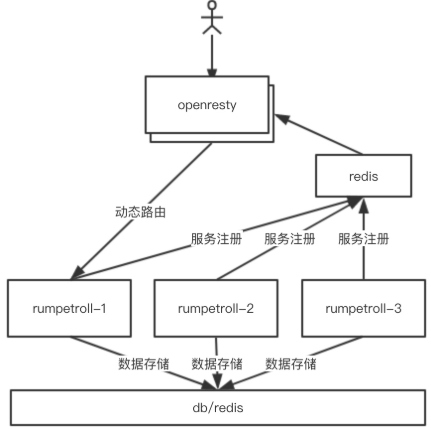

## 吃豆小游戏案例

## 1. 小游戏介绍



分为 3 个模块， openresty、rumpetroll 和 redis。其中 openresty 作为游戏的接入模块，rumpetroll 是游戏房间(游戏后台)，redis 是数据存储与服务发现模块。

## 2. 模块示例
### 基于 Deployment 部署 openresty
```yml
apiVersion: extensions/v1beta1
kind: Deployment
metadata:
  name: openresty-v2
  namespace: rumpetroll-v2
spec:
  replicas: 1
  selector:
    matchLabels:
      app: openresty-v2
  template:
    metadata:
      labels:
        app: openresty-v2
    spec:
      hostNetwork: true
      dnsPolicy: ClusterFirstWithHostNet
      hostAliases:
      - ip: 127.0.0.1
        hostnames:
        - "game2-got.o.qcloud.com"
      containers:
      - name: openresty
        image: rumpetroll-openresty:0.61
        imagePullPolicy: IfNotPresent
        ports:
        - containerPort: 80
          hostPort: 80
          protocol: TCP
        env:
        - name: DOMAIN
          value: game2-got.o.qcloud.com
        - name: MAX_CLIENT
          value: "2"
        - name: MAX_ROOM
          value: "100"
        - name: REDIS_HOST
          value: "redis"
        - name: NAMESPACE
          valueFrom:
            fieldRef:
              fieldPath: metadata.namespace
        - name: REDIS_PORT
          value: "6379"
        - name: REDIS_DB
          value: "0"
        - name: REDIS_PASSWORD
          value: ""
```
openresty 模块直接使用主机网络，对外提供访问服务
### 基于 Statefulset 部署 rumpetroll
```yml
apiVersion: apps/v1beta2
kind: StatefulSet
metadata:
  name: rumpetrollv2
  namespace: rumpetroll-v2
spec:
  selector:
    matchLabels:
      app: web
  serviceName: "rumpetroll2"
  replicas: 5
  template:
    metadata:
      labels:
        app: web
    spec:
      containers:
      - name: web
        image: pyrumpetroll:0.3
        ports:
        - containerPort: 20000
          name: web
        env:
        - name: DOMAIN
          value: game2-got.o.qcloud.com
        - name: MAX_CLIENT
          value: "2"
        - name: MAX_ROOM
          value: "100"
        - name: REDIS_HOST
          value: redis
        - name: REDIS_PORT
          value: "6379"
        - name: REDIS_DB
          value: "0"
        - name: REDIS_PASSWORD
          value:
        - name: NUMPROCS
          value: "1"
        - name: HOST
          valueFrom:
            fieldRef:
              fieldPath: status.podIP
```
```yml
apiVersion: v1
kind: Service
metadata:
  name: rumpetroll2
  namespace: rumpetroll-v2
  labels:
    app: rumpetroll-v2
spec:
  ports:
  - port: 80
    name: web
  clusterIP: None
  selector:
    app: web
```
由于每个房间有自己的标识，是有"状态的"，因此采用 StatefulSet 方式部署；同时配置 Headless Service,  提供给 openresty 模块访问
### 基于 Deployment 部署 redis
```yml
apiVersion: extensions/v1beta1
kind: Deployment
metadata:
  name: redis-v2
  namespace: rumpetroll-v2
spec:
  replicas: 1
  selector:
    matchLabels:
      app: redis-v2
  template:
    metadata:
      labels:
        app: redis-v2
    spec:
      containers:
      - name: redis-v2
        image: redis:1.0
        imagePullPolicy: IfNotPresent
```
```yml
apiVersion: v1
kind: Service
metadata:
  name: redis
  namespace: rumpetroll-v2
spec:
  selector:
    app: redis-v2
  ports:
  - name: default
    protocol: TCP
    port: 6379
    targetPort: 6379
```
redis 服务模块采用 Deployment 方式部署，并创建与其关联的 Service。Service 的 Cluster IP 会被注册到 dns 中，方便 openresty 和 rumpetroll 模块从集群内访问服务