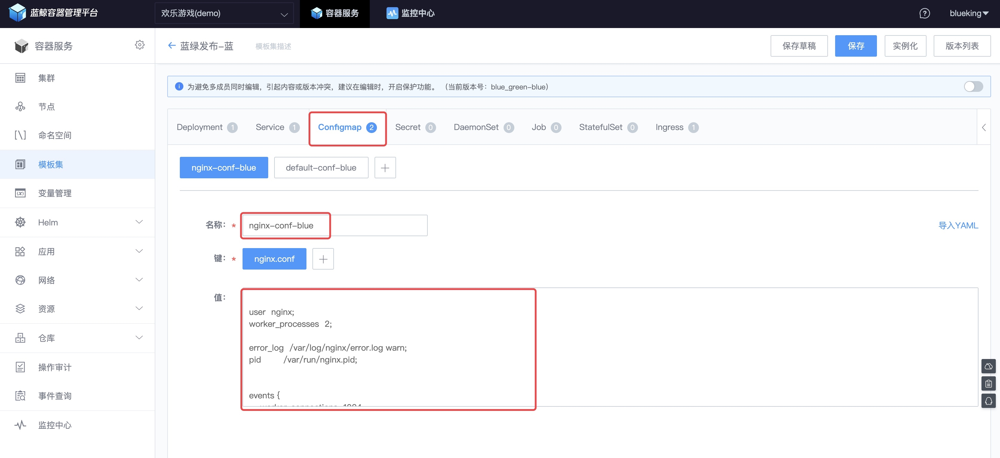

## kubernetes ConfigMap 说明


ConfigMap 是用来存储配置文件的 kubernetes(简称 k8s)资源对象，它的作用是将配置文件从容器镜像中解耦，从而增强容器应用的可移植性。在一个 Pod 里面使用 ConfigMap 主要有两种方式：
- 环境变量
- 数据卷文件

## 1. 模板示例
### 1.1 示例一：环境变量
```yml
apiVersion: v1
kind: ConfigMap
metadata:
  name: external-config
data:
    AUX_CONNECTION_STRING: jdbc:mysql://demo.bcs.com:10000/db_ffm_aux
    PUBLIC_ASSETS_URL: https://demo.bcs.com/wxlive
```
全导入用法
```yml
        envFrom:
        - configMapRef:
            name: external-config
```
或者部分引用
```yml
        env
        - name: PUBLIC_ASSETS_URL
          valueFrom:
           configMapKeyRef:
               name: external-config
               key: PUBLIC_ASSETS_URL
```
### 1.2 示例二：数据卷文件
```yml
apiVersion: v1
kind: ConfigMap
metadata:
  name: apps-servergame-tlog-config
data:
    logstash.conf: |-
    input {
      file {
        path => "/opt/servergame/log/tlog.log"
        type => "tlog"
        start_position => "beginning"
      }
    }

    filter {
    }

    output {
    }
```
引用方法
```yml
      volumes:
      - name: config
        configMap:
          name: apps-servergame-tlog-config
```
## 2. 配置项介绍
ConfigMap 的配置数据存储在`data`字段中，具体参考示例模板


## 3. BCS 模板集操作

关于 ConfigMap 的实战演练，请参照 [应用的蓝绿发布](../../../Scenes/Bcs_blue_green_deployment.md)。



