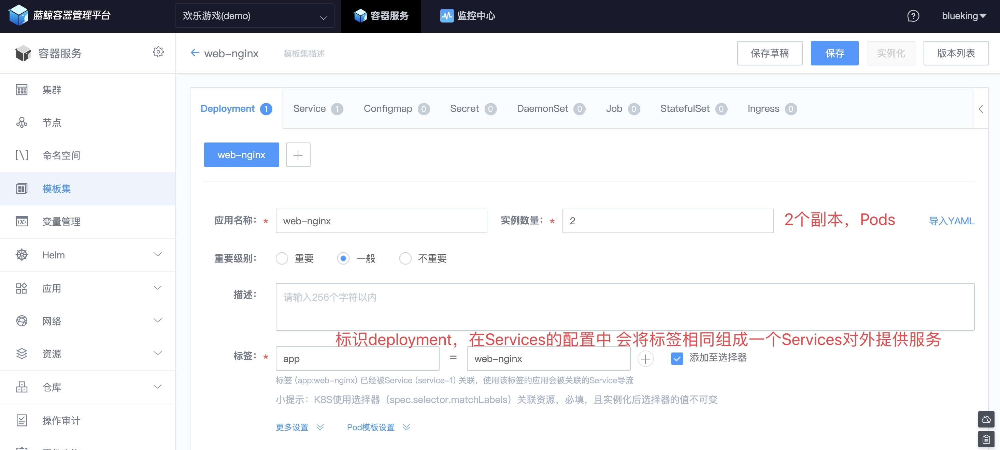
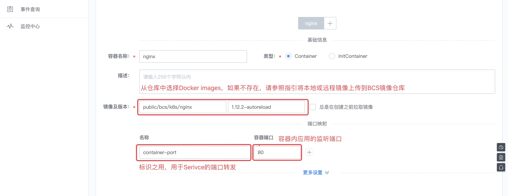

## Kubernetes Deployment 说明

Deployment 是 kubernetes(简称 k8s)中用于管理 Pod 的对象，从 1.2 版本开始引入，与 Replication Controller 相比，它提供了更加完善的功能，集成了上线部署、滚动升级、创建副本、暂停/恢复上线任务，回滚等功能，使用起来也更加方便

## 1. 模板示例
```yml
apiVersion: apps/v1beta2
kind: Deployment
metadata:
  name: servergame
spec:
  selector:
    matchLabels:
      app: servergame
  replicas: 4
  strategy:
    type: RollingUpdate
    rollingUpdate:
      maxUnavailable: 0
      maxSurge: 2
  template:
    metadata:
      labels:
        app: servergame
    spec:
      nodeSelector:
        network: private
      imagePullSecrets:
        - name: paas.image.registry.default
      containers:
      - name: servergame
        image: servergame:2.0.0
        args: [ "-c /opt/live.env.conf" ]
        env:
        - name: FUEL_ROLE
          value: servergame
        - name: INSTANCE_IP
          valueFrom:
            fieldRef:
               fieldPath: status.podIP
        envFrom:
        - configMapRef:
            name: external-config
        - secretRef:
            name: external-secret-config
        livenessProbe:
          httpGet:
            path: /g/status
            port: http
          initialDelaySeconds: 900
          timeoutSeconds: 5
        readinessProbe:
          httpGet:
            path: /g/status
            port: http
          initialDelaySeconds: 15
          timeoutSeconds: 5
        resources:
          requests:
            cpu: 100m
            memory: 3Gi
        ports:
        - name: http
          containerPort: 8080
        volumeMounts:
        - name: config
          mountPath: /opt/servergame/config
        - name: applogs
          mountPath: /opt/servergame/log
        - name: shm
          mountPath: /dev/shm
      - name: g3
        image: g3:0.5
        volumeMounts:
        - name: shm
          mountPath: /dev/shm
      volumes:
      - name: config
        configMap:
          name: apps-servergame-config
      - name: applogs
        emptyDir: {}
      - name: shm
        emptyDir:
          medium: Memory
          sizeLimit: 1Gi

```

## 2. 配置项介绍
### 2.1 Selector
`.spec.selector`是可选字段，用来指定 label selector，指定当前 Deployment 所能管理的 pod 范围。如果被指定，`.spec.selector`必须匹配`.spec.template.metadata.labels`，否则它将被 API 拒绝。如果`.spec.selector`没有被指定，`.spec.selector.matchLabels`默认是 `.spec.template.metadata.labels`

### 2.2 Replicas
`.spec.replicas`是可以选字段，指定期望的 pod 数量，默认是 1

### 2.3 Strategy
`.spec.strategy`指定新 Pod 替换旧 Pod 的策略。`.spec.strategy.type`可以是"Recreate"或者是 "RollingUpdate"。"RollingUpdate"是默认值。
- "Recreate"相对比较“暴力”，Deployment 在创建出新的 Pod 之前会先杀掉所有已存在的 Pod
- "RollingUpdate"则是使用 rolling update 的方式更新 Pod。用户可以指定 maxUnavailable 和 maxSurge 来控制 rolling update 的进程。
    - `.spec.strategy.rollingUpdate.maxUnavailable` 是可选配置项，用来指定在升级过程中不可用 Pod 的最大数量。该值可以是一个绝对值，也可以是期望 Pod 数量的百分比(例如 10%)，通过计算百分比的绝对值向下取整。如果`.spec.strategy.rollingUpdate.maxSurge`为 0 时，这个值不可以为 0。默认值是 1
    - `.spec.strategy.rollingUpdate.maxSurge`是可选配置项，用来指定可以超过期望的 Pod 数量的最大个数。该值可以是一个绝对值或者是期望的 Pod 数量的百分比。当 MaxUnavailable 为 0 时，该值不可以为 0。通过百分比计算的绝对值向上取整。默认值是 1
    - 示例中`maxUnavailable: 0，maxSurge: 2`,  表示滚动升级的过程中，处于 Available(Ready)的 pod 数不低于`.spec.replicas-0` ，同时所有的 Pod 数之和不会超过`.spec.replicas+2`

### 2.4 Pod Template
Pod 是 k8s 创建或部署的最小/最简单的基本单位，可由单个或多个容器共享组成的资源。pod template 作为定义方式，可被嵌套到 Deployment、StatefulSet、DaemonSet 等对象中，即下面介绍的`.spec.template`。
`.spec.template`是 `.spec`中唯一必须的字段，和 Pod 具备同样的 schema，除了 apiVersion 和 kind 字段。为了划分 Pod 的范围，Deployment 中的 pod template 必须指定适当的 label(如 app: servergame)和适当的重启策略。`.spec.template.spec.restartPolicy`在不指定的情况下，默认为 Always。

#### 2.4.1 nodeSelector
`.spec.template.spec.nodeSelector`是较常用的调度 pod 到具体 node 节点上的方法，它通过 k8s 的 label-selector 机制进行节点选择。如示例中，pod 会被调度到已经打上`network=private`这一 label 的 node 节点上。

#### 2.4.2 containers
一个 pod 可以管理一个或多个容器，`.spec.template.spec.containers[]`即是描述这些容器的数组(例如，示例模板中的 pod 包含 servergame 和 g3 这两个容器)。每个数组对应一个容器的配置，包括容器 name, 所使用的 image，环境变量，resources 的限制等。

- 环境变量
环境变量的设置方法有多种
    - env 指定
        - 直接设置 key, value
        - 通过 valueFrom 获取 pod 信息(如`status.podIP`), 设置 value
    - envFrom 直接从 configmap 或 secret 中获取环境变量

- 健康度探测(livenessProbe 和 readinessProbe)
容器的健康度探测维度分为两类: 存活探针(livenessProbe)和就绪探针(readinessProbe)。kubelet 使用 livenessProbe 来确定何时重启容器，使用 readinessProbe 来确定容器是否已经就绪可以接受流量。探测手段可以通过 http, tcp 或者定义 command。无论使用哪种方式，都会用到下面这几个参数
    - `initialDelaySeconds` 容器启动后第一次执行探测是需要等待多少秒
    - `timeoutSeconds` 一次性探测的超时时间
    - `periodSeconds` 探测的时间周期
    - `successThreshold` 探测失败后，最少连续探测成功多少次才被认定为成功。默认是 1。对于 liveness 必须是 1。最小值是 1
    - `failureThreshold` 探测成功后，最少连续探测失败多少次才被认定为失败。默认是 3。最小值是 1

- 容器挂载卷的引用
`.spec.template.spec.containers[i].volumeMounts[]`中描述了当前容器需要使用到的一些 volume，通过 name 与 volumes 绑定，mountPath 表示挂载到容器中的位置

#### 2.4.3 volumes
k8s 支持多种类型的卷，其核心是目录，可以通过 pod 中的容器来访问。目录是如何形成的、支持该目录的介质以及其内容取决于所使用的特定卷类型。卷的类型：
- configMap
- emptyDir
- hostPath
- persistentVolumeClaim
- cephfs
- ...
类型很多，这里对常用的`configMap`和`emptyDir`做重点说明。
`configMap`类型提供了一种将配置文件注入到 Pods 中的方法，如示例片段，
```yml
      volumes:
      - name: config
        configMap:
          name: apps-servergame-config
```
通过在`.spec.template.spec.containers[i].volumeMounts[]`中引用`name: config`，可以将`apps-servergame-config`中定义的文件内容挂载到容器指定的`mountPath`下
`emptyDir`类型主要用于某些应用程序无需永久保存的临时目录，多个容器的共享目录等。这个目录的初始内容为空，当 Pod 从 Node 上移除时，emptyDir 中的数据会被永久删除。根据介质的不同，分为硬盘(emptyDir: {})和内存存储。内存存储用于多个容器需要共享内存的情况，如示例片段，
```yml
        - name: shm
          emptyDir:
            medium: Memory
            sizeLimit: 1Gi
```
指定了介质类型为 Memory 和 1G 大小的内存空间。

## 3. Deployment  之 “吃豆小游戏”实践
下面是 bcs 小游戏中，Deployment 用法的示例: openresty-v2 是接入层模块，redis-v2 是 redis 服务模块。
```yml
apiVersion: extensions/v1beta1
kind: Deployment
metadata:
  name: openresty-v2
  namespace: rumpetroll-v2
spec:
  replicas: 1
  selector:
    matchLabels:
      app: openresty-v2
  template:
    metadata:
      labels:
        app: openresty-v2
    spec:
      hostNetwork: true
      dnsPolicy: ClusterFirstWithHostNet
      hostAliases:
      - ip: 127.0.0.1
        hostnames:
        - "game2-got.o.qcloud.com"
      containers:
      - name: openresty
        image: rumpetroll-openresty:0.61
        imagePullPolicy: IfNotPresent
        ports:
        - containerPort: 80
          hostPort: 80
          protocol: TCP
        env:
        - name: DOMAIN
          value: game2-got.o.qcloud.com
        - name: MAX_CLIENT
          value: "2"
        - name: MAX_ROOM
          value: "100"
        - name: REDIS_HOST
          value: "redis"
        - name: NAMESPACE
          valueFrom:
            fieldRef:
              fieldPath: metadata.namespace
        - name: REDIS_PORT
          value: "6379"
        - name: REDIS_DB
          value: "0"
        - name: REDIS_PASSWORD
          value: ""
```
```yml
apiVersion: extensions/v1beta1
kind: Deployment
metadata:
  name: redis-v2
  namespace: rumpetroll-v2
spec:
  replicas: 1
  selector:
    matchLabels:
      app: redis-v2
  template:
    metadata:
      labels:
        app: redis-v2
    spec:
      containers:
      - name: redis-v2
        image: redis:1.0
        imagePullPolicy: IfNotPresent
```
大部分的配置项都在上一节中做了介绍，这里仅对 openresty-v2 中用到的一些其他配置做简单说明。

`DNS policies`:  一般情况下，pod 访问集群内 dns 是不需要额外配置的，`dnsPolicy`的默认值为`ClusterFirst`，但由于 pod 绑定了主机网络`hostNetwork: true`,因此如果需要访问集群内网络，必须设置成`ClusterFirstWithHostNet`。

`hostAliases`:  通过`hostAliases`向 hosts 文件添加额外的条目, 即本例中的
```127.0.0.1   game2-got.o.qcloud.com```

## 4. BCS 模板集操作

关于 Deployment 的实战演练，请参照 [快速构建 Nginx 集群](../../../Scenes/Bcs_deploy_nginx_cluster.md)。





