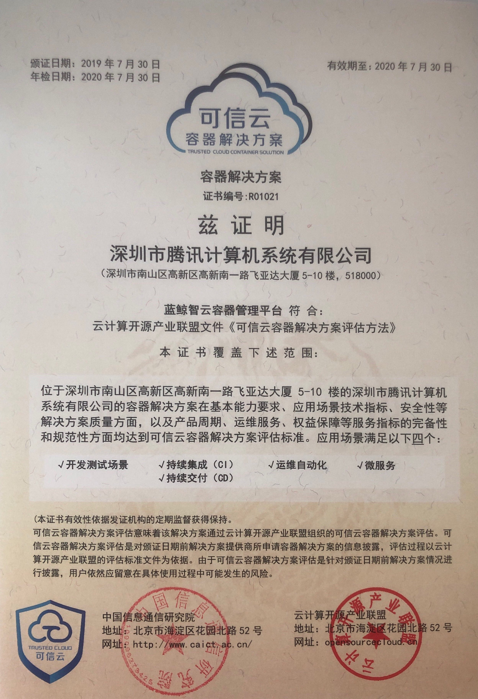

## 产品优势

## 1. 双引擎驱动的容器编排方案
BCS 支持两种集群模式可选： **Kubernetes**、**Mesos** 。

Kubernetes 和 Mesos 都是基于 Google borg 系统开源的项目，二者在产品定位上有所不同，Kubernetes 集成了 **资源调度** 和 **应用编排** 的能力，面向分布式应用、微服务和大规模集群管理；Mesos 则更侧重于 **分布式资源调度**，对应用编排的能力更多依赖于第三方 Framework 系统或结合业务场景进行深度定制。

BCS 对这两种技术体系的集群模式都支持，用户可以根据需要进行选择。

### 1.1 基于 Kubernetes
* 基于原生 Kubernetes 实现，秉承社区开源、开放的心态
* 支持社区容器、网络、存储实施方案

### 1.2 基于 Mesos
* 基于 Mesos 的分布式资源调度
* 结合游戏特点定制化开发的 Framework：BCS-Scheduler

## 2. 基于 Docker 的服务生态

- 服务发现

不管是基于 Kubernetes 还是 Mesos 的集群，都自带了服务发现的能力。服务发现有两种模式，一是通过服务的域名访问服务，在域名上动态绑定当前服务的后端；另一种是通过服务代理容器，流量全部导向服务代理容器，由代理容器将流量转发到服务的后端。

- 负载均衡

负载均衡器是一组特殊的容器，用来帮一个服务或者多个服务实现后端流量或者处理能力的均衡。用户可以设定负载均衡的算法以达到不同的负载均衡效果。

- 分布式配置中心

业务程序在运行过程中往往需要使用不同的配置启动，在活动期间，也可能需要通过配置调整策略。蓝鲸容器服务提供了分布式配置中心，用户可以将配置存放在配置中心，业务容器可以通过指定的协议方式获取到对应的配置。

- CNI 格式的 Overlay 和 Underlay 网络支持

容器的网络方案不仅支持 Overlay，也支持 Underlay 的方案。在 Underlay 方案下，每个容器拥有一个真实的内网 IP，并且在容器销毁时自动回收该 IP，用户也可以设定容器重启、迁移时使用固定的一组 IP。

## 3. 认证

**蓝鲸智云容器管理平台** 通过中国 **云计算开源产业联盟** 组织的 **可信云容器解决方案评估认证**。

蓝鲸智云容器管理平台在基本能力要求、应用场景技术指标、安全性等解决方案质量方面，以及产品周期、运维服务、权益保障等服务指标的完备性和规范性方面均达到可信云容器解决方案的评估标准。应用场景满足以下四个：

* 开发测试场景
* 持续集成、持续交付
* 运维自动化
* 微服务

