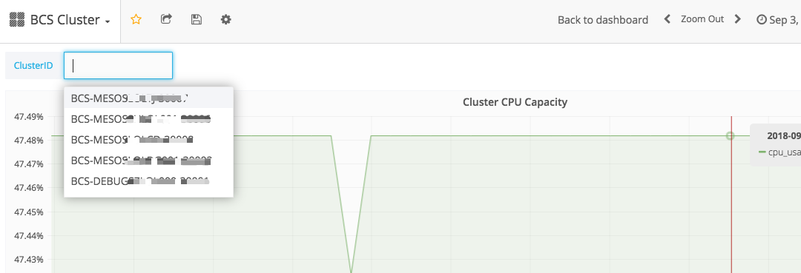
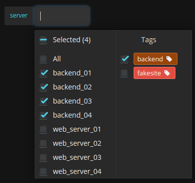

## Dashboard - 模板(Templating)

模板允许更多交互式,动态的仪表板。您可以在度量标准查询中使用变量代替硬编码 cluster_id，namespace 和 container_id 名称等内容。变量显示为仪表板顶部的下拉选择框。通过这些下拉菜单，您可以轻松更改仪表板中显示的数据。



## 1. 什么是变量

变量是值的占位符。您可以在度量标准查询和面板标题中使用变量。因此，当您更改值时，使用仪表板顶部的下拉列表，面板的度量标准查询将更改以反映新值。

### 1.1 Interpolation

面板标题和度量标准查询可以使用两种不同的语法引用变量：

- `$<varname>`  Example: apps.frontend.$server.requests.count
- `[[varname]]` Example: apps.frontend.[[server]].requests.count

为什么两种方式？第一种语法更易于读写，但不允许在单词中间使用变量。在表达式中使用第二种语法  `my.server[[serverNumber]].count`.

在将查询发送到数据源之前，将对查询进行插值，这意味着将变量替换为其当前值。在插值期间，可以对变量值进行转义，以符合查询语言的语法和使用它的位置。例如，InfluxDB 或 Prometheus 查询中的正则表达式中使用的变量将进行正则表达式转义。有关插值期间值转义的详细信息，请阅读数据源特定文档文章。

### 1.2 变量选项

变量显示为仪表板顶部的下拉选择框。它具有当前值和一组选项。该选项是一组可供选择的值。

## 2. 添加变量


您可以通过 Dashboard > Templating 添加变量。这将打开一个变量列表和一个 New 用于创建新变量的按钮。


### 2.1 基本变量选项

选项 | 描述
------- | --------
*Name* | 变量的名称，这是在度量标准查询中引用变量时使用的名称。必须是唯一的，不包含空格。
*Label* | 此变量的下拉列表的名称。
*Hide* | 隐藏下拉选择框的选项。
*Type* | 定义变量类型。


### 2.2 变量类型

类型 | 描述
------- | --------
*Query* | 此变量类型允许您编写数据源查询，该查询通常返回度量标准名称，标记值或键的列表。例如，返回服务器名称，传感器 ID 或数据中心列表的查询。
*Interval* | 此变量可表示时间跨度。不是按时间或日期直方图间隔对组进行硬编码，而是使用此类型的变量。
*Datasource* | 此类型允许您快速更改整个仪表板的数据源。如果您在不同的环境中有多个数据源实例，则非常有用。
*Custom* | 使用逗号分隔列表手动定义变量选项。
*Constant* | 定义隐藏常量。对于要共享的仪表板的度量标准路径前缀很有用。在仪表板导出期间，常量变量将变为导入选项。
*Ad hoc filters* | 非常特殊的变量，目前仅适用于某些数据源，InfluxDB 和 Elasticsearch。它允许您添加键/值过滤器，这些过滤器将自动添加到使用指定数据源的所有度量标准查询中。

### 2.3 查询选项

此变量类型是最强大和最复杂的，因为它可以使用数据源查询动态获取其选项。

选项 | 描述
------- | --------
*Data source* | 查询的数据源目标。
*Refresh* | 控制何时更新变量选项列表（下拉列表中的值）。在仪表板上加载将减慢仪表板负载，因为在初始化仪表板之前需要完成变量查询。如果变量选项查询包含时间范围过滤器或取决于仪表板时间范围，则仅将此设置为“ 开启时间范围更改”。
*Query* | 数据源特定的查询表达式。
*Regex* | 正则表达式用于过滤或捕获数据源查询返回的名称的特定部分。可选的。
*Sort* | 在下拉列表中定义选项的排序顺序。已禁用表示将使用数据源查询返回的选项顺序。

### 2.4 查询表达式

每个数据源的查询表达式都不同。

- [Elasticsearch templating queries](/monitor/Dashboard/DashboardSearch.md#EsTempalte)
- [InfluxDB templating queries](/monitor/Dashboard/DashboardSearch.md#Tempalte)


需要注意的一点是，查询表达式可以包含对其他变量的引用，实际上可以创建链接变量。Grafana 将检测到这一点并在其中一个变量包含变量时自动刷新变量。

## 3. 选择选项

选项 | 描述
------- | --------
*Multi-value* | 如果启用，该变量将支持同时选择多个选项。
*Include All option* | 添加一个特殊 All 选项，其值包括所有选项。
*Custom all value* | 默认情况下，该 All 值将包括组合表达式中的所有选项。这可能会变得很长并且可能会出现性能问题。很多时候，最好指定一个自定义的所有值，比如通配符正则表达式。为了能够在 Custom all value 选项中使用自定义正则表达式，globs 或 lucene 语法，它永远不会被转义，因此您必须考虑哪些是数据源的有效值。

### 3.1 形成多个值

使用所选择的多个值对变量进行插值是很棘手的，因为如何将多个值格式化为在使用该变量的给定上下文中有效的字符串。Grafana 试图通过允许每个数据源插件通知模板插值引擎用于多个值的格式来解决这个问题。

例如，**Graphite**使用 glob 表达式。在这种情况下，具有多个值的变量将被内插，`{host1,host2,host3}`就像当前变量值是 host1，host2 和 host3 一样。

**InfluxDB** 和 **Prometheus** 使用正则表达式，因此相同的变量将被插值为`(host1|host2|host3)`。如果没有，每个值也将是正则表达式转义，具有正则表达式控制字符的值将破坏正则表达式。

**Elasticsearch** 使用 lucene 查询语法，因此在这种情况下，相同的变量将被格式化为`("host1" OR "host2" OR "host3")`。在这种情况下，每个值都需要进行转义，以便该值可以包含 lucene 控制字和引号。


### 3.2 值组/标签

如果您在多值变量的下拉列表中有很多选项。您可以使用此功能将值分组为可选标记。

选项 | 描述
------- | --------
*Tags query* | 应返回标记列表的数据源查询
*Tag values query* | 应返回指定标记键值的列表的数据源查询。`$tag`在查询中使用以引用当前选定的标记。



### 3.3 区间变量

使用 Interval 类型创建表示时间跨度的变量（例如`1m`，`1h`，`1d`）。还有一个特殊 auto 选项会根据当前时间范围而改变。您可以指定当前时间范围应分多少次以计算当前 auto 时间跨度。

此变量类型可用作按时间分组的参数（对于 InfluxDB），日期直方图间隔（对于 Elasticsearch）或作为汇总函数参数（对于 Graphite）。

在 graphite 函数中使用`myinterval`类型的模板变量的示例`Interval`：

```plain
summarize($myinterval, sum, false)
```

## 4. 全局内置变量

Grafana 具有全局内置变量，可以在查询编辑器中的表达式中使用。

### 4.1 $__interval 变量

这个$__interval 变量类似于上面描述的`auto`interval 变量。它可以用作按时间分组的参数（对于 InfluxDB），日期直方图间隔（对于 Elasticsearch）或作为汇总函数参数（对于 Graphite）

Grafana 自动计算可用于在查询中按时间分组的间隔。当数据点多于图表上显示的数据点时，可以通过更大的间隔分组来提高查询效率。在查看 3 个月的数据时，分组比 1 天比 10 分更有效，图表看起来相同，查询会更快。的$__interval 使用时间范围和图形（像素数）的宽度来计算。

近似计算： `(from - to) / resolution`

例如，当时间范围为 1 小时且图形为全屏时，则可以计算间隔`2m` - 以 2 分钟为间隔对点进行分组。如果时间范围是 6 个月并且图表是全屏，则间隔可能是`1d`（1 天） - 点按天分组。

在 InfluxDB 数据源中，遗留变量`$interval`是同一个变量。`$__interval`应该用来代替。

InfluxDB 和 Elasticsearch 数据源具有 Group by time interval 用于对间隔进行硬编码或设置`$__interval`变量的最小限制的字段（通过使用>语法 - > >10m）。

### 4.2 $__interval_ms 变量

此变量是以`$__interval`毫秒为单位的变量（而不是格式化字符串的时间间隔）。例如，如果`$__interval`是，20m 那么`$__interval_ms`是 1200000。

### 4.3 $timeFilter or $__timeFilter 变量

的$timeFilter 变量返回当前选定的时间范围作为表达。例如，时间范围间隔`Last 7 days`表达式为`time > now() - 7d`。

这在 InfluxDB 数据源的 WHERE 子句中使用。在查询编辑器模式下，Grafana 会自动将其添加到 InfluxDB 查询中。必须在文本编辑器模式下手动添加：`WHERE $timeFilter`。

### 4.4 $__name 变量

此变量仅在 Singlestat 面板中可用，可以在“选项”选项卡上的前缀或后缀字段中使用。变量将替换为系列名称或别名。

## 5. 重复面板

模板变量对于在整个仪表板中动态更改查询非常有用。如果您希望 Grafana 根据您选择的值动态创建新面板或行，则可以使用“ 重复”功能。

如果您启用了变量`Multi-value`或`Include all value`选项，则可以选择一个面板或一行，并让 Grafana 为每个选定值重复该行。您可以在面板编辑模式的“常规”选项卡下找到此选项。选择要重复的变量，然后选择`min span`。该`min span`控制小 Grafana 将如何使面板（如果您有很多值中选择）。Grafana 将自动调整每个重复面板的宽度，以便填满整行。目前，您不能将一行中的其他面板与重复面板混合使用。

仅对第一个面板（原始模板）进行更改。要使更改在所有面板上生效，您需要触发动态仪表板重建。您可以通过更改变量值（这是重复的基础）或重新加载仪表板来完成此操作。

## 6. 重复行

此选项要求您打开行选项视图。将鼠标悬停在行左侧以触发行菜单，在此菜单中单击 Row Options。这将打开行选项视图。在这里，您可以找到重复下拉列表，您可以在其中选择要重复的变量。

## 7. URL 状态

变量值始终使用语法同步到 URL `var-<varname>=value`。

### 示例
- [Elasticsearch Templated Dashboard](http://play.grafana.org/dashboard/db/elasticsearch-templated)
- [InfluxDB Templated Dashboard](http://play.grafana.org/dashboard/db/influxdb-templated-queries)