# 快速构建 Nginx 集群

## 情景
传统的 Nginx 集群要先部署多个 Nginx 节点，然后通过 `upstream` 统一一个入口提供给用户访问。

该过程操作繁琐，接下来看 BCS（容器管理平台） 如何通过 **容器调度 (以 K8S 编排为例，BCS 同时还支持 Mesos)** 快速构建 Nginx 集群。


## 前提条件
- [K8S 基本概念](https://kubernetes.io/zh/docs/concepts/)，包含  [Deployment](https://kubernetes.io/zh/docs/concepts/workloads/controllers/deployment/)、[Services](https://kubernetes.io/docs/concepts/services-networking/service/)。
- [完成 BCS 部署](https://docs.bk.tencent.com/bkce_install_guide/setup/quick_install_bcs.html)
- 准备 2 台云主机：4 核 8 G，不低于 CentOS 7，K8s Master 和 Node 各 1 台
- 完成上述 2 台云主机的 [Agent 安装](Hybrid_cloud_management.md) ，并分配至  [CMDB 业务下](https://docs.bk.tencent.com/cmdb/Introduction.html#BusinessResource)

## 操作步骤

- 1. 新建集群
- 2. BCS 快速构建 Nginx 集群

### 1. 新建集群
#### 1.1 启用容器服务

在 BCS 首页，点击`新建项目`，如`欢乐游戏(demo)`。

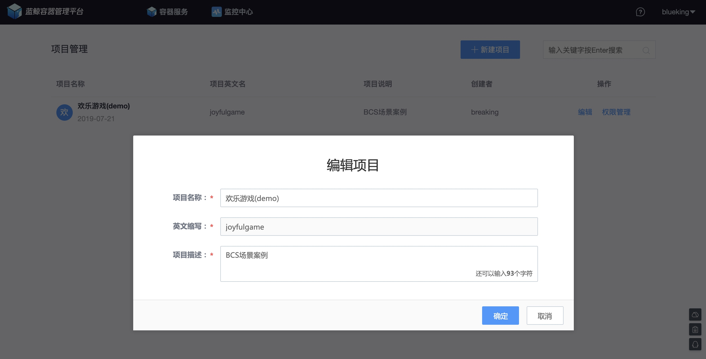

然后选择容器编排类型为 `Kubernetes` ，关联 [前提条件](#Prerequisites)中提到的 CMDB 业务，点击`启用容器服务`。


#### 1.2 新建集群

`启用容器服务`后，进入容器服务欢迎页，点击`创建容器集群`。

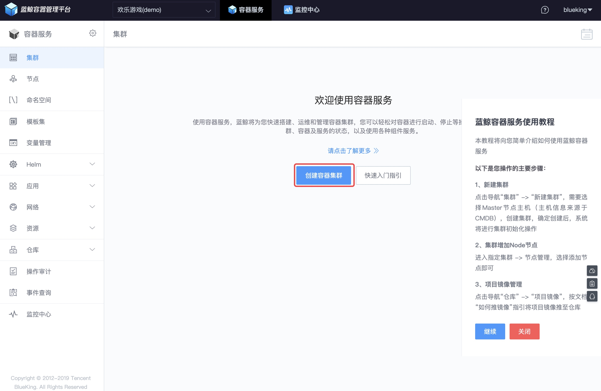

按提示填写集群的基本信息。

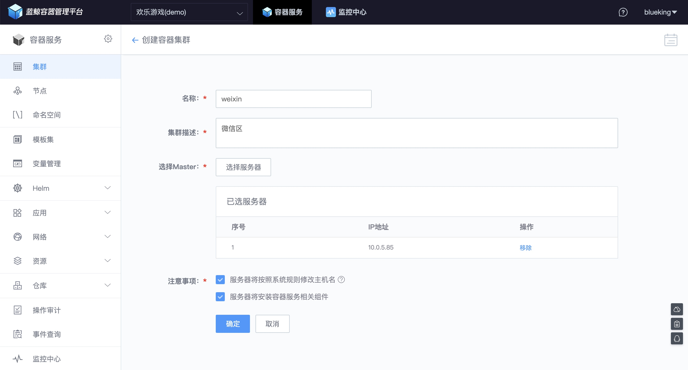

> 容器服务的集群划分和[传统单体应用在 CMDB 中的集群划分](CMDB_management_hosts.html#Combing_business_architecture)很类似，可以按照`地域（如华北区）`或者`完全独立的应用集合（微信区）`来划分。


选择 1 台云主机作为 Master。

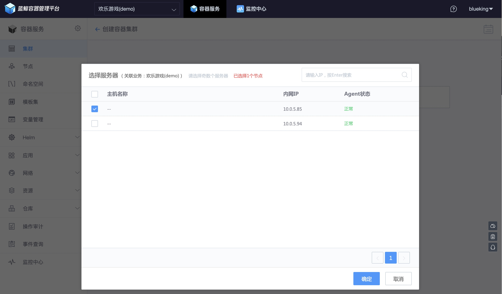

点击`确定`后，集群开始初始化。

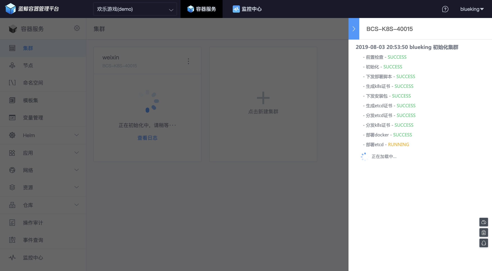

点击`节点管理`

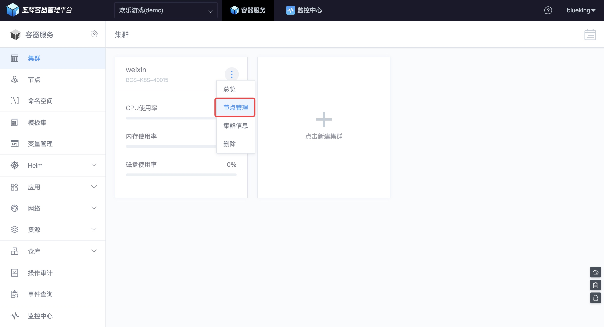

点击`添加节点`，按提示节点添加。

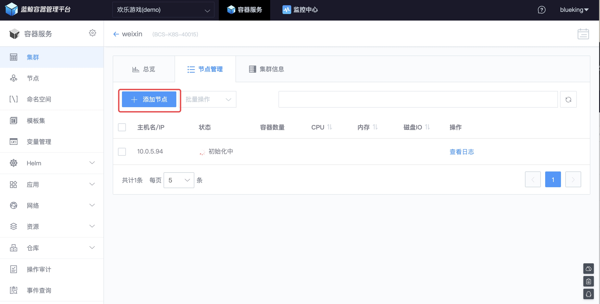

至此，新建集群完毕。可以看到集群的基础信息。

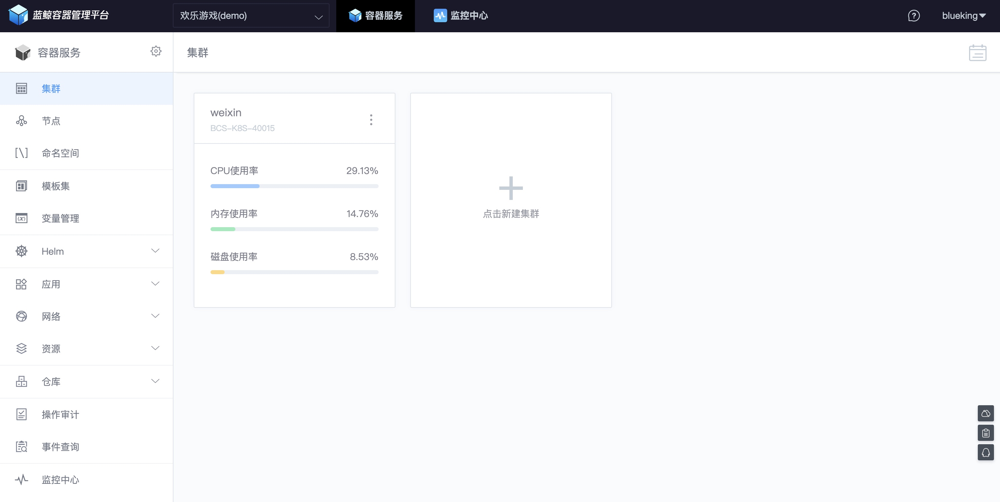

另外，在集群的设置(**⋮**)下拉菜单中，可以看到集群主要性能指标。

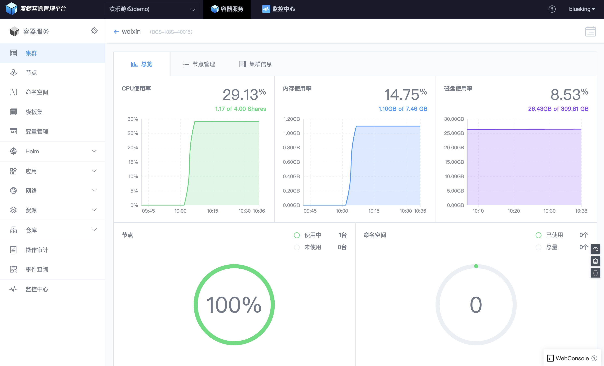


### 2. BCS 快速构建 Nginx 集群

#### 2.1 新建命名空间
新建命名空间`dev`


#### 2.2 新建模板集

模板集，可以类比为 K8S 中 **[Helm](https://helm.sh/)** 的`Charts`，在 K8S 编排中，是 K8S 对象的集合：`Deployment（无状态）`、`StatefulSet（有状态）`、`DaemonSet（守护进程集）`、`Job（定时任务）`、`Configmap（配置项）`、`Secret（保密字典）`，具体参见 [模板集使用介绍](https://docs.bk.tencent.com/bcs/Container/TemplateIntroduce.html) 。

打开菜单`[模板集]`，新建模板集`web-nginx`。

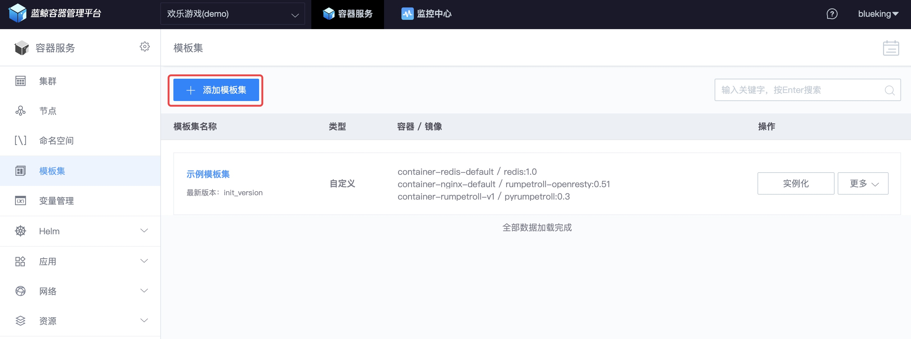


按提示，填写`Deployment`

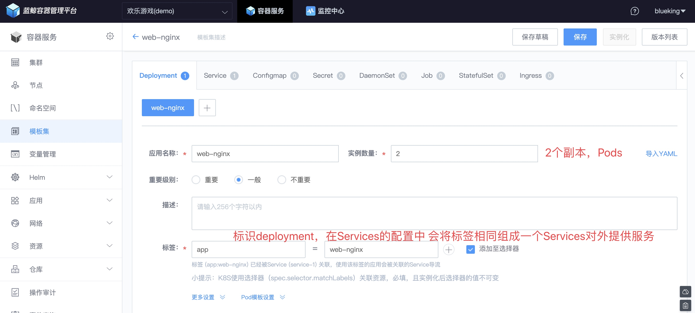
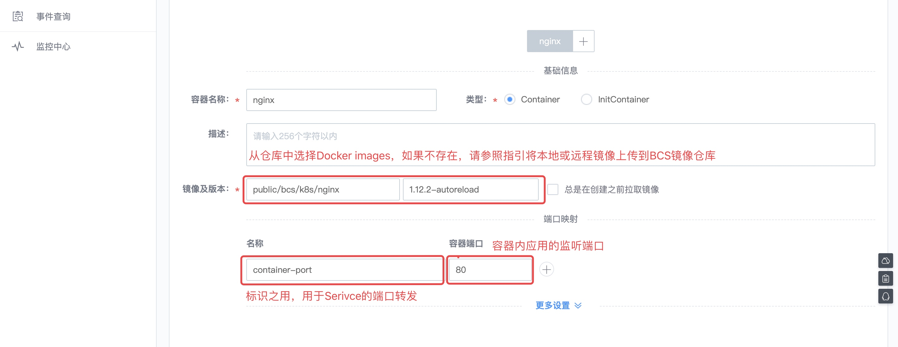

填写`Service`

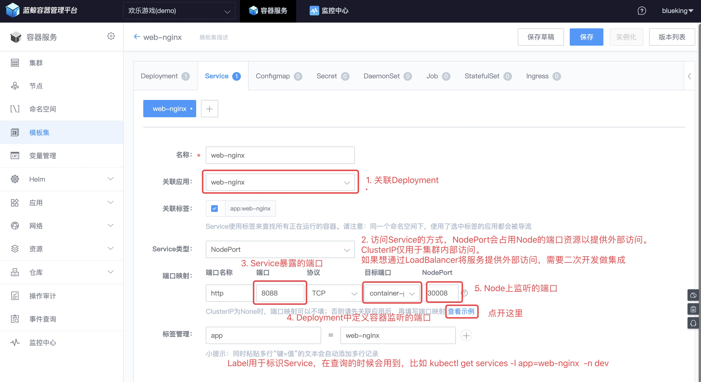

#### 2.3 实例化


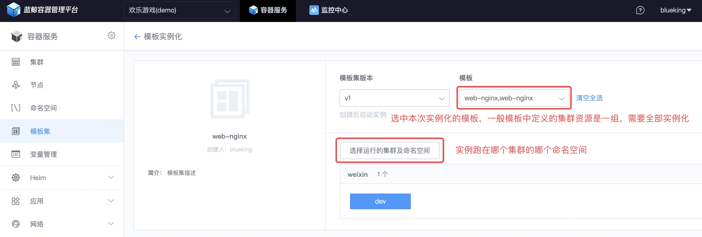


#### 2.4 检查部署效果

在菜单`网络` -> `Services`中，找到刚实例化的 Service `web-nginx`

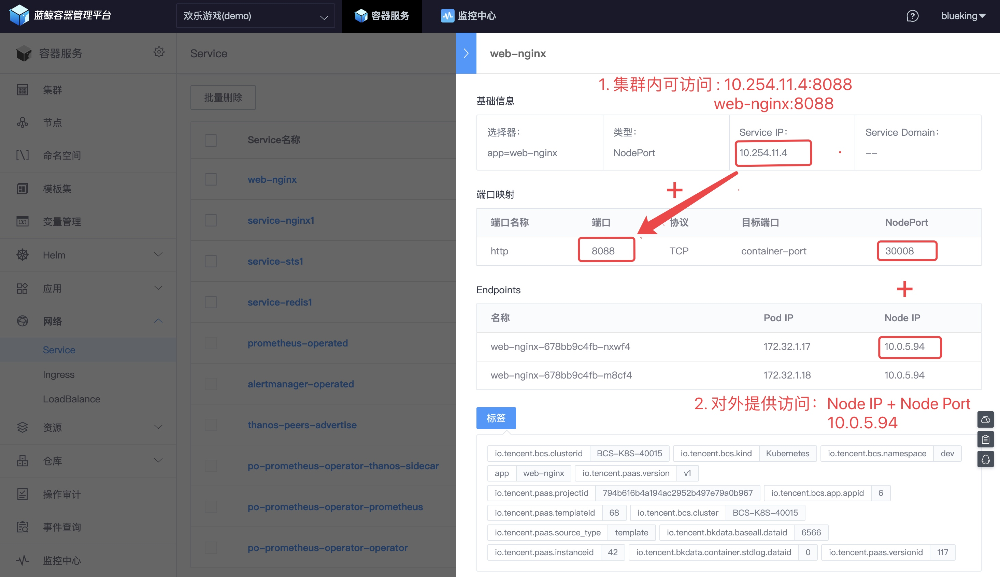

在菜单`[应用]` -> `[Deployment]`中可以找到 `web-nginx`

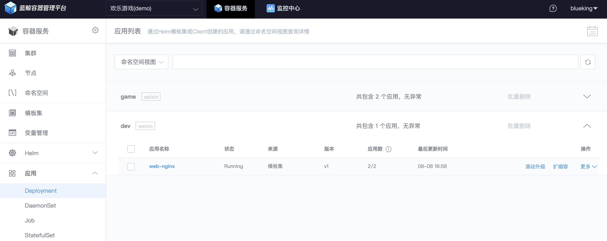

以及其运行指标

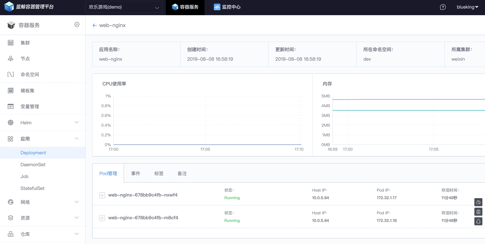

通过访问 `Node+NodePort`，可以查看刚刚部署 Nginx 集群的版本号。

```bash
[root@ip-10-0-5-94-n-bcs-k8s-40015 ~]# curl 10.0.5.94:30008 -I
HTTP/1.1 200 OK
Server: nginx/1.12.2
Date: Thu, 08 Aug 2019 09:11:42 GMT
```

通过访问`Service IP + Port`，也可以查看刚部署 Nginx 的版本号。

```bash
[root@ip-10-0-5-94-n-bcs-k8s-40015 ~]# curl 10.254.11.4:8088 -I
HTTP/1.1 200 OK
Server: nginx/1.12.2
Date: Thu, 08 Aug 2019 09:12:33 GMT
Content-Type: text/html
Content-Length: 612
Last-Modified: Tue, 11 Jul 2017 13:29:18 GMT
Connection: keep-alive
ETag: "5964d2ae-264"
Accept-Ranges: bytes
```
