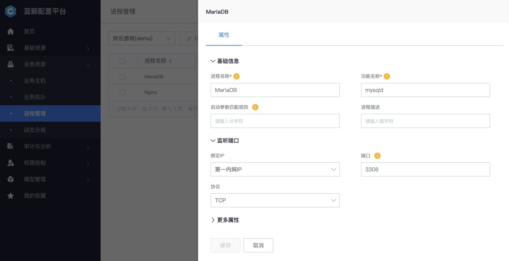
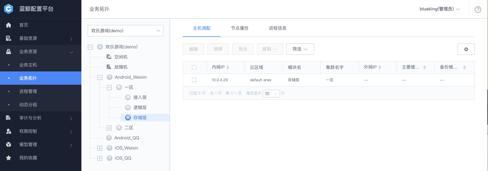
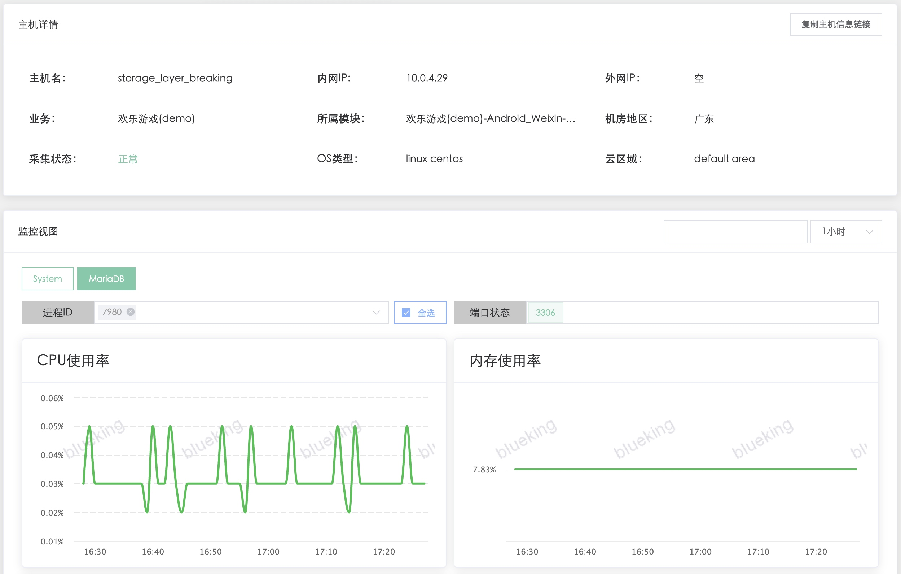

## CMDB 如何管理进程

#### 情景 
应用的存储是 MariaDB，在 CMDB 中注册 MariaDB，以便在监控系统做进程监控。

#### 前提条件 
在 [配置平台](https://docs.bk.tencent.com/cmdb/) 中新建好 [业务](https://docs.bk.tencent.com/cmdb/Introduction.html#BizManagement) 及 [业务拓扑](https://docs.bk.tencent.com/cmdb/Introduction.html#%EF%BC%882%EF%BC%89%E4%B8%9A%E5%8A%A1%E6%8B%93%E6%89%91%E6%9F%A5%E7%9C%8B)。

#### 步骤 
- [1. CMDB 中注册进程和端口](#CMDB_add_process)
- [2. 将进程绑定模块](#add_process_bind_module)
- [3. 监控系统自动实现进程端口监控](#process_monitor)

## 1. CMDB 中注册进程 

在菜单`业务资源`-`进程管理`中`新建进程`



### 1.1 注册进程 

- 进程名称：对外显示的服务名：`MariaDB`；
- 功能名称：程序的二进制名称：`mysqld`；

在配置功能名称时，使用命令查询该程序的二进制名称
```bash
$ ps -ef | grep -i mysqld
mysql     7800     1  0 7月08 ?       00:00:00 /bin/sh /usr/bin/mysqld_safe --basedir=/usr
mysql     7980  7800  0 7月08 ?       00:01:55 /usr/libexec/mysqld --basedir=/usr --datadir=/var/lib/mysql --plugin-dir=/usr/lib64/mysql/plugin --log-error=/var/log/mariadb/mariadb.log --pid-file=/var/run/mariadb/mariadb.pid --socket=/var/lib/mysql/mysql.sock
```

> 注：监控系统一般`完全匹配`二进制名称。
>    获取二进制名称的方法：`basename $(readlink -f /proc/7980/exe)`


### 1.2 注册端口 

查询 mysqld 监听的 IP 和端口

```bash
$ netstat -antp | grep mysqld
tcp        0      0 10.0.4.29:3306          0.0.0.0:*               LISTEN      7980/mysqld
```

- 绑定 IP：MariaDB 为存储层，一般绑定内网 IP，故选择`第一内网 IP`。
- 端口：进程监听的端口，`3306`
- 协议：`TCP`


## 2. 将进程绑定模块 
[如何管理主机](CMDB_management_hosts.md) 提到依据业务架构来划分业务拓扑，业务拓扑中模块代表服务，而服务将由一个或多个进程监听的端口来对用户或其他模块提供服务。

所以，需要将`进程`绑定至对应的`模块`上。

这里将`MariaDB`进程绑定至存储层模块上。


## 3. 监控系统自动实现进程端口监控 

给模块 [分配主机](https://docs.bk.tencent.com/cmdb/Introduction.html#%EF%BC%884%EF%BC%89%E4%B8%BB%E6%9C%BA%E8%BD%AC%E7%A7%BB)



等候一分钟，在蓝鲸自带的监控系统 [蓝鲸监控](https://docs.bk.tencent.com/bk_monitor/) 中可以看到 [进程的运行情况](https://docs.bk.tencent.com/bk_monitor/Process_and_Port_Monitor_Nice.html)。


点击 MariaDB 图标，可以查看其占用的 CPU、内存使用率以及文件句柄数等进程占用的资源指标。




### 扩展阅读 
#### 1. 监控系统消费 CMDB 中进程配置背后的逻辑 

当给模块分配完主机后，该主机的大部分 CI 属性将被自动推送至`/var/lib/gse/host/hostid`

```json
{
  .....
     "process" : [
      {
         "bind_ip" : "3",
         "bind_modules" : [ 68 ],
         "bk_func_id" : "",
         "bk_func_name" : "mysqld",  // 对应功能名称
         "bk_process_id" : 110,
         "bk_process_name" : "MariaDB",  // 对应进程名称
         "bk_start_param_regex" : "",
         "port" : "3306",
         "protocol" : "1"
      }
   ]
}
```

蓝鲸内置的进程监控采集器`processbeat`会读取该文件，并写入自身的配置文件`/usr/local/gse/plugins/etc/processbeat.conf`，以实现进程和端口的监控。


```yaml
......
processbeat.processes:
- name: mysqld // 二进制名称
  displayname: MariaDB
  protocol: tcp
  ports:
  - 3306
  paramregex: ""
  bindip: 10.0.4.29
```

#### 2. 二进制名称均为 java，该如何配置 

如 ZooKeeper、Hadoop 的二进制均为`java`，可用进程启动参数区分

```bash
$ ps -ef | grep -i zookeeper

root      4872     1  0 May11 ?        14:05:34 /data/bkee/service/java/bin/java -Dzookeeper.log.dir=/data/bkee/logs/zk/ -Dzookeeper.root.logger=INFO,ROLLINGFILE -Dzookeeper.DigestAuthenticationProvider.superDigest=bkadmin:1bF5dHUwvnyrhMDaPLkHwFS1JOg= -cp /data/bkee/service/zk/bin/../build/classes:/data/bkee/service/zk/bin/../build/lib/*.jar:/data/bkee/service/zk/bin/../lib/slf4j-log4j12-1.6.1.jar:/data/bkee/service/zk/bin/../lib/slf4j-api-1.6.1.jar:/data/bkee/service/zk/bin/../lib/netty-3.10.5.Final.jar:/data/bkee/service/zk/bin/../lib/log4j-1.2.16.jar:/data/bkee/service/zk/bin/../lib/jline-0.9.94.jar:/data/bkee/service/zk/bin/../zookeeper-3.4.10.jar:/data/bkee/service/zk/bin/../src/java/lib/*.jar:/data/bkee/etc:/data/bkee/service/zk/conf:/data/bkee/service/java/lib: -Dcom.sun.management.jmxremote -Dcom.sun.management.jmxremote.local.only=false org.apache.zookeeper.server.quorum.QuorumPeerMain /data/bkee/etc/zoo.cfg


ps -ef | grep -i kafka
root      5707     1  3 May11 ?        1-22:34:50 /data/bkee/service/java/bin/java -Xmx1G -Xms1G -server -XX:+UseG1GC -XX:MaxGCPauseMillis=20 -XX:InitiatingHeapOccupancyPercent=35 -XX:+DisableExplicitGC -Djava.awt.headless=true -Xloggc:/data/bkee/logs/kafka/kafkaServer-gc.log -verbose:gc -XX:+PrintGCDetails -XX:+PrintGCDateStamps -XX:+PrintGCTimeStamps -Dcom.sun.management.jmxremote -Dcom.sun.management.jmxremote.authenticate=false -Dcom.sun.management.jmxremote.ssl=false -Dkafka.logs.dir=/data/bkee/logs/kafka -Dlog4j.configuration=file:./../config/log4j.properties -cp /data/bkee/service/java/lib::/data/bkee/service/kafka/bin/../libs/aopalliance-repackaged-2.5.0-b05.jar:/data/bkee/service/kafka/bin/../libs/argparse4j-0.7.0.jar:/data/bkee/service/kafka/bin/../libs/connect-api-0.10.2.0.jar:/data/bkee/service/kafka/bin/../libs/connect-file-0.10.2.0.jar:/data/bkee/service/kafka/bin/../libs/connect-json-0.10.2.0.jar:/data/bkee/service/kafka/bin/../libs/connect-runtime-0.10.2.0.jar:/data/bkee/service/kafka/bin/../libs/connect-transforms-0.10.2.0.jar:/data/bkee/service/kafka/bin/../libs/guava-18.0.jar:/data/bkee/service/kafka/bin/../libs/hk2-api-2.5.0-b05.jar:/data/bkee/service/kafka/bin/../libs/hk2-locator-2.5.0-b05.jar:/data/bkee/service/kafka/bin/../libs/hk2-utils-2.5.0-b05.jar:/data/bkee/service/kafka/bin/../libs/jackson-annotations-2.8.0.jar:/data/bkee/service/kafka/bin/../libs/jackson-annotations-2.8.5.jar:/data/bkee/service/kafka/bin/../libs/jackson-core-2.8.5.jar:/data/bkee/service/kafka/bin/../libs/jackson-databind-2.8.5.jar:/data/bkee/service/kafka/bin/../libs/jackson-jaxrs-base-2.8.5.jar:/data/bkee/service/kafka/bin/../libs/jackson-jaxrs-json-provider-2.8.5.jar:/data/bkee/service/kafka/bin/../libs/jackson-module-jaxb-annotations-2.8.5.jar:/data/bkee/service/kafka/bin/../libs/javassist-3.20.0-GA.jar:/data/bkee/service/kafka/bin/../libs/javax.annotation-api-1.2.jar:/data/bkee/service/kafka/bin/../libs/javax.inject-1.jar:/data/bkee/service/kafka/bin/../libs/javax.inject-2.5.0-b05.jar:/data/bkee/service/kafka/bin/../libs/javax.servlet-api-3.1.0.jar:/data/bkee/service/kafka/bin/../libs/javax.ws.rs-api-2.0.1.jar:/data/bkee/service/kafka/bin/../libs/jersey-client-2.24.jar:/data/bkee/service/kafka/bin/../libs/jersey-common-2.24.jar:/data/bkee/service/kafka/bin/../libs/jersey-container-servlet-2.24.jar:/data/bkee/service/kafka/bin/../libs/jersey-container-servlet-core-2.24.jar:/data/bkee/service/kafka/bin/../libs/jersey-guava-2.24.jar:/data/bkee/service/kafka/bin/../libs/jersey-media-jaxb-2.24.jar:/data/bkee/service/kafka/bin/../libs/jersey-server-2.24.jar:/data/bkee/service/kafka/bin/../libs/jetty-continuation-9.2.15.v20160210.jar:/data/bkee/service/kafka/bin/../libs/jetty-http-9.2.15.v20160210.jar:/data/bkee/service/kafka/bin/../libs/jetty-io-9.2.15.v20160210.jar:/data/bkee/service/kafka/bin/../libs/jetty-security-9.2.15.v20160210.jar:/data/bkee/service/kafka/bin/../libs/jetty-server-9.2.15.v20160210.jar:/data/bkee/service/kafka/bin/../libs/jetty-servlet-9.2.15.v20160210.jar:/data/bkee/service/kafka/bin/../libs/jetty-servlets-9.2.15.v20160210.jar:/data/bkee/service/kafka/bin/../libs/jetty-util-9.2.15.v20160210.jar:/data/bkee/service/kafka/bin/../libs/jopt-simple-5.0.3.jar:/data/bkee/service/kafka/bin/../libs/kafka_2.12-0.10.2.0.jar:/data/bkee/service/kafka/bin/../libs/kafka_2.12-0.10.2.0-sources.jar:/data/bkee/service/kafka/bin/../libs/kafka_2.12-0.10.2.0-test-sources.jar:/data/bkee/service/kafka/bin/../libs/kafka-clients-0.10.2.0.jar:/data/bkee/service/kafka/bin/../libs/kafka-log4j-appender-0.10.2.0.jar:/data/bkee/service/kafka/bin/../libs/kafka-streams-0.10.2.0.jar:/data/bkee/service/kafka/bin/../libs/kafka-streams-examples-0.10.2.0.jar:/data/bkee/service/kafka/bin/../libs/kafka-tools-0.10.2.0.jar:/data/bkee/service/kafka/bin/../libs/log4j-1.2.17.jar:/data/bkee/service/kafka/bin/../libs/lz4-1.3.0.jar:/data/bkee/service/kafka/bin/../libs/metrics-core-2.2.0.jar:/data/bkee/service/kafka/bin/../libs/osgi-resource-locator-1.0.1.jar:/data/bkee/service/kafka/bin/../libs/reflections-0.9.10.jar:/data/bkee/service/kafka/bin/../libs/rocksdbjni-5.0.1.jar:/data/bkee/service/kafka/bin/../libs/scala-library-2.12.1.jar:/data/bkee/service/kafka/bin/../libs/scala-parser-combinators_2.12-1.0.4.jar:/data/bkee/service/kafka/bin/../libs/slf4j-api-1.7.21.jar:/data/bkee/service/kafka/bin/../libs/slf4j-log4j12-1.7.21.jar:/data/bkee/service/kafka/bin/../libs/snappy-java-1.1.2.6.jar:/data/bkee/service/kafka/bin/../libs/validation-api-1.1.0.Final.jar:/data/bkee/service/kafka/bin/../libs/zkclient-0.10.jar:/data/bkee/service/kafka/bin/../libs/zookeeper-3.4.9.jar kafka.Kafka ../config/server.properties

```

进程的功能名称均为`java`，`启动参数匹配规则`中分别输入`zookeeper`、`kafka`即可.