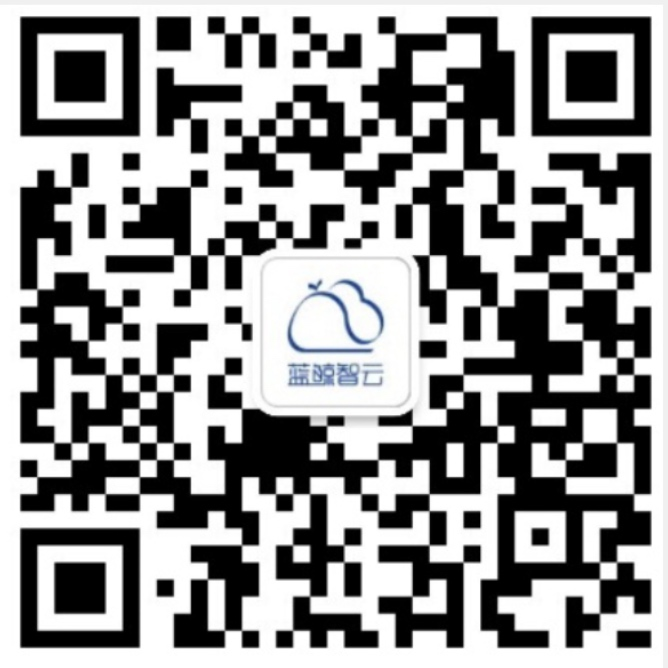

# 快速入门

## 情景

运维的职能为 **应用发布** 、 **变更** 、 **故障处理** 以及 **日常需求** ，覆盖研发运营生命周期的 **持续集成** （CI）、 **持续部署** （CD）、 **持续运营** （CO）三个阶段，从测试包交付到测试环境，到将验证通过的版本部署到生产环境，以及提供业务上线后的运维基础和增值服务。

传统人工、脚本的运维模式会面临 **效率低下** 、 **频繁出错背锅** 等等挑战，在质量、效率、成本、安全四个维度上，无法跟随业务快速增长的步伐。此外，由于这种困境，运维交付基础运维服务已经疲于奔命，无法向上交付运维的增值服务，难以体现自身价值。

蓝鲸是腾讯游戏基于 PaaS 理念设计的一套 **研发运营一体化解决方案** ，服务于业务全生命周期。将服务以原子能力集成，并提供了自主研发 SaaS 的 DevOps 工具链，通过私有化部署的模式，帮助企业整合及落地研发运营体系，提升企业研发运营效率，帮助企业运维团队转型，提供更多增值服务。

接下来，我们通过 **一个传统单体应用的发布（将版本部署至生产环境）** 、 **故障处理（磁盘告警自动化处理）** 以及 **日常需求（测试同学自助调整应用配置）** 等几大场景，看蓝鲸是如何高效的交付运维服务。

## 前提条件

- [了解蓝鲸的体系架构](5.1/蓝鲸体系/品牌简介/intro.md)

http://bkopen-10032816.file.myqcloud.com/grayscale_test/BkVideo/bk_AdVideo_cn.mp4

- [完成蓝鲸的部署](5.1/部署维护/README.md)

## 操作步骤

- 准备环境
- 应用交付
- 故障处理
- 日常需求

## 1. 准备环境
完成蓝鲸部署后，接下来开始初始化环境。

在蓝鲸 CMDB 中 新建业务、划分业务拓扑，以及 安装 Agent，完成蓝鲸对业务主机的纳管。

### 1.1 CMDB 新建业务及划分业务拓扑
在蓝鲸中，蓝鲸 CMDB 位于原子平台层，通过蓝鲸 PaaS 的 ESB 模块，为上层 SaaS 提供统一的资源管理。

所以，针对业务或者主机等资源的管理之前，要先将其在 CMDB 中纳管。

首先，在配置平台中 [新建业务](5.1/配置平台/快速入门/case1.md)，然后参照 [业务上线时 CMDB 如何管理主机](5.1/bk_solutions/CD/CMDB/CMDB_management_hosts.md) 完成业务拓扑的划分。

接下来，安装 Agent，蓝鲸的管控平台可以对主机实现包含文件分发、命令执行、数据上报的管控，同时主机会自动录入到蓝鲸 CMDB 对应的业务。

### 1.2 安装 Agent

参照 [管理直连网络区域的主机](5.1/bk_solutions/CD/Automation/Hybrid_cloud_management.md)，完成 Agent 安装。

### 1.3 执行脚本和分发文件

执行一个脚本和文件分发，验证环境是否已准备妥当。

../CD/Automation/media/blueking_execute_push_file.mp4

接下来，我们尝试做一次单体应用的版本发布。

## 2. 应用交付

参照 [一次标准的应用交付自动化案例](5.1/bk_solutions/CD/Automation/application_deployment.md)，完成一次自动化的应用交付，效果如下：

../CD/Automation/media/sops_execution.mp4

完成应用交付后，接下来了解在蓝鲸中如何实现告警的自动化处理。

## 3. 故障处理

根据企业内部正在使用的监控系统，参照 [Zabbix 告警自动处理](5.1/bk_solutions/CO/FTA/Zabbix_Alarm_processing_automation.md) 或 [第 3 方监控系统告警自动处理](5.1/bk_solutions/CO/FTA/REST_API_PUSH_Alarm_processing_automation.md) 或[蓝鲸监控告警自动处理](5.1/bk_solutions/CO/FTA/Bkmonitor_Alarm_processing_automation.md)，实现 **磁盘告警自动化处理**。

../CO/FTA/media/zabbix_fta.mp4

接下来，了解来自产品、运营、测试等团队，对运维的日常需求，是如何释放运维，做到 **需求自助化** 的。

## 4. 日常需求

参照 [需求自助化:测试自助调整验收环境](5.1/bk_solutions/CD/Demand_self_service.md)，完成测试自助修改测试环境配置，从此再也不会骚扰运维了。

以上就是一个运维的日常，在蓝鲸中如何做到 **标准化** 、 **自动化** 和 **自助化**。

---

当然，如果想做深，你还需要实现 [CMDB 中资源实例的自动发现](5.1/bk_solutions/CD/CMDB/CMDB_CI_auto_discovery_MySQL.md)，靠自动化去维护 CMDB 实例。

在自动化的应用发布过程中，不免还是需要和上下游沟通版本发布细节，如此高的沟通成本，我们建议运维在标准运维固化发布流程，并 [启用操作员的发布功能](5.1/bk_solutions/CD/Automation/ops_half_automation.md)，让运维更关注增值服务。

另一方面，蓝鲸 ITSM 实现 [服务器资源申请流程线上化](5.1/bk_solutions/CO/ITSM/Service_Request.md)、[应用发布流程线上化](5.1/bk_solutions/CO/ITSM/Release_Management.md)、[环境变更流线上化](5.1/bk_solutions/CO/ITSM/Change_Management.md)、[故障提报流程线上化](5.1/bk_solutions/CO/ITSM/Incident_Management.md)，通过线上流程完成企业 IT 的运营维护，告别邮件的低效率和不可回溯的交付模式。

持续部署(Continuous Deployment)之前是持续集成(Continuous Integration)和 [持续交付(Continuous Delivery)](5.1/bk_solutions/CI/Pipeline_git_commit_to_stag.md)，蓝盾会逐渐覆盖，尽请期待。

---

解决了运维当前的主要矛盾后，蓝鲸更关注 **研发运营这个领域的行业技术变化**。

通过支持 Kubernetes 和 Mesos 容器编排的蓝鲸容器管理平台，实现 [快速构建 Nginx 集群](5.1/bk_solutions/CD/BCS/Bcs_deploy_nginx_cluster.md) 、[应用的滚动升级](5.1/bk_solutions/CD/BCS/Bcs_app_Rolling_Update_Deployment.html) 、[蓝绿发布](5.1/bk_solutions/CD/BCS/Bcs_blue_green_deployment.md) 以及自动扩缩容等微服务化带来的技术红利。

蓝鲸，不止如此，更多尽情关注蓝鲸公众号。

