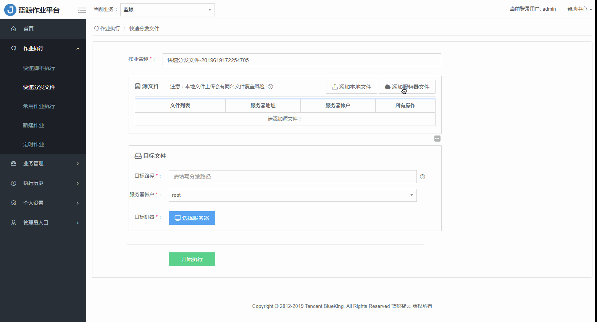

### 服务器之间的文件传输

把 `A 服务器`的`test.txt`文件上传到 `B 服务器`的`/tmp/`目录。

**步骤详情**

1、输入脚本名称，否则会使用系统默认名称如：快速分发文件-2019612204221713 。

2、添加服务器文件，1-n 个

- 选择服务器地址，选择状态 `Agent 正常` 的目标主机，1-n 台，否则会执行失败。
  - 支持通过 IP 选择服务器、从配置平台选择服务器、手动添加服务器、从动态分组选择服务器。
  - 列表默认全部模块类型的主机，勾选 `仅展示模块类型为 “数据库” 的主机`， 可快速选择“数据库” 类型的主机。
- 选择服务器账户：root 或者 system。
- 填写文件列表，即服务器文件路径，保证文件路径正确和文件存在，否则会执行失败。
- 选择 `保存` 。

3、选择目标机器，选择状态 `Agent正常` 的目标主机，1-n 台，否则会执行失败。

  - 支持通过 IP 选择服务器、从配置平台选择服务器、手动添加服务器、从动态分组选择服务器。
  - 列表默认全部模块类型的主机，勾选 `仅展示模块类型为 “数据库” 的主机`， 可快速选择“数据库” 类型的主机。

4、选择服务器账户：root 或者 system。

5、选择目标路径。

>**Note:**
- 如果该路径不存在，系统将自动创建。
- 文件传输目的地址的路径规则：Linux 服务器需要以 `/` 开头的绝对路径。例如：/data/xx 。Windows 服务器必须包含盘符开头，例如：D:\tmp\ 。

6、点击【开始执行】，若成功，节点状态反馈 “执行成功” ；若失败，节点状态反馈 “执行失败”，会提示 Agent 不正常的主机数和用户不存在的主机数。可查看完整日志。

