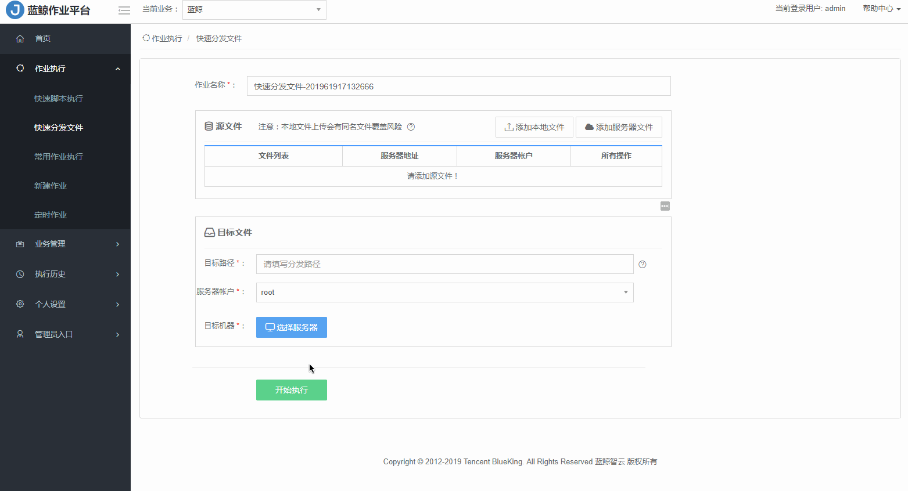

### 把本地文件上传到服务器上

把 本地文件 `test.txt` 上传到 远程服务器的 `/tmp/` 目录。

**步骤详情**

1、输入脚本名称，否则会使用系统默认名称如：快速分发文件-2019612204221713。

2、添加本地文件，1-n个。

>**Note:**
- 本地文件上传会有同名文件覆盖风险。
- 本地文件不能包含中文字符，且大小最大支持到 2 GB。
- 文件名中支持正则表达式写法以匹配多个文件，文件名前需加【REGEX】，如 /tmp/REGEX：abc[A-z,a-z，0-9，+，-,- ]{0,50}.tgc 。
- 如需分发文件目录，文件名请以 `/` 结束。

3、选择状态 `Agent正常` 的目标主机，1-n 台，否则会执行失败。

- 支持通过 IP 选择服务器、从配置平台选择服务器、手动添加服务器、从动态分组选择服务器。
- 列表默认全部模块类型的主机，勾选  【仅展示模块类型为 "数据库" 的主机】  ， 可快速选择 “数据库“ 类型的主机。

4、选择服务器账户：root 或者 system。

5、选择目标路径。

>**Note:**
- 如果该路径不存在，系统将自动创建。
- 文件传输目的地址的路径规则：Linux 服务器需要以 `/` 开头的绝对路径。例如：/data/xx 。Windows 服务器必须包含盘符开头，例如：D:\tmp\ 。

6、点击【开始执行】，若成功，节点状态反馈 `执行成功`，若失败，节点状态反馈 `执行失败`，会提示 Agent 不正常的主机数和用户不存在的主机数。可查看完整日志。

