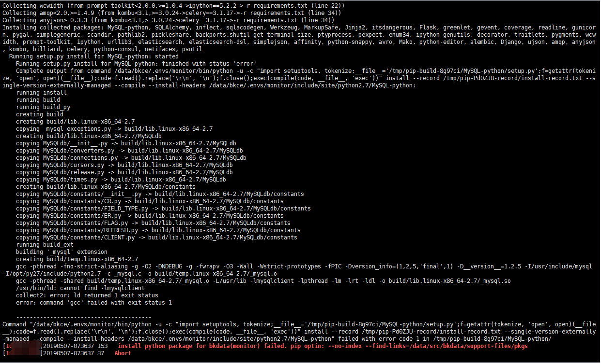
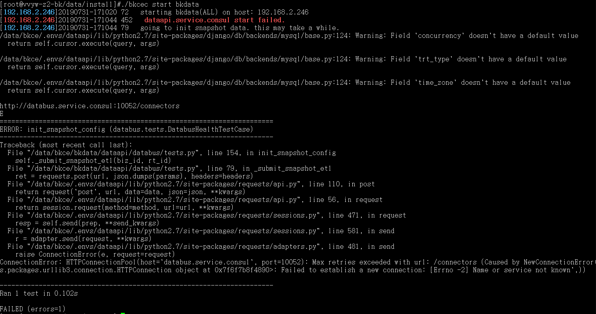

# 部署常见问题

## 部署 PaaS 常见问题

## 部署 CMDB 常见问题

### prot 31001 start failed，please check 先检查 cmdb 服务状态。


./bkcec status cmdb 若服务装状态都是RUNNING则 dig zk.service.consul查看能否解析（非单机部署） dig服务名.service.consul 解析异常处理方法：

 1.1、检查内部域名解析，运行dig 域名 @127.0.0.1 看是否能解析，如果不能解析，说明consul有问题 
 1.2、检查consul服务是否正常
 1.3、检查三台服务器resolv.conf  首行是否有配置nameserver 127.0.0.1，如无，请添加
 1.4、重启或重装consul服务
```
./bkcec stop consul  #(或在consul服务所在的三台主机，ps -ef |grep consul | awk '{print $2}'  |xargs kill -9)
./bkcec install consul 1
./bkcec start consul

```


### 若安装 consul 报错
 
2.1 检查/data/src/service/consul/是否有这两个文件夹bin ，conf；bin文件夹下是否有文件
 2.2 备份一下src下的.pip/pip.conf文件，然后重新解压一下bkce_src安装包，继续检查是否有文件，如果还没有
 2.3 解压时直接用tar xf 包名，不要加-C，还没有文件去官网下载新包重新解压
 2.4 对比包的md5是否和官网一致
 2.5 检查防火墙端口是否有开（8300，8301，8302）
 2.6 查看日志，登录所在机器的路径：/data/bkce/logs

### cmdb-adminserver 服务状态 failed 
 3.1.检查依赖服务是否正常 redis mongodb nginx gse zk 
 3.2.查看cmdb-adminserver日志（/data/bkce/logs/cmdb/）

### 检查 cmd b服务进程，参照下图
```
./bkcec status cmdb

```


### cmdb-nginx服务状态failed 
 5.1 检查yum info nginx 
 5.2 安装epel yum源, 重装cmdb

```
./bkcec stop cmdb 
./bkcec install cmdb 1 
./bkcec start cmdb 
./bkcec initdata cmdb

```
三台机器的yum源都更新一致，确保yum源能安装nginx
其他进程状态EXIT，请前往cmdb所在服务器
/data/bkce/logs/cmdb/目录下查看相应的日志


## 部署 JOB 常见问题


## 部署 App_mgr 常见问题


该报错是激活 paas_agent 失败，需要查看的是 appo 还是appt，再检查进程是否正常。
```bash
./bkcec status appo
./bkcec status appt 
```
若是异常重启进程，启动失败需要查看日志详情/data/bkce/logs/paas_agent/
进程正常启动后再激活
```bash
./bkcec activate appo
./bkcec activate appt
```
## 部署 BKDATA 常见问题

### MySQL-python 安装失败

./bk_install bkdata 报错原因：
- 系统缺乏对应的库文件；
- 版本不对应；
- 库文件的链接错误；
- 库文件路径设置问题； 



- 解决方案：

1. 确保mysql-devel 已经安装
可用which mysql-devel来确认

2. 建立软连接
```bash
ln -s /usr/lib64/mysql/libmysqlclient_r.so /usr/lib/libmysqlclient_r
ln -s /usr/lib64/mysql/libmysqlclient.so /usr/lib/libmysqlclient.so
ln -s /usr/lib64/mysql/libmysqlclient.so.18 /usr/lib/libmysqlclient.so.18
ln -s /usr/lib64/mysql/libmysqlclient.so.18.0.0 /usr/lib/libmysqlclient.so.18.0.0
```


重新部署bkdata即可恢复

### 安装python-snappy包失败

原因是缺少snappy-c.h导致pip安装python-snappy包失败


- 解决方案：

    通过安装snappy-devel解决,yum install -y snappy-devel 

### 启动报 "dataapi.service.consul start failed ERROR： init_snapshot_config"  

启动bkdata报错：dataapi.service.consul start failed ERROR： init_snapshot_config (databus.tests.DatabusHealthTestCase) 


- 解决方案
    登陆到bkdata机器（社区版5.1登陆到databus所在机器）查看consul配置是否生成databus.json配置。
    
    ```
    /data/bkce/etc/consul.d/bkdata.json 
  
    # 若无则重装consul
    ./bkcec stop consul
    ./bkcec install consul 1
    ./bkcec start consul
    ./bkcec status consul
  
    # 登陆到databus所在机器查看
    ls /data/bkce/etc/consul.d/bkdata.json
  
    # 启动 bkdata
    ./bkcec start bkdata
   ```

## 部署 SaaS 常见问题

**安装saas-o报错KeyError: "name='bk_csrftoken', domain=None, path=None"**


- 解决方案
确认是否是在 PaaS 页面个人信息重置了密码后，但是 `globals.env` 文件没同步更新。 请在 `globals.env` 文件中更新重置后的密码后确认是否恢复正常。
```bash
./bkcec sync common
```


 