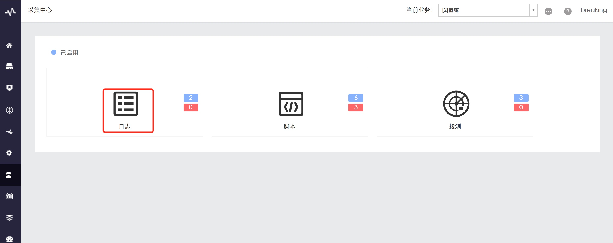
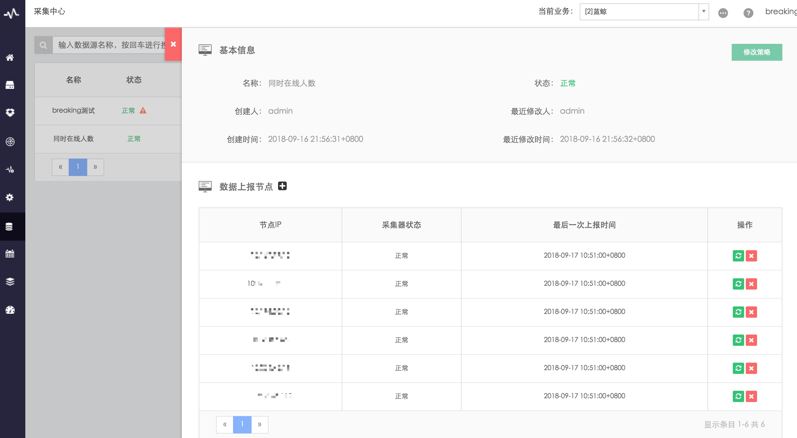
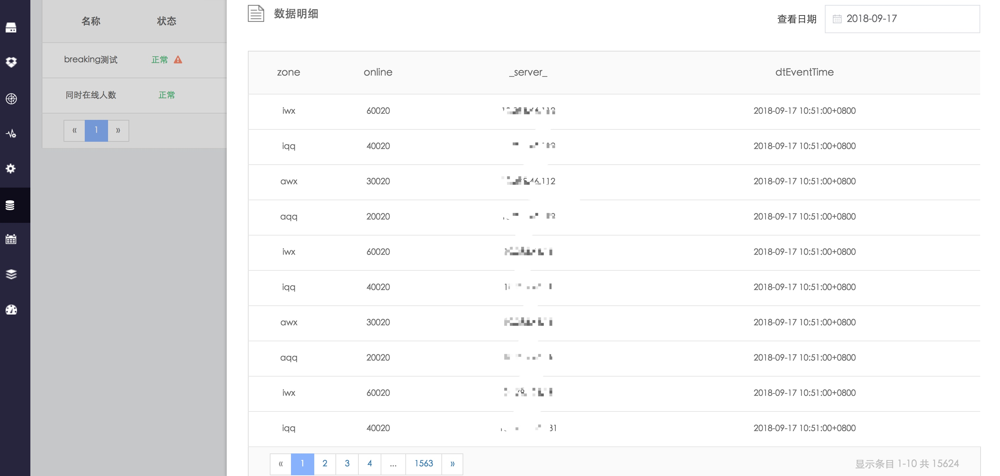

### 日志采集

从日志文件中解析上报的字段（比如一行日志的内容是 "2018-09-16 21:46:16 | aqq | 20020"），做时序数据的监控。

从上面例子可知道 aqq 在 2018-09-16 21:46 的在线人数是 20020，也可以 sum 所有大区(包含 aqq 在内)在 2018-09-16 21:46 的在线人数是多少，来做总在线监控。

以下是本次教程的数据示例.（每分钟会自动更新）

```plain
# cat /data/bk.monitor.breaking_test2.log
2018-09-16 21:46:16|aqq|20020
2018-09-16 21:46:16|awx|30020
2018-09-16 21:46:16|iqq|40020
2018-09-16 21:46:16|iwx|60020
```
#### 采集

实时捕获日志文件的变动（借助 Linux 的 inotify 事件)，通过分隔符完成日志格式清洗，将其作为时序数据做监控。

在`采集中心`中找到日志采集

图 1. 采集中心-日志采集

##### 1. 按照提示，填写上报内容


图 2. 日志采集-参数填写

##### 2. 保存后，可以在列表页找到采集项

图 3. 日志采集-列表

##### 3. 点击预览，可以查看数据的上报情况



图 4. 日志采集数据上报情况

> 日志采集的当前版本不支持跨云、Windows，同时数据落地为 MySQL。后续版本会改造以支持。
