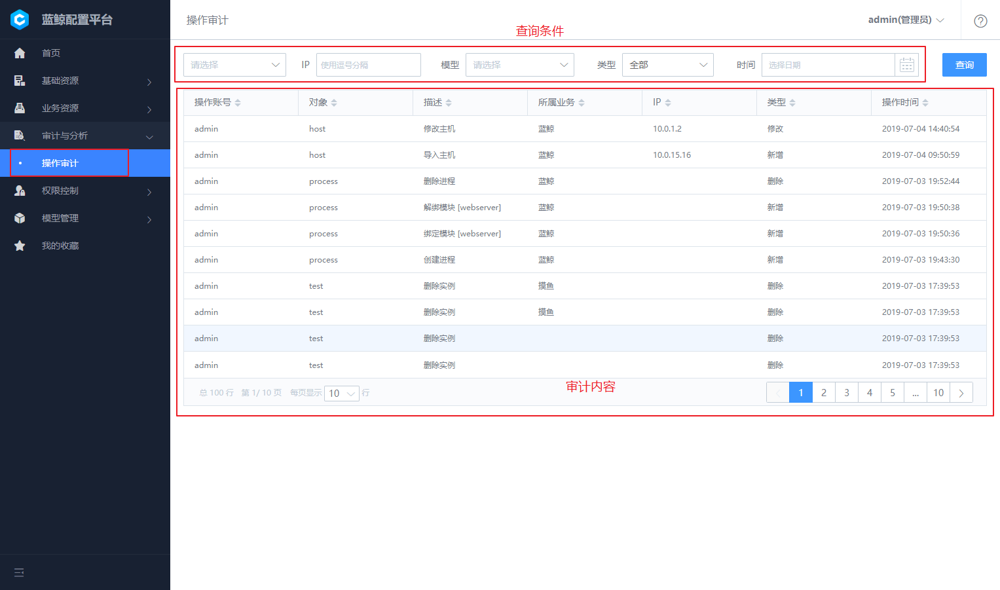
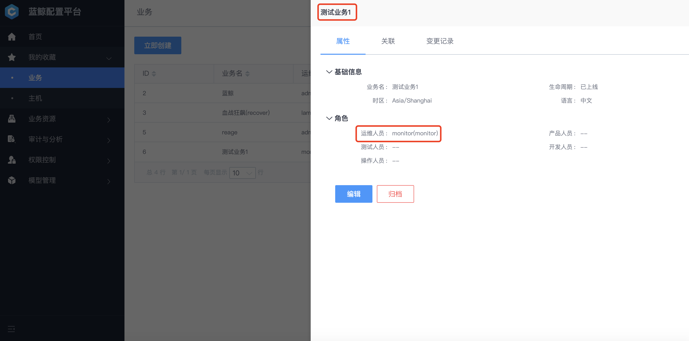
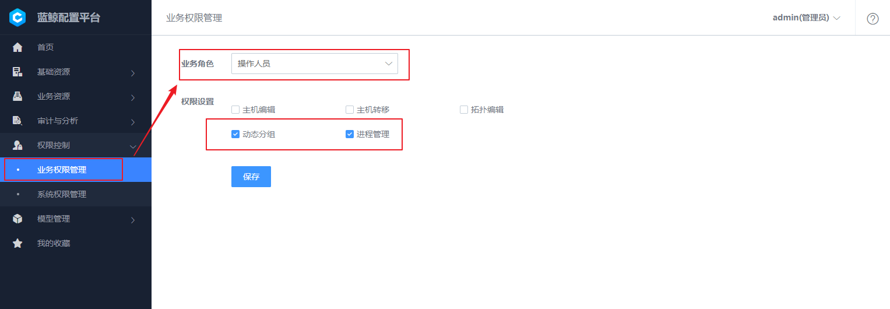
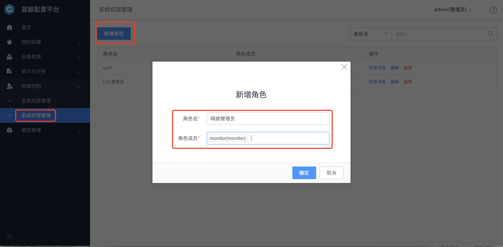
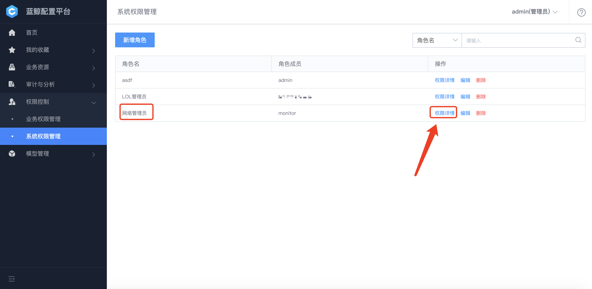

### 审计与分析 {#OperationAnalysis}

所有用户在配置平台上的操作，都有对应的记录可以追溯，用户可以在操作审计菜单项下查看具体的历史操作。

#### 操作审计 {#OperationAudit}

操作审计是面向管理员功能，能够查询到所有用户在配置平台上的操作。通过导航打开 "审计与分析 - 操作审计" 进入功能页。

### 权限控制 {#PermissionsControl}

配置平台支持两层权限配置：业务功能权限管理、系统功能权限管理。

#### 业务功能权限管理 {#BuzPermissionsManagement}

当新建业务时，"业务运维" 被认为是业务的主要负责人，默认拥有此业务最高权限，包含业务下所有集群、模块、主机等的管理权限。如下图配置，monitor 用户拥有 "测试业务 1" 所有的权限。

默认状态下，产品、测试、开发、操作人员可以在配置平台看到业务的资源情况，但是对业务下数据没有修改权限。管理员可以根据企业的实际需要，授予角色特定的权限。

具体操作可以通过侧边导航打开 "权限控制-业务权限管理"，选择目标角色，勾选需要授予的权限即可。

需要注意的是，这里角色的权限配置是对整个企业的所有业务生效，而非单个业务。

#### 系统功能权限管理 {#SysPermissionsManagement}

对于和业务没有直接关系的功能，如系统功能、普通自定义实例，管理员可以通过常用的 "角色+权限" 方式设定权限。以下以网络设备管理员为例，分为两个步骤设定角色权限：

**（1）创建角色**

通过侧边导航打开 "权限控制-系统权限管理"，点击 `新建` 打开对话框。

角色名填写 "网络管理员" ，成员中指定需要授权的人员，这里设定了 monitor 为网络管理员。

**（2）角色授权**

通过角色创建以后，可以在角色列表中看到新增的角色，点击 【权限详情】 按钮进入权限配置页，可以对该角色的权限进行细粒度的划分。

