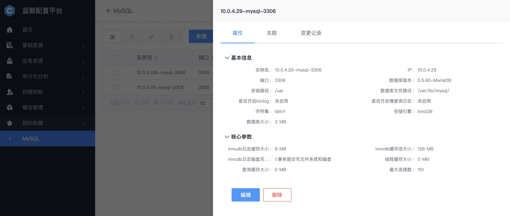
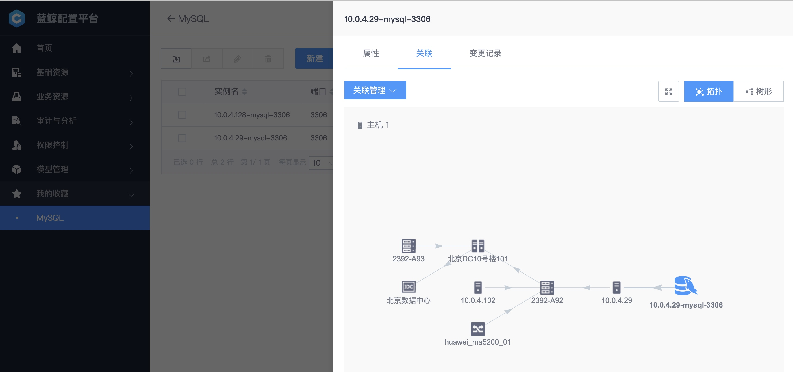

# 自动发现数据库实例：以 MySQL 为例
> 感谢 [嘉为科技](http://tech.canway.net/cheshi.html) 贡献该文档.

## 情景
业务存储层是 MySQL，通过蓝鲸 CMDB 已管理 MySQL 实例，然而却是手工维护，难以长期维护。需要通过自动化的方式实现，自动发现 MySQL 实例、 MySQL CI 属性以及关联关系。

## 前提条件

1. 提前导入或录入 MySQL CI 、创建模型（不是实例）的关联关系，详见：[如何管理数据库实例:以 MySQL 为例](5.1/bk_solutions/CD/CMDB/CMDB_management_database_middleware.md)
2. 在蓝鲸开发者中心 [新建一个应用](5.1/开发指南/SaaS开发/新手入门/Windows.md)，用于调用 [CMDB 的 API](5.1/API文档/CC/README.md)
3. 提供一个运维权限的账号以及 CMDB 的主机 IP 和端口,用于执行 JOB 作业
4. 创建查询 MySQL CI 属性的账号

```bash
     sudo mysql -e "CREATE USER 'bk'@'{YOUR_MYSQL_IP}' IDENTIFIED BY '{PASSWORD_FOR_BK_QUERY}';"
     sudo mysql -e "GRANT PROCESS, REPLICATION CLIENT ON *.* TO 'bk'@'{YOUR_MYSQL_IP}' WITH MAX_USER_CONNECTIONS 5;"
     sudo mysql -e "GRANT SELECT ON performance_schema.* TO 'bk'@'{YOUR_MYSQL_IP}';"
```

## 操作步骤
- 梳理自动发现逻辑
- 代码解读（含样例脚本）
- 测试效果

### 视频教程

media/cmdb_mysql_autodiscovery.mp4

### 梳理自动发现逻辑
- **自动发现 MySQL 实例**：调用作业平台的快速脚本执行 API，在 MySQL 所在的主机上执行 ps 命令发现 MySQL 实例，调用 CMDB 的 API 创建实例。
- **自动发现  MySQL CI  属性**：调用 CMDB 获取实例的 API，获取 MySQL 实例所在的主机，调用作业平台的快速脚本执行 API，执行 SQL 语句查询 MySQL 属性，并调用 CMDB API 更新实例。
- **自动发现 MySQL 与所在主机的关联关系**：调用 CMDB 查询实例 API 找出 MySQL 实例对应主机，创建关联关系。

### 代码解读（含样例脚本）
#### 自动发现 MySQL 实例

- 通过 `ps` 命令获取 `mysql` 的 `进程ID`
- 通过 `netstat` 命令，根据 `进程ID` 获得 `mysql端口` 号
- 调用 `CMDB` 创建实例的接口，将发现到的实例存入 `CMDB`

```python
#! /usr/bin/env python
# -*-coding:utf-8-*-

import requests
import json
import time
import base64
import sys
import warnings

warnings.filterwarnings("ignore")
reload(sys)
sys.setdefaultencoding('utf8')

BK_PAAS_HOST = 'http://'   # 蓝鲸 PaaS 地址，例如https://paas.blueking.com/
BK_APP_CODE = ''  # 用于调用蓝鲸CMDB API 的 SaaS账号
BK_APP_TOKEN = '' # 用于调用蓝鲸CMDB API 的 SaaS Token
BK_USERNAME = '' # 拥有业务运维权限的蓝鲸账号
BK_BIZ_ID =   # 业务 ID，在哪个业务下发现 MySQL 实例
BK_OBJ_ID = 'mysql'  #  MySQL CI 名
BK_CMDB_HOST = 'http://{CMDB_HOST}:33031'  # 在蓝鲸业务下查看配置平台的主机IP或在install.config中 cmdb 对应的 IP
MYSQL_HOST_IP = ['']  # 此处最好自行编写代码来获取 MySQL的IP
MYSQL_USERNAME = 'bk'  # 查询 MySQL CI 属性的 MySQL 账号
MYSQL_PASSWORD = '' # 查询 MySQL CI 属性的 MySQL 密码
MYSQL_OS_ACCOUNT = 'root'   # 执行 JOB 作业的操作系统账号，用于发现 MySQL 实例、CI属性、关联关系

# 自动发现MySQL
class CoverMysql(object):
    def __init__(self):
        self.bk_biz_id = BK_BIZ_ID
        self.job = JobMan()
        self.cover_ips = MYSQL_HOST_IP

    def start_cover(self):
        ip_list = self.search_ip_list()
        if not ip_list.__len__():
            return
        params = {
            "bk_biz_id": self.bk_biz_id,
            "script_content": self._mysql_script(),
            "script_timeout": 1000,
            "account": MYSQL_OS_ACCOUNT,
            "script_type": 1,
            "ip_list": ip_list,
        }
        self.job.fast_execute_sql(params)
        for x in ip_list:
            res, log_content = self.job.get_log(x['ip'])
            if not res:
                continue
            proc = json.loads(log_content)
            data = self._make_inst_data(x['ip'], proc)
            self.create_inst(data)

    def create_inst(self, data):
        url = BK_PAAS_HOST + '/api/c/compapi/v2/cc/create_inst/'
        params = {
            "bk_app_code": BK_APP_CODE,
            "bk_app_secret": BK_APP_TOKEN,
            "bk_username": BK_USERNAME,
            "bk_obj_id": BK_OBJ_ID,
            "bk_supplier_account": "0"
        }
        params = dict(params, **data)
        rp = requests.post(url, json.dumps(params), verify=False)
        if rp.status_code != 200:
            raise Exception(u'请求失败')

    # 查询主机
    def search_ip_list(self):
        url = BK_PAAS_HOST + '/api/c/compapi/v2/cc/search_host/'
        params = {
            "bk_app_code": BK_APP_CODE,
            "bk_app_secret": BK_APP_TOKEN,
            "bk_username": BK_USERNAME,
            "bk_supplier_account": "0",
            "bk_biz_id": self.bk_biz_id,
            "condition": [
                {
                    "bk_obj_id": "host",
                    "fields": [],
                    "condition": [
                        {
                            'operator': '$eq',
                            'field': 'bk_os_type',
                            'value': '1'  # 查询linux主机
                        },
                        {
                            'operator': '$in',
                            'field': 'bk_host_innerip',
                            'value': self.cover_ips
                        }
                    ]
                },
            ],
        }
        rp = requests.post(url, json.dumps(params), verify=False)
        if rp.status_code != 200:
            raise Exception(u'请求失败')
        res = json.loads(rp.content)
        if not res['result']:
            raise Exception(u'查询主机失败')
        info = res['data']['info']
        return [{
            "bk_cloud_id": x['host']['bk_cloud_id'][0]['bk_inst_id'] if x['host']['bk_cloud_id'].__len__() else 0,
            "ip": x['host']['bk_host_innerip']
        } for x in info]

    def _make_inst_data(self, ip, proc):
        port = proc.get('port', '')
        inst_name = '{0}-{1}-{2}'.format(ip, BK_OBJ_ID, port)
        return {
            'ip_addr': ip,
            'bk_inst_name': inst_name,
            'port': port
        }

    def _mysql_script(self):
        script = u"""#!/bin/bash
# 获取进程端口号
Get_Port_Join_Str(){
    port_arr_str=$(netstat -ntlp | grep $1 |awk '{print $4}'|awk -F ':' '{print $NF}'|sed 's/ *$//g'|sed 's/^ *//g'|sort|uniq)
    if [ -z "$port_arr_str" ];then
        continue
    fi
    port_str=""
    for port in ${port_arr_str[@]}
    do
        if [ -n "$port_str" ];then
            port_str=${port_str},${port}
        else
            port_str=${port}
        fi
    done
}

Get_Soft_Pid(){
    i=0
    soft_pid=()
    pid_arr=$(ps -ef | grep -v grep | grep -i $1 |awk '{print $2}' )
    for pid in ${pid_arr[@]}
    do
    	 # 过滤掉端口不存在的进程
        port_str=$(netstat -ntlp | grep -w $pid)
        if [ -z "$port_str" ];then
            continue
        fi
		 # 过滤掉不是mysql的进程
        is_mysql=$($(readlink /proc/$pid/exe) -V 2>/dev/null|grep -i mysql)
        if [ -z "$is_mysql" ];then
			continue
        fi
        # 过滤掉蓝鲸sass 进程
        userId=$(ps -ef | grep $1 | grep -w $pid | grep -v grep | awk '{print $1}')
        if [[ "$userId" == "apps" ]];then
            continue
        fi
        # 筛选后的pid
        soft_pid[$i]=$pid
        i=$(expr $i + 1)
    done
}

Cover_Mysql(){
    condition=mysql
    Get_Soft_Pid $condition
    for pid in ${soft_pid[@]}
    do
        Get_Port_Join_Str $pid
        exe_path=$(readlink /proc/$pid/exe)
        echo {'"'port'"': '"'$port_str'"'}
    done
}
Cover_Mysql
"""
        return base64.b64encode(script)
```

#### 自动采集 MySQL CI 属性
- 获取 CMDB 中 MySQL 的实例
- 根据 MySQL 中的 IP，调用作业平台执行脚本，采集配置信息
- 调用 CMDB 更新实例接口, 将采集到的配置信息保存到 CMDB 中

```python
class CollectMysql(object):
    def __init__(self):
        self.job = JobMan()
        self.cred = {
            'username': MYSQL_USERNAME,
            'password': MYSQL_PASSWORD
        }

    def start_collect(self):
        insts = self.search_inst()
        for inst in insts:
            hosts = self.search_host(inst['ip_addr'])
            if not hosts.__len__():
                print u'主机不存在'
                continue
            host = hosts[0]
            biz_id = host['biz'][0]['bk_biz_id']
            innerip = host['host']['bk_host_innerip']
            cloud_id = host['host']['bk_cloud_id'][0]['bk_inst_id']
            ip_list = [
                {
                    'ip': innerip,
                    'bk_cloud_id': cloud_id
                }
            ]
            params = {
                "bk_biz_id": biz_id,
                "script_content": self._mysql_script(innerip, self.cred['username'], self.cred['password']),
                "script_timeout": 1000,
                "account": MYSQL_OS_ACCOUNT,
                "script_type": 1,
                "ip_list": ip_list,
            }
            self.job.fast_execute_sql(params)
            res, log_content = self.job.get_log(innerip)
            if not res:
                continue
            inst_id = inst['bk_inst_id']
            config = json.loads(log_content)
            config = self.clear_data(config)
            self.update_inst(inst_id, config)
            asst_host = {
                'bk_asst_inst_id': inst_id,
                'bk_inst_id': host['host']['bk_host_id'],
                'bk_obj_asst_id': "host_run_{}".format(BK_OBJ_ID)
            }
            self.create_asst(asst_host)

    def search_inst(self):
        params = {
            "bk_app_code": BK_APP_ID,
            "bk_app_secret": BK_APP_TOKEN,
            "bk_username": BK_USERNAME,
            "bk_supplier_account": "0",
            "bk_obj_id": BK_OBJ_ID,
            "condition": {
                BK_OBJ_ID: []
            }
        }
        url = BK_PAAS_HOST + '/api/c/compapi/v2/cc/search_inst/'
        rp = requests.post(url, json.dumps(params), verify=False)
        if rp.status_code != 200:
            raise Exception(u'请求失败')
        res = json.loads(rp.content)
        if not res['result']:
            raise Exception(u'查询实例失败')
        return res['data']['info']

    # 查询主机
    def search_host(self, ip):
        url = BK_PAAS_HOST + '/api/c/compapi/v2/cc/search_host/'
        params = {
            "bk_app_code": BK_APP_ID,
            "bk_app_secret": BK_APP_TOKEN,
            "bk_username": BK_USERNAME,
            "bk_supplier_account": "0",
            "condition": [
                {
                    "bk_obj_id": "host",
                    "fields": [],
                    "condition": [
                        {
                            'operator': '$in',
                            'field': 'bk_host_innerip',
                            'value': [ip]
                        }
                    ]
                },
                {
                    "bk_obj_id": "biz",
                    "fields": [],
                    "condition": []
                },
            ],
        }
        rp = requests.post(url, json.dumps(params), verify=False)
        if rp.status_code != 200:
            raise Exception(u'请求失败')
        res = json.loads(rp.content)
        if not res['result']:
            raise Exception(u'查询主机失败')
        return res['data']['info']

    def update_inst(self, inst_id, config):
        params = {
            "bk_app_code": BK_APP_ID,
            "bk_app_secret": BK_APP_TOKEN,
            "bk_username": BK_USERNAME,
            "bk_supplier_account": "0",
            "bk_obj_id": BK_OBJ_ID,
            "bk_inst_id": inst_id
        }
        params = dict(params, **config)
        url = BK_PAAS_HOST + '/api/c/compapi/v2/cc/update_inst/'
        rp = requests.post(url, json.dumps(params), verify=False)
        if rp.status_code != 200:
            raise Exception(u'请求失败')
        res = json.loads(rp.content)
        if not res['result']:
            raise Exception(u'更新实例失败')


    def clear_data(self, config):
        print config
        return {
            'character': config.get('charset', ''),
            'db_version': config.get('db_version', ''),
            'db_size': int(float(config.get('db_size', 0).rstrip('MB').rstrip('mb'))),
            'install_dir': config.get('basedir', ''),
            'dbfile_dir': config.get('datafile_path', ''),
            'enable_binlog': 'enable_binlog' if config.get('is_binlog', None) == 'ON' else 'disable_binlog',
            'enable_slowlog': 'enable_slowlog' if config.get('is_slow_query_log', None) == 'ON' else 'disable_slowlog',
            'storage_engine': config.get('storage_engine', ''),
            'inno_buff_pool_size': int(float(config.get('innodb_buffer_pool_size', 0)) / 1024 / 1024),
            'inno_log_buff_size': int(float(config.get('innodb_log_buffer_size', 0)) / 1024 / 1024),
            'inno_flush_log_trx': config.get('innodb_flush_log_at_trx_commit', ''),
            'thread_cache_size': int(float(config.get('thread_cache_size', 0)) / 1024 / 1024),
            'query_cache_size': int(float(config.get('query_cache_size', 0)) / 1024 / 1024),
            'max_connections': int(float(config.get('max_connections', 0)))
        }


    def _mysql_script(self, ip, username, password):
        mysql_script = u"""#!/bin/bash
ip= {{ip}}
username={{username}}
password={{password}}
sql1='''show VARIABLES WHERE variable_name LIKE "character_set_database"
OR variable_name LIKE "slow_query_log"
OR variable_name LIKE "datadir"
or variable_name LIKE "basedir"
OR variable_name LIKE "version"
or variable_name LIKE "log_bin" '''
sql2='SHOW VARIABLES WHERE variable_name ="default_storage_engine"'
# 大小
sql3="select concat(round((sum(data_length)+sum(index_length))/1024/1024,2),'MB') as data from information_schema.tables"
# 数据库名
base_info=$(mysql -u$username -h$ip -p$password -s -e "${sql1}" 2>/dev/null)
sql10='''SHOW VARIABLES WHERE variable_name LIKE "innodb_buffer_pool_size" OR variable_name LIKE "innodb_log_buffer_size" OR variable_name LIKE "innodb_flush_log_at_trx_commit" OR variable_name LIKE "thread_cache_size" OR variable_name LIKE "query_cache_size" OR variable_name LIKE "max_connections"'''
base_info2=$(mysql -u$username -h$ip -p$password -s -e "${sql10}" 2>/dev/null)

charset=`echo $base_info|awk -F ' ' '{print $4}'`
db_version=`echo $base_info|awk -F ' ' '{print $12}'`
db_size=$(mysql -u$username -h$ip -p$password -s -e "${sql3}" 2>/dev/null)
basedir=`echo $base_info|awk -F ' ' '{print $2}'`
datafile_path=`echo $base_info|awk -F ' ' '{print $6}'`
storage_engine=`echo $(mysql -u$username -h$ip -p$password -s -e "${sql2}" 2>/dev/null)|awk -F ' ' '{print $2}'`
is_binlog=`echo $base_info|awk -F ' ' '{print $8}'`
is_slow_query_log=`echo $base_info|awk -F ' ' '{print $10}'`

innodb_buffer_pool_size=`echo $base_info2|awk -F ' ' '{print $2}'`
innodb_log_buffer_size=`echo $base_info2|awk -F ' ' '{print $6}'`
innodb_flush_log_at_trx_commit=`echo $base_info2|awk -F ' ' '{print $4}'`
thread_cache_size=`echo $base_info2|awk -F ' ' '{print $12}'`
query_cache_size=`echo $base_info2|awk -F ' ' '{print $10}'`
max_connections=`echo $base_info2|awk -F ' ' '{print $8}'`

echo {'"'charset'"': '"'$charset'"',\
 '"'db_version'"': '"'$db_version'"',\
  '"'db_size'"': '"'$db_size'"',\
  '"'basedir'"': '"'$basedir'"',\
  '"'datafile_path'"': '"'$datafile_path'"',\
  '"'storage_engine'"': '"'$storage_engine'"',\
  '"'is_binlog'"': '"'$is_binlog'"',\
  '"'is_slow_query_log'"': '"'$is_slow_query_log'"',\
  '"'innodb_buffer_pool_size'"': '"'$innodb_buffer_pool_size'"',\
  '"'innodb_log_buffer_size'"': '"'$innodb_log_buffer_size'"',\
  '"'innodb_flush_log_at_trx_commit'"': '"'$innodb_flush_log_at_trx_commit'"',\
  '"'thread_cache_size'"': '"'$thread_cache_size'"',\
  '"'query_cache_size'"': '"'$query_cache_size'"',\
  '"'max_connections'"': '"'$max_connections'"'\
  }
exit
"""
        mysql_script = mysql_script \
            .replace('{{username}}', username) \
            .replace('{{password}}', password) \
            .replace('{{ip}}', ip)
        return base64.b64encode(mysql_script)
```

#### 自动发现关联信息
- 通过 MySQL 实例中 IP 地址，找到与之对应的主机
- 调用 CMDB 创建关联的接口，添加主机和 MySQL 直接的关联关系

```python
    # 发现 MySQL 实例与所在主机的关联关系
    # 创建关联: CMDB_HOST + '/api/v3/inst/association/action/create'
    # 目前暂未开放ESB接口，接口地址和参数通过抓包获取
    # params:
    # {
    #   'bk_asst_inst_id': 目标实例ID, * 必填
    #   'bk_inst_id': 源实例ID, * 必填
    #   'bk_obj_asst_id'：关联ID * 必填
    # }
    def create_asst(self, params):
        is_asst = self.search_asst(params)  # 判断关联关系是否已存在
        if is_asst:
            return
        url = BK_CMDB_HOST + '/api/v3/inst/association/action/create'
        headers = {
            "Content-Type": "application/json",
            "HTTP_BlUEKING_SUPPLIER_ID": "0",
            "BK_USER": BK_USERNAME
        }
        rp = requests.post(url=url, data=json.dumps(params), headers=headers, verify=False)
        if rp.status_code != 200:
            raise Exception(u'请求失败')
        res = json.loads(rp.content)
        if not res['result']:
            print res
            raise Exception(u'创建关联失败')

    # 查询关联: CMDB_HOST + '/api/v3/object/association/action/search'
    # 目前暂未开放ESB接口，接口地址和参数通过抓包获取
    # params:
    # {
    #   'bk_asst_inst_id': 目标实例ID,
    #   'bk_inst_id': 源实例ID,
    #   'bk_obj_id': 模型ID, * 必填
    #   'bk_obj_asst_id'：关联ID
    # }
    def search_asst(self, params):
        url = BK_CMDB_HOST + '/api/v3/inst/association/action/search'
        params['bk_obj_id'] = BK_OBJ_ID
        headers = {
            "Content-Type": "application/json",
            "HTTP_BlUEKING_SUPPLIER_ID": "0",
            "BK_USER": BK_USERNAME
        }
        rp = requests.post(url=url, data=json.dumps(params), headers=headers, verify=False)
        if rp.status_code != 200:
            raise Exception(u'请求失败')
        res = json.loads(rp.content)
        if not res['result']:
            raise Exception(u'查询关联')
        for asst in res['data']:
            if params['bk_obj_asst_id'] == asst['bk_obj_asst_id'] and \
                    params['bk_inst_id'] == asst['bk_inst_id'] and \
                    params['bk_asst_inst_id'] == asst['bk_asst_inst_id']:
                return True
        return False
```

#### 封装作业平台执行类
封装好调用作业平台快速执行脚本接口的类

```python
class JobMan(object):
    def __init__(self):
        self.ip_log = {}

    def get_log(self, ip):
        if ip not in self.ip_log:
            return False, u"IP{0}未执行作业，可能是IP未录入或Agent异常".format(ip)
        return self.ip_log[ip]["is_success"], self.ip_log[ip]["log_content"]

    # 快速执行脚本
    def fast_execute_sql(self, params):
        url = BK_PAAS_HOST + '/api/c/compapi/v2/job/fast_execute_script/'
        params = dict({
            "bk_app_code": BK_APP_ID,
            "bk_app_secret": BK_APP_TOKEN,
            "bk_username": BK_USERNAME,
        }, **params)
        rp = requests.post(url, json.dumps(params), verify=False)
        if rp.status_code != 200:
            raise Exception(u'请求失败')
        res = json.loads(rp.content)
        if not res['result']:
            raise Exception(u'执行脚本失败')
        self.get_job_instance_log(params['bk_biz_id'], res['data']['job_instance_id'])

    def get_job_instance_log(self, bk_biz_id, job_instance_id):
        params = {
            "bk_app_code": BK_APP_ID,
            "bk_app_secret": BK_APP_TOKEN,
            "bk_username": BK_USERNAME,
            "bk_biz_id": bk_biz_id,
            "job_instance_id": job_instance_id
        }
        url = BK_PAAS_HOST + '/api/c/compapi/v2/job/get_job_instance_log/'
        rp = requests.post(url, json.dumps(params), verify=False)
        if rp.status_code != 200:
            raise Exception(u'请求失败')
        res = json.loads(rp.content)
        if not res['result']:
            raise Exception(u'获取日志失败')
        step = res['data'][0]
        if step['is_finished']:
            self.__get_step_log(step)
        else:
            time.sleep(5)
            self.get_job_instance_log(bk_biz_id, job_instance_id)

    def __get_step_log(self, step):
        for step_res in step['step_results']:
            for ip_content in step_res['ip_logs']:
                if ip_content['ip'] in self.ip_log:
                    print ip_content['ip'] + u"IP重复"
                    continue
                self.ip_log[ip_content['ip']] = {
                    "is_success": step_res["ip_status"] == 9,
                    "source": ip_content['bk_cloud_id'],
                    "ip": ip_content['ip'],
                    "log_content": ip_content['log_content']
                }
```

#### 调用执行

```python
if __name__ == '__main__':
    # 自动发现
    cover = CoverMysql()
    cover.start_cover()
    # 自动采集
    collect = CollectMysql()
    collect.start_collect()
```

### 测试效果

- 自动发现 MySQL 实例


- 自动发现 MySQL CI 属性



- 自动发现 MySQL 与主机的关联关系



> 注：关联关系中，主机与机架、机房管理单元、机房等关联需要单独添加对应的关联关系，此处不做展开。

## MySQL 自动发现采集器 Demo

请 [下载 demo](http://bktencent-1252002024.file.myqcloud.com/cmdb_autodiscovery_mysql_instance.py.tgz) 后，在一台有  Python 环境的主机（可访问蓝鲸）或 SaaS 中运行。

## 其他说明

要实现周期性自动发现，可用`Celery`的周期任务实现
