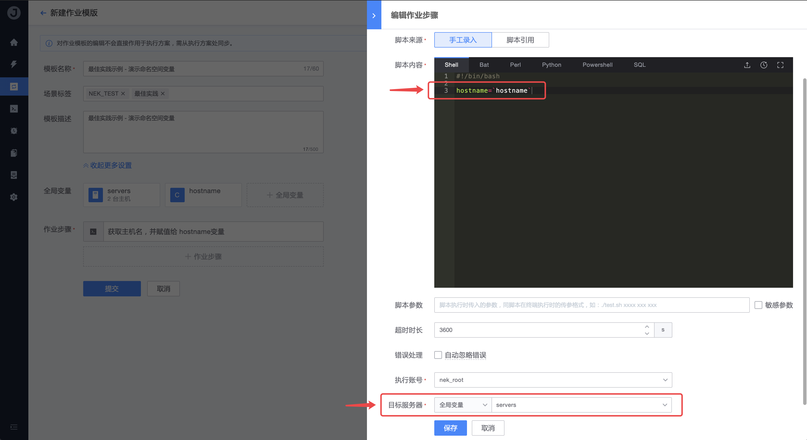
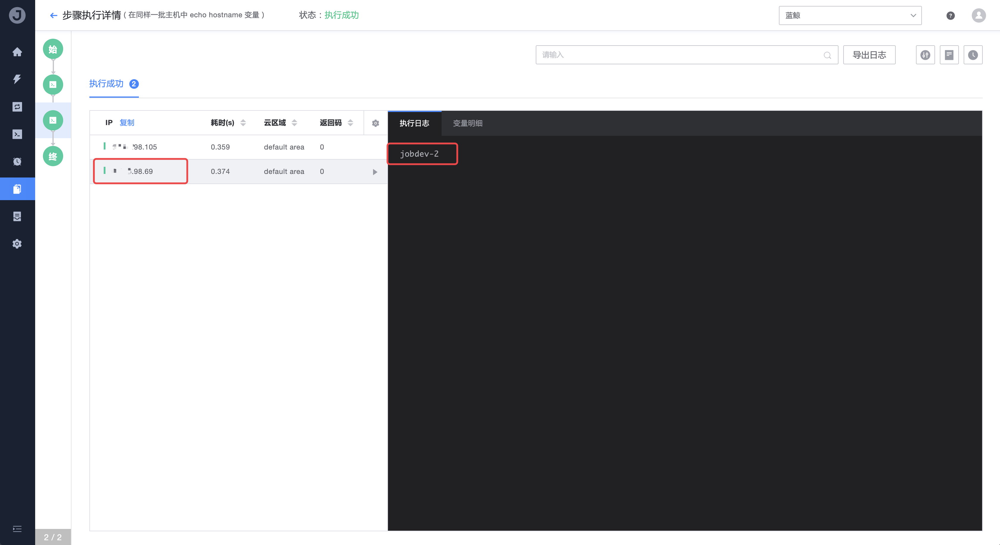

# 如何让同一主机独享变量？

当同一批主机在多个步骤间需要传递独立的变量值时，我们需要用到 `命名空间` 变量；它和 `字符串` 变量的差别是，`命名空间` 是以主机为唯一标识的独有变量，适合在主机处于多个步骤并需要透传属于自己变量值的场景使用；下面我们列举一个简单的示例来演示 `命名空间` 类型变量的使用方式。

## 操作步骤

1. 创建一个 `servers` 的主机变量，和一个 `hostname` 的命名空间变量

   

   

2. 在第一个步骤获取主机名，并赋值给 `hostname`，执行目标选择 `servers`

   

3. 在第二个步骤 echo `hostname`，执行目标同样选择 `servers`

   

4. 执行作业，观察每台主机 echo 的结果是否是各自主机名

   

   \*\*\*.\*\*\*.98.105 这台机器的变量值为 `jobdev-1`

   

   而 *\*\*.\*\*\*.98.69 这台机器的变量值为 `jobdev-2`

## 结论

由此可见，同样的代码逻辑，由于使用的是 `命名空间` 变量，所以不同机器 echo 的结果是属于主机自身独有的变量值。

本章节介绍结束，希望通过该示例能够帮助到你，感谢对蓝鲸作业平台的支持。