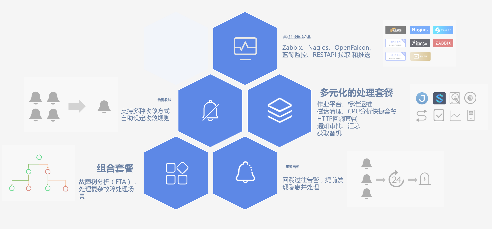

# 特点及优势

图2. 故障自愈核心功能图

* **获取告警**：告警源集成蓝鲸监控、4款主流开源监控产品 Zabbix、OpenFalcon、Nagios、Icinga，及 AWS、邮件的告警接入，更能通过 REST API 拉取、推送告警。

* **告警处理**：故障处理支持作业平台、标准运维流程

* **告警收敛和防御**：系统预定收敛和防御规则，对异常告警事件进行收敛，更能通过收敛审批功能对异常的执行做审批。

* **支持组合套餐**:把自定义自愈套餐通过 FTA(故障树分析)处理流程，组装成解决复杂场景的组合套餐。

* **健康诊断**：根据系统内置的健康诊断策略，周期性回溯异常事件，并通过邮件方式推送出来。

* **预警自愈**：是健康诊断功能的延伸，把健康诊断发现的问题通过自愈方案解决，完成异常事件的闭环。

* **操作审计**：感知故障自愈的每一次改动，确保运营安全，问题可回溯

* **丰富的处理套餐**：除支持作业平台、标准运维外，还支持快捷套餐类(磁盘清理、汇总、检测 CPU 使用率 TOP10 等)、组合套餐类(获取故障机备机、通知、审批等)

* **自愈小助手**：分析告警和套餐关联，决策推荐自愈方案方案，降低配置成本
