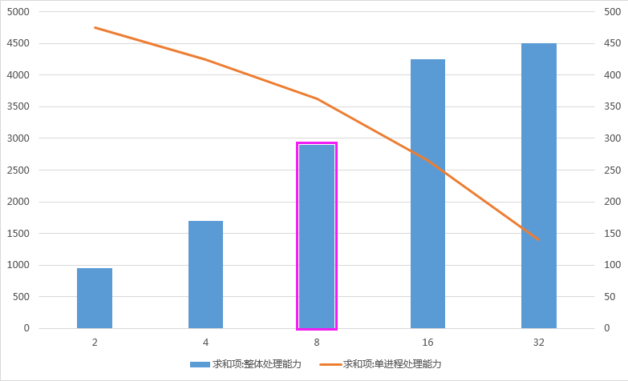

# 主要性能指标

压测机型配置：4核8G内存虚拟机 \* 2(台)

## 告警拉取

-   匹配率 0%的压测数据：37000条告警/分钟

-   匹配率 50%的压测数据：37000条告警/分钟

## 告警匹配

-   匹配率 0%的压测数据：33492条告警/分钟

-   匹配率 50%的压测数据：10703条告警/分钟

-   匹配率 100%的压测数据：6521条告警/分钟

## 告警汇总

-   2 进程(双机部署，每台主机 1 进程)：约 950条告警/分钟
    的整体处理能力，475条告警/分钟 的单进程处理能力

-   4 进程(双机部署，每台主机 2 进程)：约 1700条告警/分钟
    的整体处理能力，425条告警/分钟 的单进程处理能力

-   8 进程(双机部署，每台主机 4 进程)：约 2900条告警/分钟
    的整体处理能力，360条告警/分钟 的单进程处理能力

-   16 进程(双机部署，每台主机 8 进程)： 约 4250条告警/分钟
    的整体处理能力，265条告警/分钟 的单进程处理能力

-   32 进程(双机部署，每台主机 16 进程)：约 4500条告警/分钟
    的整体处理能力，140条告警/分钟 的单进程处理能力

1\) 当进程数量低于 CPU 核心数时，可通过增加进程数显著提升处理能力；但进程数量高于 CPU 核心数时，提升效果十分有限。

2\) 随着进程数量的增加，单进程平均处理能力降低；进程数量高于 CPU 核心数量时，降低幅度更为显著。

> 部署建议：告警汇总模块进程单独部署时，进程数量为 CPU 核心数量的2倍时最佳；与其它模块的混合部署时，建议不超过 CPU 核心数。

## 告警汇总

参考告警汇总模块
