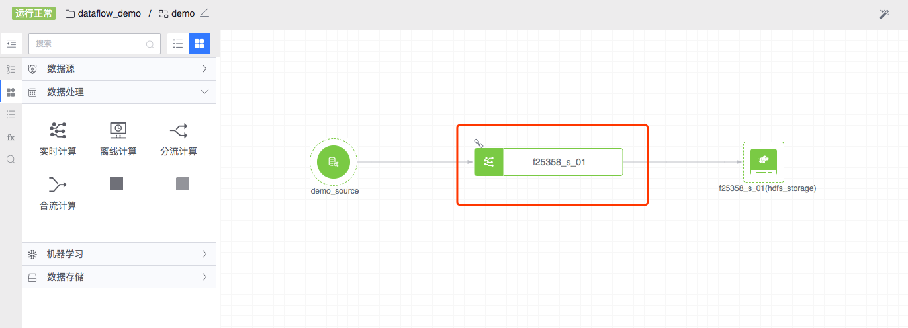
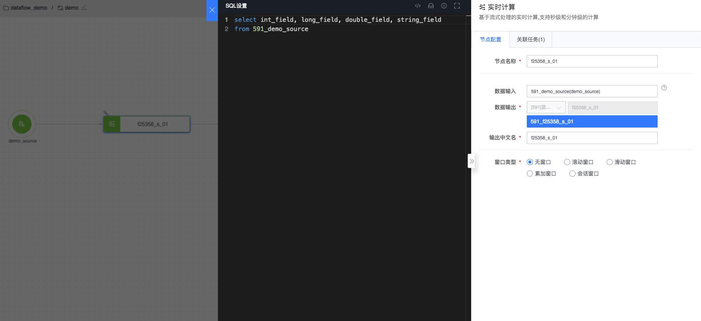
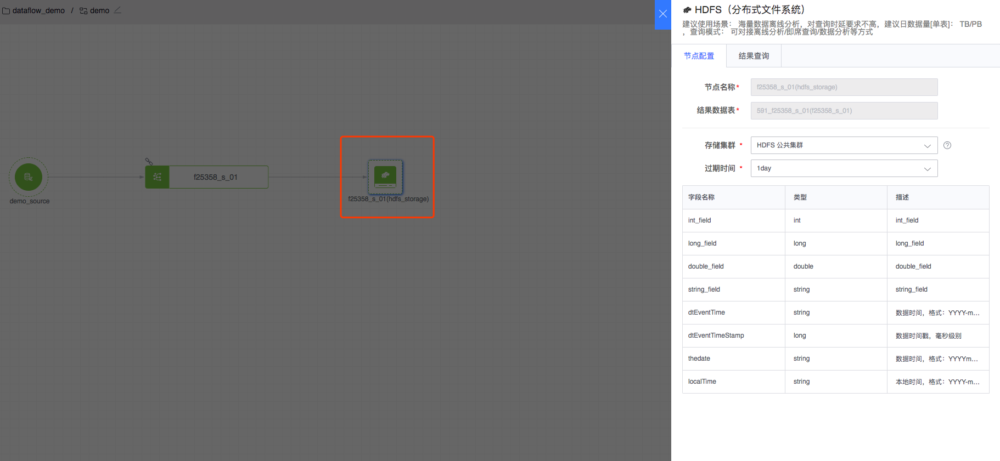

## 什么是实时计算

传统大数据计算模型是将在线数据处理和离线数据分析从时序上完全分割开来的。随着业务和技术不断发展，人们对信息高时效性、可操作性需求的不断增张，显然该架构目前已经不能满足对于大数据的实时处理需求。

数据的价值随着时间的推移而降低，那么数据发生之后马上进行计算和处理就显得尤为重要，实时计算的产生就是人们对数据价值挖掘的一个过程。在实时推荐、监控预警、实时预测、金融交易等很多场景中，传统的大数据处理是不能满足其业务需求的。而实时计算作为针对流式数据的计算模型，可以实时、高效的处理大数据的业务需求。

- 实时、无界的数据源

流数据是按照时间发生顺序地被实时计算消费。且由于数据发生的持续性，数据流将长久且持续地集成进入实时计算系统。例如，一个游戏的登录日志流，只要游戏正常运转，登录日志流将一直产生并进入实时计算中去。。因此，对于实时计算来说，数据是实时且不终止\(无界\)的。

- 持续、高效的计算

实时计算是一种”事件触发”的计算模式，触发源就是上述的无界流式数据。一旦有新的流数据进入实时计算，实时计算立刻发起并进行一次计算任务，因此整个实时计算是持续进行的计算

## 怎么配置实时计算

- 首先选择实时数据源，双击数据源进行配置，选择用来做计算的数据源

- 选择实时计算节点进行配置

- 用 SQL 表达计算逻辑，并保存

- 最后配置存储节点进行计算结果的存储

#### 时间介绍

 - 数据时间：事件时间，一般是事件产生的时间，平台中对应保留字段是 dtEventTime。
 - 本地时间：事件数据经过计算后入库的本地时间，平台中对应保留字段是 localTime。

#### 窗口简介

实时计算支持以数据时间属性做窗口的。支持四种窗口类型：滚动窗口、滑动窗口、累加窗口和会话窗口。
 - 等待时间：是用于处理数据时间乱序这种情况的。例如，设置等待时间为 60 秒，当数据源数据延迟 60 秒之内到达都可以进入窗口计算，这时候计算结果将延迟 60 秒输出。
 - 窗口输出时间：滚动窗口、滑动窗口的输出时间为窗口的起始时间。由于累加窗口和会话窗口的独特性，这两个窗口是以窗口的结束时间做为窗口的输出时间。