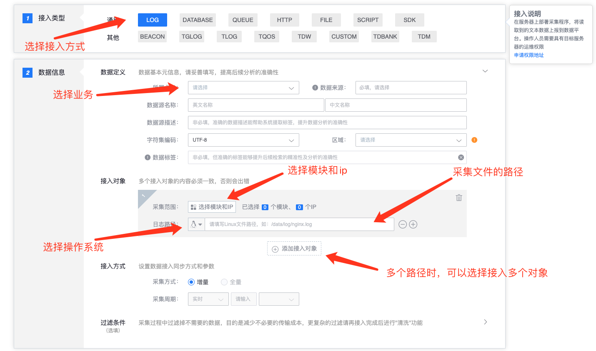

# 日志接入

## 简介

日志接入提供实时日志采集上报功能。能动态感知日志文件内容追加，新增日志文件，删除日志文件等事件，支持实时采集新增数据上报到数据平台。

## 采集原理

数据平台下发采集器和采集配置到目标机器上，托管到 gseAgent 下。

采集器会监控配置的日志路径，路径支持通配符，当有新的日志数据产生或者新日志文件产生时，能实时感知并采集上报。

_注意：不支持直接清空文件内容的回滚方式_

日志采集默认按行采集，支持配置过滤条件。数据上报支持打包上报，所以一次上报的数据可能是一行或者多行。数据上报格式默认为 json 格式，采集器会追加主机 IP 等附属信息。

## 接入准备

* 作业平台执行权限。采集器下发和重启都是依赖作业平台来执行，所以用户需要作业平台执行权限。

## 数据接入

### 数据信息

定义了源数据的基础信息，包含业务，源数据名称等。数据源名称由用户自己定义，在相同业务中不能重复。

### 接入对象

每个接入对象定义了接入范围，日志路径，操作系统。

* 采集范围：按模块或者 IP 接入;
* 日志路径支持通配符;
* 操作系统当前支持 Linux 和 Windows;

每个数据源支持配置多项接入对象。

### 接入方式

采集器为实时采集，暂时不可配置。

### 过滤条件

可选项，当日志量很大的时候可以筛选出指定的日志上报，用于减少不必要的传输成本。

过滤是按行过滤，每行日志按分隔符切分，当指定字段等于\(=\)配置的关键字时，这行日志才上报。

过滤条件可配置多项，支持灵活组装。过滤需要消耗本地 CPU 资源，过滤条件不适宜太多。

#### 接入界面示例如下

