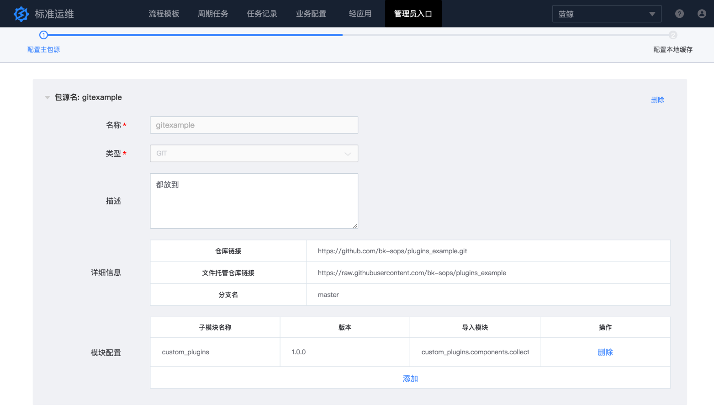
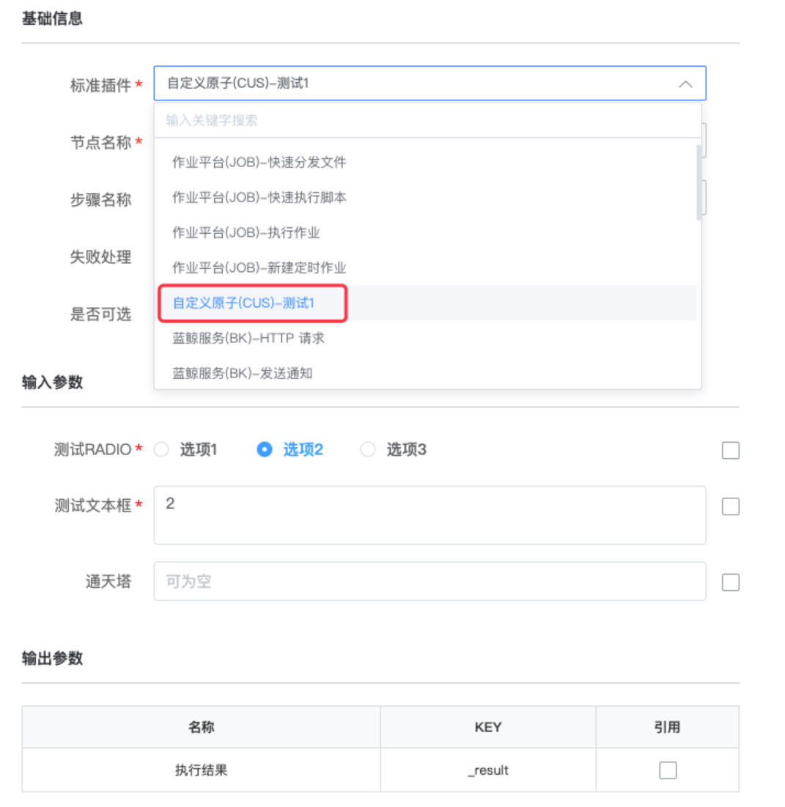
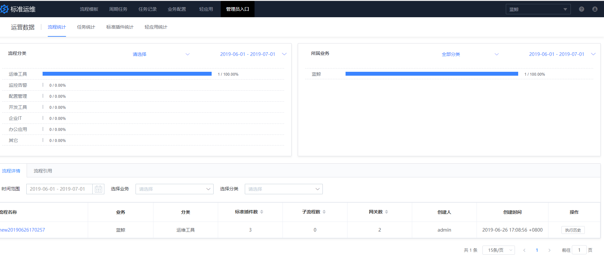
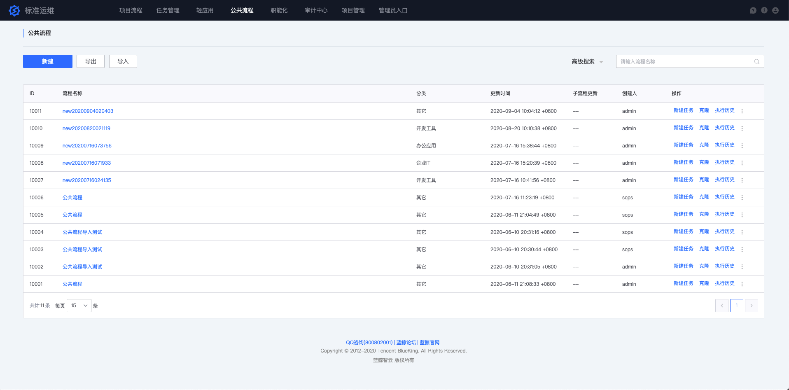

# 管理员入口
## 后台管理

包含远程插件包源管理，和远程插件同步。

后台管理可以让用户不修改标准运维源码就可以加载第三方插件，主要是为了解决标准插件开发和维护流程复杂的问题。 在之前的版本中， 用户如果想开发自定义插件，并发布到官方标准运维 SaaS 上使用，一般需要先拉取 bk-sops 源码在本地开发插件，测试通过后， 还需要把官方标准运维 SaaS 版本包在本地解压，然后添加自定义插件包到版本包中，并修改部分 settings 配置，然后重新打包并上传部署； 如果自定义插件需要额外安装 python 依赖包，那么用户还需要在 CentOS 机器上执行打包脚本才能完成官方 S-mart 应用打包操作。并且，后续用户开发的自定义插件有任何版本变动，都需要重新打包、上传、部署，维护成本很高。

而后台管理中通过对远程插件包的管理，让用户可以不需要解压官方包以及重新打包，只需要在自定义插件开发测试完成后， 在标准运维配置自定义插件包源信息，然后重新部署应用，就能自动加载插件。

1.配置主包源信息。在配置页面，填入需要的信息

2.重新部署后成功加载插件效果 在"新建流程"中编辑默认的标准插件节点，可以看到远程插件包源中的"自定义原子(CUS)-测试 1"，并且选择该插件后页面渲染正常。

## 运营数据

包含流程统计、任务统计、标准插件统计、轻应用统计 4 个维度的运营数据分析。

## 公共流程

公共流程是标准运维方便用户在不同业务中共用同一套流程模板的功能。用户可以新建公共流程，达到多业务共享公共流程模板的目的。

