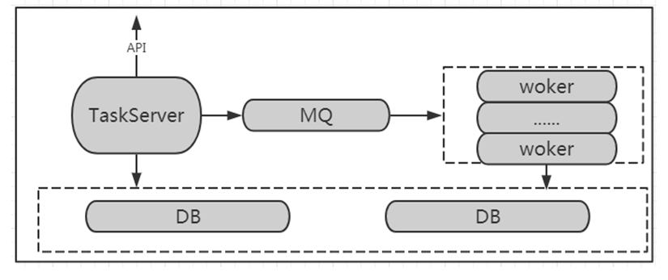

# 任务引擎子系统结构和功能

负责任务队列的维护，根据优先度分发到 woker 执行，并实时更新任务状态到数据库持久化存储。

其中 TaskServer 负责解析上层的任务执行计划，并把待执行的任务放到消息队列MQ中。

TaskServer 还负责提供对外 API ，让上层应用可以通过 API 来操作任务，如启动任务、暂停任务、恢复任务、终止任务等，并通过 API 实时轮训任务执行状态，以及获取任务执行耗时、日志等重要信息。

MQ 队列使用 RabbitMQ ，接收 TaskServer 发送过来的任务，并根据优先级把任务分派给空闲的 worker 执行。

Worker 使用了 python 的 celery 包，负责在应用后台执行具体的某个任务。

Worker 还负责把任务的执行结果写入数据库 DB ，DB 可以持久化的存储任务信息，并让 TaskServer 可以查询任务的数据库记录获取任务信息。

