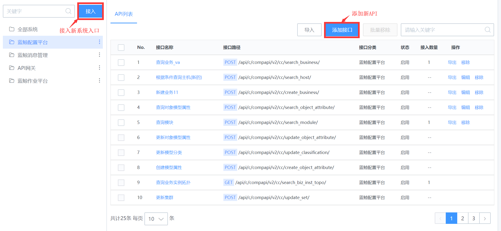
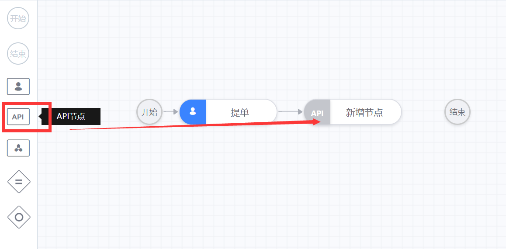
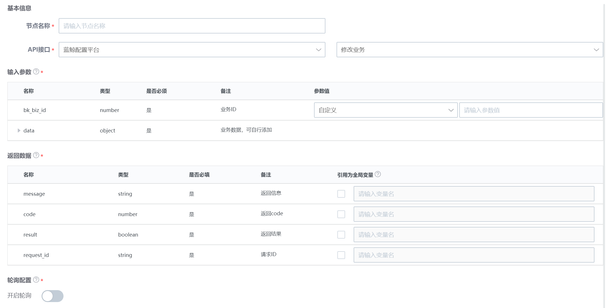
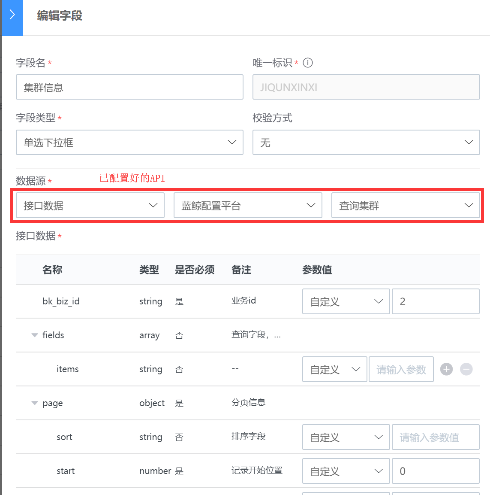

## API配置

当你在流程中需要引用第三方系统来进行自动处理，或者需要引用第三方系统中的某些数据作为流程中的必要信息时，可以通过API配置功能对第三方系统的接口进行管理。配置完成后，在流程节点设置过程中，可以直接引用这些API。

【流程服务】中内置了部分蓝鲸体系内的系统API，可以根据需要自行取用或维护。

>   \*API配置模块具有一定门槛，需要管理员对API间的调用协议有比较充分的了解。

1.  新增API

    新增API之前，需要先接入系统。接入系统后，可以添加API至该系统下。

API配置页面

2.  API使用

-   API节点

    在设计流程时，可以通过拖拽API节点来直接选择合适的API。选定之后，通过相应的字段参数关联设置，在流程应用后，单据流转到该节点时，自动调用相应API进行处理及流转。

添加API节点

API节点配置页面

-   API字段

    在对流程节点的字段进行管理时，如果字段值需要从第三方系统调用或引用，则设置该字段值时，可以将其数据来源设置为从API获取。

API字段配置列表
