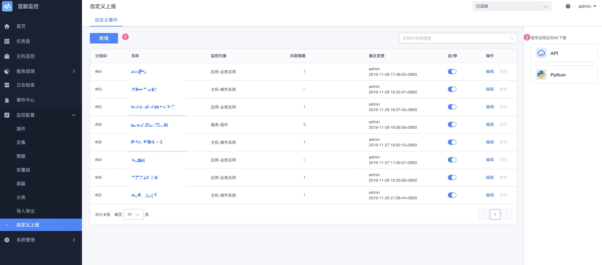
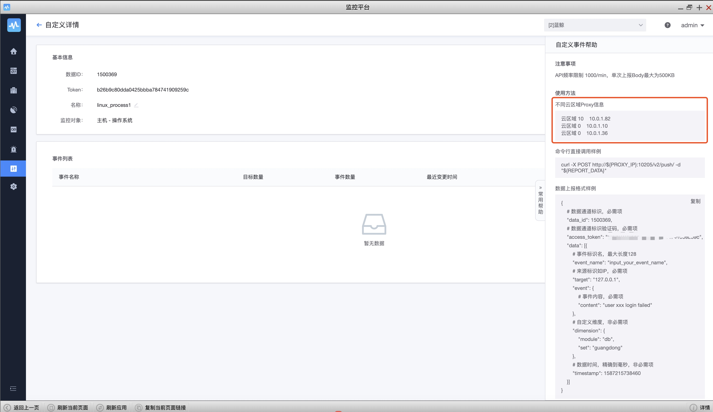

# 自定义上报

自定义上报是支持用户不安装 Agent 的情况下，直接通过 HTTP上报的方式，常见的就是是在程序里面进行打点打报。

自定义上报主要是注册自定义上报，只有先注册了才可以进行打点上报，分为自定义事件和自定义指标数据。

## 前置步骤

**自定义指标数据上报工作原理**：


**自定义事件数据上报工作原理**：


## 主功能一览

* SDK
* 自定义事件 分类/分组
* 特性 ID
* 自定义命令行工具

## 功能说明



#### 自定义事件上报


自定义事件利用http协议，通过bkmonitorproxy上报事件数据。

1. 上报IP及端口
     bkmointorproxy服务端口为10205。而为了让在不同云区域下的主机都可以正常上报数据，蓝鲸监控将bkmonitorproxy部署到各个云区域：
     - 直连区域
       bkmonitorproxy将会由部署到指定的直连区域主机上。
     - 非直连区域
       bkmonitorproxy将会部署到各个非直连区域的GSE proxy主机上。此时，需要参考页面上对应云区域的上报IP。进一步，对于有条件搭建域名服务的环境，可以考虑在不同云区域下搭建独立的域名服务，为GSE proxy提供统一的域名，方便不同云区域的上报域名统一。
     如下图，页面查找上报IP：
    


#### 上报格式说明

- 上报格式：json
- 参数说明：
- data_id：数据管道ID，一个事件组使用同一个数据管道ID
- access_token：数据通道标识验证码，防止数据误上报至其他管道
- data：上报事件集合
  - event_name：事件标识名
  - target：事件产生来源，可以理解为监控目标
  - event：事件详细内容
    - Content：事件具体内容文字描述
  - dimension：事件维度，具体字段及内容可自定义填写
  - timestamp：事件发生时间，单位ms

#### 使用样例

   自定义系统事件监控，需要检查上报系统登录异常事件，通过curl上报样例:

   ```bash
   curl -X POST http://${PROXY_IP}:10205/v2/push/ -d '{
       "data_id": 1500369,
       "access_token": "b26b9c80dda0425bbba784741909259c",
       "data": [{
           "event_name": "login_failed",
           "target": "0:192.168.0.1",
           "event": {
               "content": "user->[user00] login failed"
           },
           "dimension": {
               "module": "db",
               "set": "guangdong"
           },
           "timestamp": 1587218838000
       }]
   }'
   ```

   Python语言利用requests库上报样例

   ```python
   import requests
   import json
   result = requests.post('http://${PROXY_IP}:10205/v2/push/', data=json.dumps({
       "data_id": 1500369,
       "access_token": "b26b9c80dda0425bbba784741909259c",
       "data": [{
           "event_name": "login_failed",
           "target": "0:192.168.0.1",
           "event": {
               "content": "user->[user00] login failed"
           },
           "dimension": {
               "module": "db",
               "set": "guangdong"
           },
           "timestamp": 1587218838000
       }]
   }))
   ```

   返回内容：

   ```bash
{"code":"200","message":"success","request_id":"a75ad22e-3c4f-4481-9096-c4947bf47187","result":"true"}
   ```

   表示上报成功。

### 自定义命令行工具

具体查看[自定义命令行工具介绍](../../guide/custom-report-tools.md)

### 注意事项

   - API频率限制 1000/min，单次上报Body最大为500KB；如果有更大量级数据的上报需求，请考虑使用插件方式上报数据.
   - bkmonitorproxy部署说明
       - 直连区域
          直连区域的部署依赖环境管理员通过监控后台提供的命令进行部署。需要注意，部署的直连区域机器10205端口应该保持可用，并确保直连区域机器到该机器间的网络可用。部署操作命令如下：

```bash
# 登录到中控机
source /data/install/utils.fc
ssh $BKMONITORV3_MONITOR_IP
workon bkmonitorv3-monitor
# 执行部署bkmonitorproxy
./bin/manage.sh deploy_official_plugin --plugin_name bkmonitorproxy --target_hosts ${target_ip},${target_ip}
```

> 其中填写的target_ip将会在页面上显示为云区域0(直连区域)的上报IP

- 非直连区域
  - bkmonitorproxy的更新依赖节点管理插件管理功能。在首次使用自定义事件上报功能 或 bkmonitorproxy有更新的时候，需要在节点管理中更新bkmonitorproxy。

