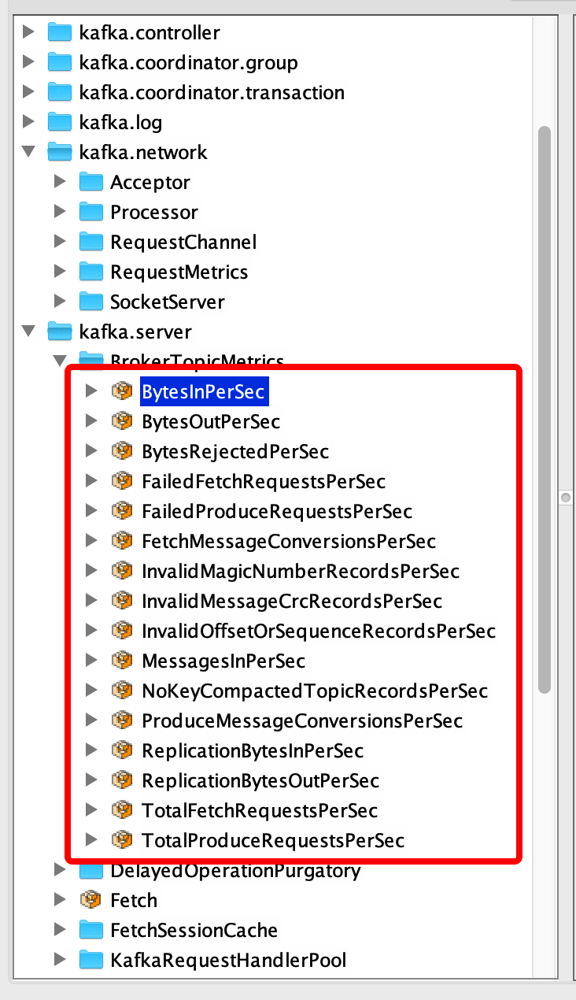
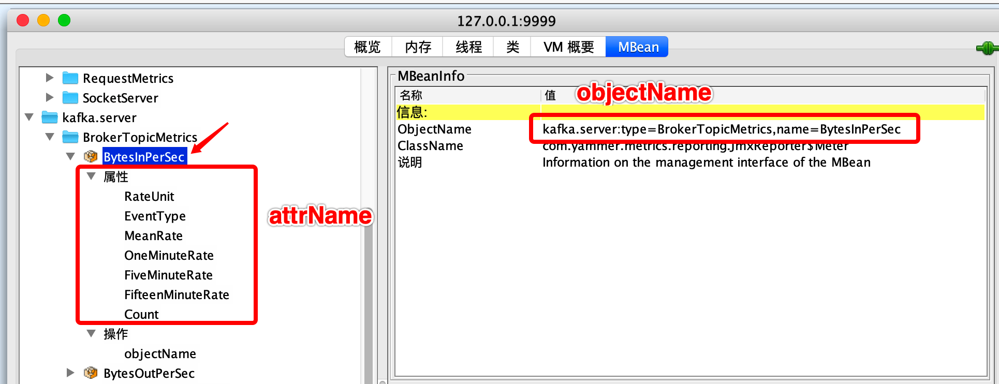

# 如何在线制作JMX插件

JMX 插件工作原理：


# 自定义一个JMX插件

## 开启 JMX 远程访问功能

java 默认自带的了 JMX RMI 的连接器。所以，只需要在启动 java 程序的时候带上运行参数，就可以开启 Agent 的 RMI 协议的连接器

### 自研 java 程序

例如 java 程序为 `app.jar`，其启动命令为

```bash
java -jar app.jar
```

若要开启 JMX 远程访问功能，需要添加如下启动参数

```bash
java -jar app.jar \
-Dcom.sun.management.jmxremote \
-Dcom.sun.management.jmxremote.port=9999 \
-Dcom.sun.management.jmxremote.authenticate=false \
-Dcom.sun.management.jmxremote.ssl=false
```

参数说明

| 参数名 | 类型   | 描述 |
| ----- | ------ | ---- |
| `-Dcom.sun.management.jmxremote` | 布尔 | 是否支持远程JMX访问，默认true。**此项必须开启才能正常进行监控采集** |
| `-Dcom.sun.management.jmxremote.port` | 数值 | 监听端口号，用于远程访问 |
| `-Dcom.sun.management.jmxremote.authenticate` | 布尔 | 是否需要开启用户认证，默认 `true`。开启后需要提供用户名与密码才能进行采集 |
| `-Dcom.sun.management.jmxremote.ssl` | 布尔 | 是否对连接开启SSL加密，默认`true`。**当前版本暂不支持SSL加密，请将此项设置为 false** |
| `-Dcom.sun.management.jmxremote.access.file` | 字符串 | 用户权限配置文件的路径，默认为 `JRE_HOME/lib/management/ jmxremote.access`。当 `-Dcom.sun.management.jmxremote.authenticate` 配置为 `true` 时，该配置才会生效 |
| `-Dcom.sun.management.jmxremote. password.file` | 字符串 | 用户密码配置文件的路径，默认为 `JRE_HOME/lib/management/ jmxremote.password`。当 `-Dcom.sun.management.jmxremote.authenticate` 配置为 `true` 时，该配置才会生效 |

`jmxremote.password` 文件样例

```bash
# specify actual password instead of the text password
monitorRole password
controlRole password
```

`jmxremote.access ` 文件样例

```bash
# The "monitorRole" role has readonly access.
# The "controlRole" role has readwrite access.
monitorRole readonly
controlRole readwrite
```

更多 JMX 配置参数详情，可参考 [官方文档](https://docs.oracle.com/javase/7/docs/technotes/guides/management/agent.html#gdeum)

### 第三方组件

各个组件的远程 JMX 开启方式，请参考各组件文档

### 检查是否启动成功

客户端可以通过以下 URL 去远程访问 JMX 服务。其中，`hostName` 为目标服务的主机名/IP，`portNum` 为以上配置的 `jmxremote.port`

```bash
service:jmx:rmi:///jndi/rmi://${hostName}:${portNum}/jmxrmi
```

可通过以下两种方式检查是否已经配置成功

1. 简单地可通过检查端口是否存在，以及 PID 是否匹配，来确认 JMX 远程访问是否已经成功启动

```bash
netstat -anpt | grep ${portNum}
```

2. 如果安装了 JConsole，也可直接连接测试


连接成功后，即可进入管理页面


## 采集配置

蓝鲸监控中的 JMX 采集是基于 [Prometheus JMX Exporter](https://github.com/prometheus/jmx_exporter) 实现的。插件定义页面的“采集配置”对应了JMX Exporter的 `config.yaml` 配置文件。它决定了该插件将会采集哪些指标，以及决定以何种格式输出。配置文件的定义方式有两种：

### 使用配置模板

JMX Exporter 官方提供了常用组件的 [配置模板](https://github.com/prometheus/jmx_exporter/tree/master/example_configs) ，可直接使用

### 手动配置

若配置模板不能满足需求，也可通过手动配置，以下是一个配置样例

```yaml
startDelaySeconds: 0
lowercaseOutputName: false
lowercaseOutputLabelNames: false
whitelistObjectNames: ["Catalina:*", "java.lang:*"]
blacklistObjectNames: ["Catalina:j2eeType=Servlet,*"]

rules:
  - pattern: 'Catalina<type=ThreadPool, name="(\w+-\w+)-(\d+)"><>(currentThreadCount|currentThreadsBusy|keepAliveCount|pollerThreadCount|connectionCount):(.*)'
    name: tomcat_threadpool_$3
    value: $4
    valueFactor: 1
    labels:
      port: "$2"
      protocol: "$1"
```

- 字段说明

| 字段名                    | 含义                                                         |
| ------------------------- | ------------------------------------------------------------ |
| startDelaySeconds         | 启动延迟。延迟期内的任何请求都将返回空指标                   |
| lowercaseOutputName       | 小写输出指标名称。适用于name。默认为false                    |
| lowercaseOutputLabelNames | 小写输出指标的标签名称。适用于labels。默认为false            |
| whitelistObjectNames      | 要查询的ObjectNames列表。默认为所有mBeans                    |
| blacklistObjectNames      | 要查询的ObjectNames列表。优先级高于whitelistObjectNames。默认为none |
| rules                     | 要按顺序应用的规则列表，在第一个匹配到的规则处停止处理。不收集不匹配的属性。如果未指定，则默认以默认格式收集所有内容 |
| pattern                   | 用正则表达式模式匹配每个bean属性。匹配值(用小括号标识一个匹配值)可被其他选项引用，引用方式为$n(表示第n个匹配值)。默认为匹配所有内容 |
| name                      | 指标名称。可以引用来自pattern的匹配值。如果未指定，将使用默认格式：`domain_beanPropertyValue1_key1_key2_…keyN_attrName` |
| value                     | 指标的值。可以使用静态值或引用来自pattern的匹配值。如果未指定，将使用mBean值 |
| valueFactor               | 用于将指标的值value乘以该设置值，主要用于将mBean值从毫秒转换为秒。默认为1 |
| labels                    | 标签名称到标签值的映射。可以引用来自pattern的匹配值。使用该参数必须先设置name。如果使用了name但未指定该值，则不会输出任何标签 |

- pattern 格式说明

```bash
domain<beanpropertyName1=beanPropertyValue1, beanpropertyName2=beanPropertyValue2, ...><key1, key2, ...>attrName: value
```

| Part                  | Description                                                  |
| --------------------- | ------------------------------------------------------------ |
| domain                | Bean名称，JMX object name 中冒号之前的部分                   |
| beanProperyName/Value | Bean属性，JMX object name 中冒号后面的键/值；多个之间用**逗号+空格**分割 |
| keyN                  | 当遇到复合或表格数据的属性时，将该属性的名称添加到此列表中；多级之间用逗号+空格分割；一般很少用到，留空即可 |
| attrName              | 属性的名称，即监控指标                                       |
| value                 | 属性的指，即监控指标的值，一般很少使用                       |

说明：对于上述各个 part，均支持正则表达式，指标字段(attrName)维度字段(beanProperyName)两个 part 常用正则匹配


- pattern 变量引用说明

  pattern 参数中的正则匹配的结果支持通过 `$` 引用，用于 `name`、`value`、`labels` 等参数的自定义，被引用的正则需用括号 `()` 标识，根据顺序号进行引用。

  在上述的 pattern： `Catalina<type=ThreadPool, name="(\w+-\w+)-(\d+)"><>(currentThreadCount|currentThreadsBusy|keepAliveCount|pollerThreadCount|connectionCount):(.*)` 中，变量引用含义如下

| 变量名 | 代表匹配的字符串 |
| ------ | ---------------- |
| $1     | `(\w+-\w+)`     |
| $2     | `(\d+)`          |
| $3     | `(currentThreadCount|currentThreadsBusy|keepAliveCount|pollerThreadCount|connectionCount)` |
| $4     | `(.*)` |


**请注意，无论是何种配置方式，配置文件都必须严格包含以下属性**。否则蓝鲸监控将无法正确地进行指标采集

```yaml
username: {{ username }}
password: {{ password }}
jmxUrl: {{ jmx_url }}
ssl: false
```

结合上述例子，一个完整的 JMX 采集配置如下。将以下配置输入到插件配置页面中即可

```yaml
# ==== 固定配置开始 ====
username: {{ username }}
password: {{ password }}
jmxUrl: {{ jmx_url }}
ssl: false
# ==== 固定配置结束 ====

# ==== 自定义配置开始 ====
startDelaySeconds: 0
lowercaseOutputName: false
lowercaseOutputLabelNames: false
whitelistObjectNames: ["Catalina:*", "java.lang:*"]
blacklistObjectNames: ["Catalina:j2eeType=Servlet,*"]

rules:
  - pattern: 'Catalina<type=ThreadPool, name="(\w+-\w+)-(\d+)"><>(currentThreadCount|currentThreadsBusy|keepAliveCount|pollerThreadCount|connectionCount):(.*)'
    name: tomcat_threadpool_$3
    value: $4
    valueFactor: 1
    labels:
      port: "$2"
      protocol: "$1"
# ==== 自定义配置结束 ====
```

## 定义参数

JMX 插件不支持自定义参数，均为固定参数，这些固定参数将用于渲染采集配置中形如 `{{ username }}` 的占位符。各固定参数含义如下：

- 监听端口: JMX Exporter 启动时监听的 HTTP 端口，注意不是 JMX 端口

- 连接字符串: JMX RMI 的 URL，格式为 `service:jmx:rmi:///jndi/rmi://${hostName}:${portNum}/jmxrmi`。`hostName` 为目标服务的主机IP，`portNum` 为 JMX 监听的端口号。将替换采集配置中的 `{{ jmx_url }}`
- 用户名: 若开启了用户认证，则需要输入，否则置空。将替换采集配置中的 `{{ username }}`
- 密码: 若开启了用户认证，则需要输入，否则置空。将替换采集配置中的 `{{ passowrd }}`

## 指标维度

在插件调试获取到结果后，根据实际需要定义指标和维度

# Kafka 插件定义示例

## 开启 JMX 远程访问功能

1. 导入以下环境变量

```bash
export JMX_PORT=9999
```

2. 启动 kafka

3. 使用 JConsole 连接，可观察到已经获取到一系列的 MBean


## 定义配置文件

例如，需要采集 `kafka.server` ，`type=BrokerTopicMetrics`的 MBean。如下图。具体 MBean 的含义信息可以查看 kafka 组件文档： [ JMX 指标信息](http://kafka.apache.org/documentation/#remote_jmx)



### 查看 MBean 详情

先从 `ByteInPerSec` 入手，点击查看 MBeanInfo，其中 `objectName` 和 `attrName` 需要关注



### 定义最简化 rules

假设要获取 `MeanRate` 这个属性，根据上述 pattern 规则，可以写成以下形式

```bash
kafka.server<type=BrokerTopicMetrics, name=BytesInPerSec><>MeanRate
```

`objectName` 以冒号为分割，可拆分两部分，domain 和 beanPropery，在上述例子中 `kafka.server` 为 domain，`type=BrokerTopicMetrics, name=BytesInPerSec` 为 beanPropery。最后面的 `MeanRate` 则是属性名。请注意，**两个 beanPropery 之间必须使用 逗号 + 空格 进行分割，空格不可缺少！**

最后得出的 rules 配置如下，`name` 字段作为数据上报的指标名

```yaml
rules:
-  pattern: kafka.server<type=BrokerTopicMetrics, name=BytesInPerSec><>MeanRate
   name: kafka_server_bytesinpersec
```

### 在页面上填写完整配置

```yaml
username: {{ username }}
password: {{ password }}
jmxUrl: {{ jmx_url }}
ssl: false
# 以上内容无需修改，下面为自定义配置
# 配置说明请参考 https://github.com/prometheus/jmx_exporter#configuration
startDelaySeconds: 0
lowercaseOutputName: true
lowercaseOutputLabelNames: true

rules:
-  pattern: kafka.server<type=BrokerTopicMetrics, name=BytesInPerSec><>MeanRate
   name: kafka_server_bytesinpersec
```

### 进入调试页面


填写相关参数，然后点击“开始调试”，稍等片刻后可查看调试输出

可查看到包含类似以下的 json 数据，说明配置成功

```json
{
	"key":"kafka_server_bytesinpersec",
	"labels":{

	},
	"value":691816711161
}
```

### 配置 labels

除了 `MeanRate` 外，如果想要在一张图表内同时展示 `OneMinuteRate`，`FiveMinuteRate`，`FifteenMinuteRate`，则需要配置 labels

根据 pattern 规则，配置如下

```yaml
rules:
-  pattern: kafka.server<type=BrokerTopicMetrics, name=BytesInPerSec><>(MeanRate|OneMinuteRate|FiveMinuteRate|FifteenMinuteRate)
   name: kafka_server_bytesinpersec
   labels:
     type: $1
```

`MeanRate|OneMinuteRate|FiveMinuteRate|FifteenMinuteRate` 代表匹配以上几个属性，外层使用`()`，则可以被下面的字段所引用，由于在这个 pattern 只有一组括号，因此 `$1` 就可以匹配。

`labels` 对应了监控的维度，key-value 分别代表维度名和维度值，在这里`type`是维度名，`$1` 是维度值

调试结果

```json
[
    {
        "key":"kafka_server_bytesinpersec",
        "labels":{
            "type":"MeanRate"
        },
        "value":297575.117976
    },
    {
        "key":"kafka_server_bytesinpersec",
        "labels":{
            "type":"OneMinuteRate"
        },
        "value":361639.591095
    },
    {
        "key":"kafka_server_bytesinpersec",
        "labels":{
            "type":"FiveMinuteRate"
        },
        "value":312505.738508
    },
    {
        "key":"kafka_server_bytesinpersec",
        "labels":{
            "type":"FifteenMinuteRate"
        },
        "value":304602.237208
    }
]
```

### 配置更多指标

继续配置 `ByteOutPerSec` 等指标，根据上面的例子，直接新增一条rules即可

```yaml
rules:
-  pattern: kafka.server<type=BrokerTopicMetrics, name=BytesInPerSec><>(MeanRate|OneMinuteRate|FiveMinuteRate|FifteenMinuteRate)
   name: kafka_server_bytesinpersec
   labels:
     type: $1
-  pattern: kafka.server<type=BrokerTopicMetrics, name=BytesOutPerSec><>(MeanRate|OneMinuteRate|FiveMinuteRate|FifteenMinuteRate)
   name: kafka_server_bytesoutpersec
   labels:
     type: $1
```

### 使用pattern变量定义指标

配置了更多的指标后会发现，很多 rule 除了某个字段有区别，其他的都一致，因此可以将存在差异的部分抽象为变量，减少配置成本

```yaml
rules:
-  pattern: kafka.server<type=BrokerTopicMetrics, name=(\w+)><>(MeanRate|OneMinuteRate|FiveMinuteRate|FifteenMinuteRate)
   name: kafka_server_$1
   labels:
     type: $2
```

## 定义指标

根据上述配置，可得出以下指标与维度：

- `kafka_server_bytesoutpersec`: 包含维度 `type`
- `kafka_server_bytesinpersec`: 包含维度 `type`

维度组合相同的指标，可以将其归到同一个分类，如下图


## 调试并保存插件

调试并确认数据上报正常后，可进入下一步对插件进行保存。自此，一个 JMX 插件即制作完成

# tomcat插件使用

## 添加manager角色并设置用户名和密码

编辑 `conf` 目录下的 `tomcat-user.xml` 文件，添加 manager 角色并设置用户名和密码：

配置示例：

``` java
<?xml version="1.0" encoding="utf-8"?>
<tomcat-users>
<role rolename="manager-jmx"/>
<user username="tomcat" password="tomcat" roles="manager-jmx"/>
</tomcat-users>
```

## 增加jmx的启动参数

编辑  `bin/catalina.sh` 在 JAVA_OPTS 后面增加

```java
CATALINA_OPTS="$CATALINA_OPTS -Dcom.sun.management.jmxremote"
CATALINA_OPTS="$CATALINA_OPTS -Djava.rmi.server.hostname=127.0.0.1"
CATALINA_OPTS="$CATALINA_OPTS -Dcom.sun.management.jmxremote.port=9011"
CATALINA_OPTS="$CATALINA_OPTS -Dcom.sun.management.jmxremote.ssl=false"
CATALINA_OPTS="$CATALINA_OPTS -Dcom.sun.management.jmxremote.authenticate=false"
```

* `-Dcom.sun.management.jmxremote`: 启用 jmxremote 功能；
* `-Dcom.sun.management.jmxremote.port=9011`：jmxremote 监听端口，用于客户端连接，样例设为9011；
* `-Dcom.sun.management.jmxremote.ssl=false`：是否启用 SSL 连接，样例设为 false；
* `-Dcom.sun.management.jmxremote.authenticate=true`：开启用户认证连接；
* `-Dcom.sun.management.jmxremote.password.file=/usr/share/tomcat/conf/jmxremote.password`：认证用户密码文件，样例设为 `/usr/share/tomcat/conf/jmxremote.password`；
* `-Dcom.sun.management.jmxremote.access.file=/usr/share/tomcat/conf/jmxremote.access`：认证用户权限配置文件，样例设为 `/usr/share/tomcat/conf/jmxremote.access`。
* 如果不启用用户认证，将选项 `Dcom.sun.management.jmxremote.authenticate` 的值设为false，也无需再设置选项 `Dcom.sun.management.jmxremote.password.file` 和 `Dcom.sun.management.jmxremote.access.file`。

## 参数说明

| 参数名 | 含义 | 使用举例 |
| --- | --- | ---- |
| port | exporter监听的端口，提供给采集器使用 | 9110 |
| username | 采集目标认证用户名,没有就为空 | test |
| password | 采集目标认证密码,没有就为空 | test123 |
| jmx_url | 采集目标的jmx连接字符串 | service:jmx:rmi:///jndi/rmi://localhost:9011/jmxrmi |

如上配置所示，采集器将会根据你配置的内容，定期在本地访问 localhost:9011的 tomcat jvm 以获取 Tomcat 的指标数据。
