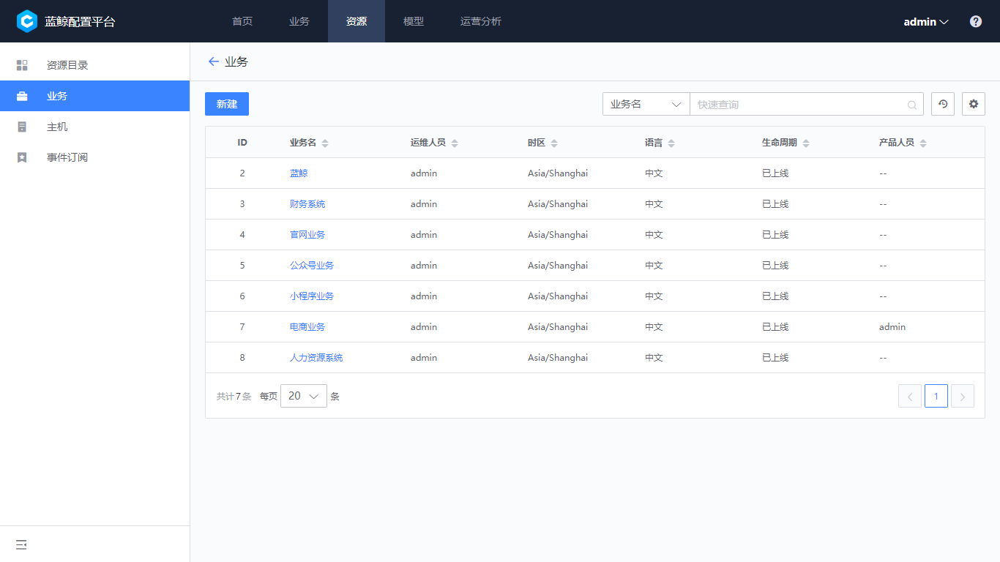
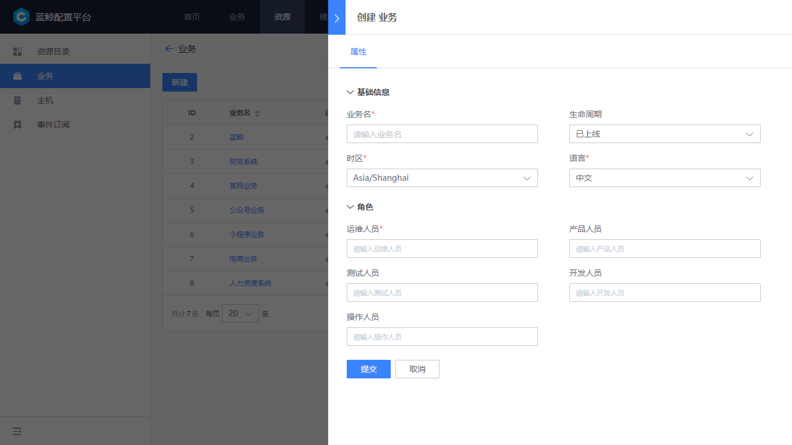

# 业务管理

业务是蓝鲸 CD 体系中比较重要的概念，日常使用中主机、进程、业务拓扑的管理都需要依赖已经存在业务。

图1.业务管理

## 创建新的业务

当拓扑形态、管理模式、部署区域或者管理人员有比较大的区别的时，建议创建一个新的业务，使用业务隔离相关资源的使用和权限。

新建业务的一些关键属性解释：

- 业务名：用于识别业务的名称
- 生命周期：用于标识当前业务的运营阶段。
- 时区：蓝鲸支持跨国管控，在监控场景和数据挖掘场景等要求配置业务正确的时区
- 语言：在 SaaS 场景中，会根据配置发送不同语言的通知
- 运维人员：在
- CD 大场景中，运维通常被认为是业务的管理者，所以在业务中运维为必填属性

图2.新建业务

## 蓝鲸业务

在蓝鲸搭建以后，会自动创建“蓝鲸”业务，初始化了蓝鲸自身的模块、进程分布情况，此业务可以用于监控、扩缩容等操作，业务不可以被删除。
