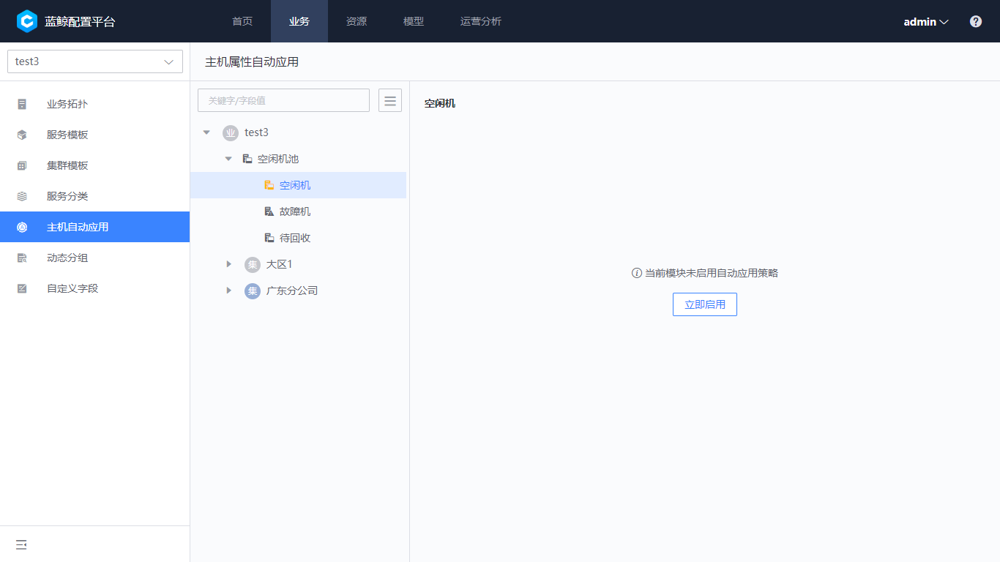
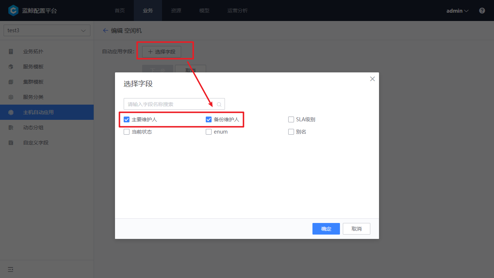
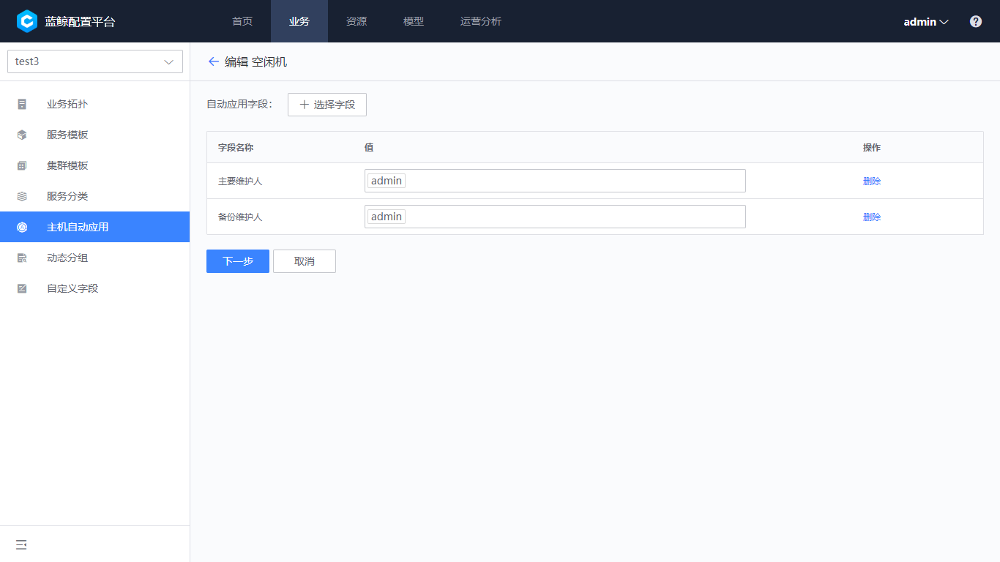
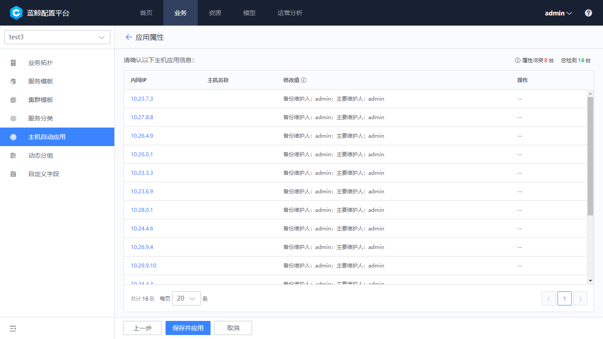
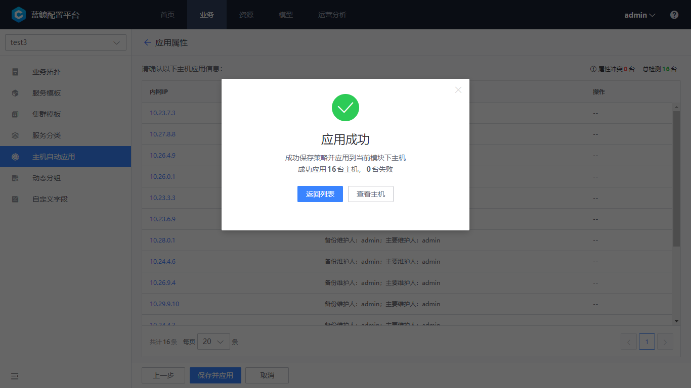
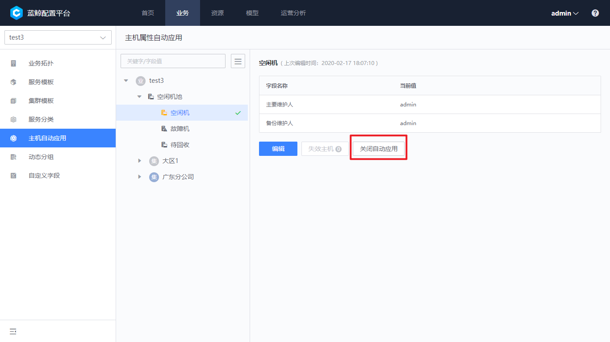
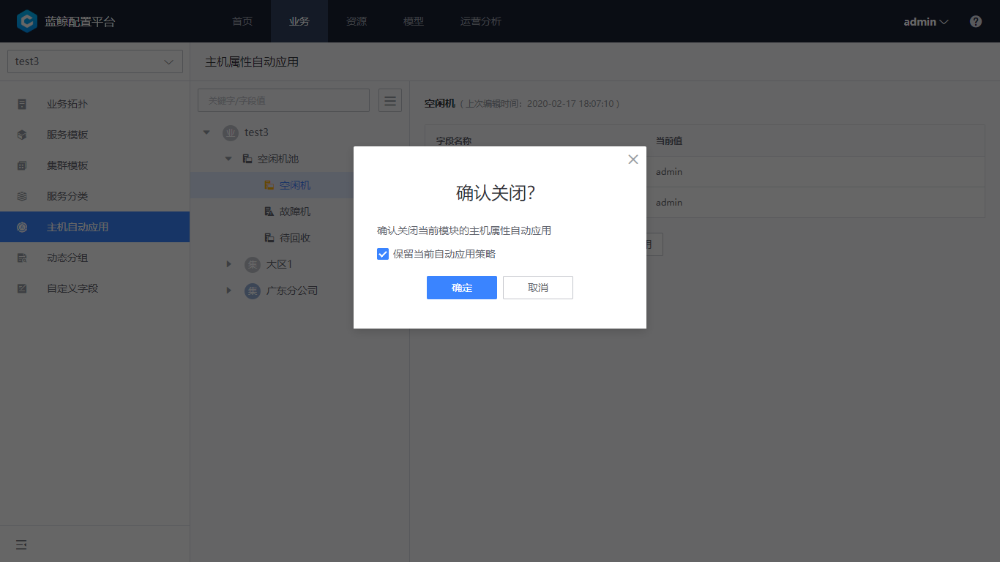

# 主机自动应用

主要用于配置主机属性的自动应用。即主机发生转移或新加入模块，会根据目标模块的策略自动触发修改主机属性

## 启用自动应用

进入到“业务-主机自动应用”，选择需要配置的模块（支持选择空闲机或者普通的业务模块），点击右侧的“立即启用”

图1：启用自动应用

启动自动应用有两个步骤。

步骤一：配置自动应用的属性

图2：选择需要配置自动应用的属性

图3：配置自动应用属性

步骤二：现存主机属性修改为自动应用配置

此步骤会把当前模块中所有主机与配置的属性设定为一致，列表中显示了哪些主机的属性需要修改。

需要注意的是，第二个步骤执行完成，策略才能够保存，中途退出策略的配置会被丢弃

图4：应用到现有主机

图5：策略保存成功

自动应用策略配置成功以后，当主机新增到当前模块，会自动应用配置的属性（此案例中会把主要负责人和备份负责人设定为 admin）

## 关闭自动应用

自动应用策略已经生效时，可以在左侧的拓扑中看到对应模块后有一个绿色的对号。

当模块不再需要自动配置的特性时候，点击拓扑树上对应的模块，然后点击关闭。

图6：关闭自动应用

这时候会弹出一个提示框，是否保存当前的配置项，如果只是临时关闭，可以选择保存，后续需要应用的时候再启用，之前的配置过的属性就不需要重复选择和填写。如果是不再需要配置，选择不保存即可，下次再次开启，从零开始配置。

关闭自动应用的时候，已经存在当前模块的主机属性不会发生变动。

此外在关闭状态，无论是否保存了之前的配置，主机移入当前模块，属性不会发生改变。

图7：关闭自动应用确认

