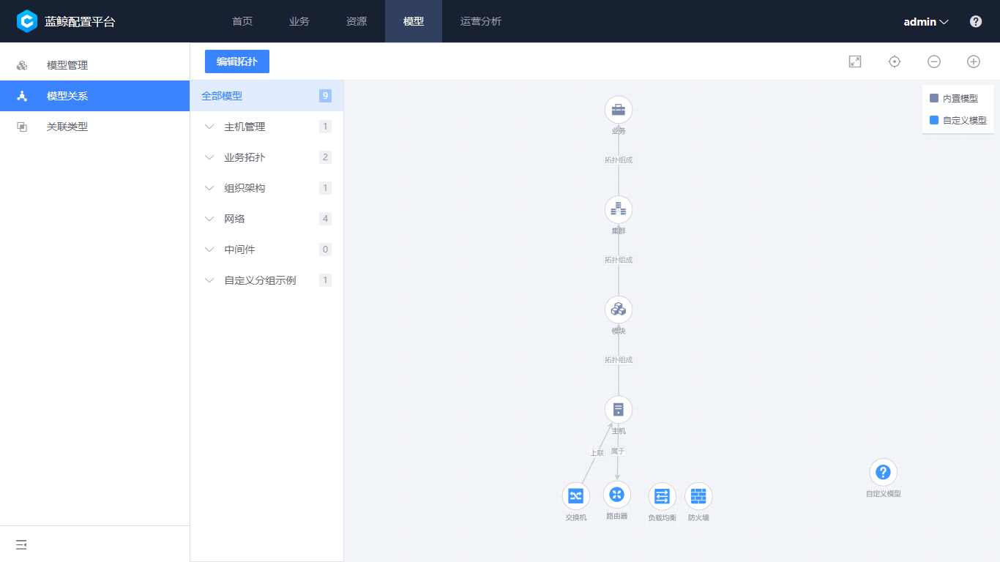
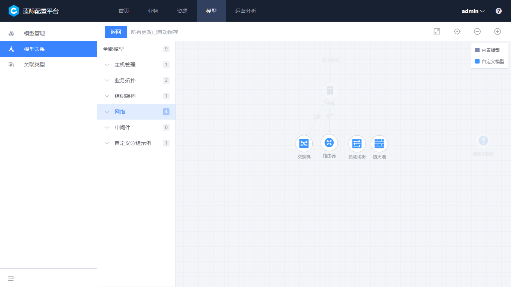
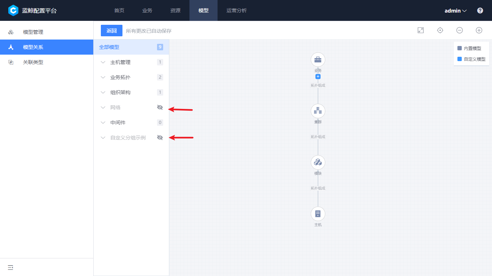
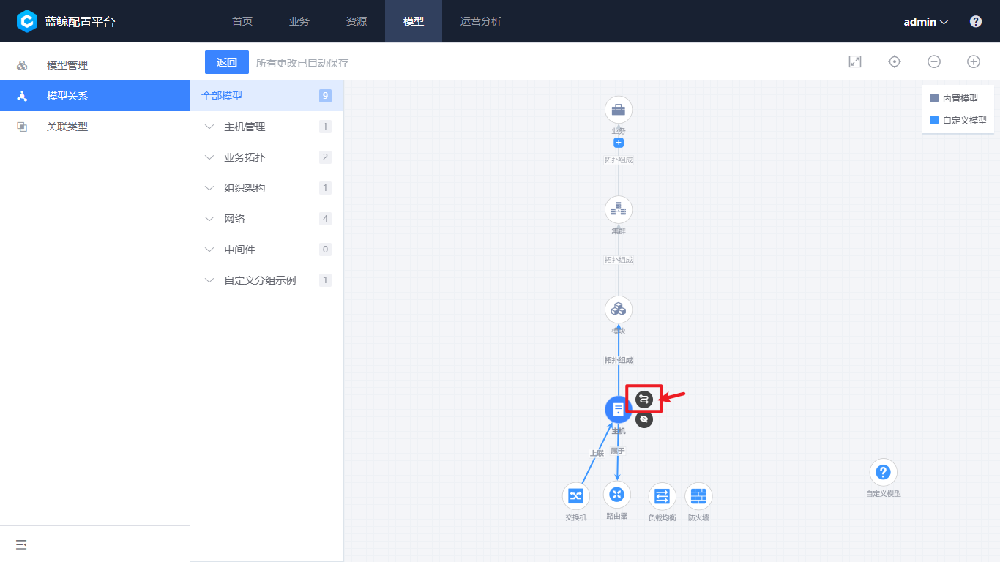
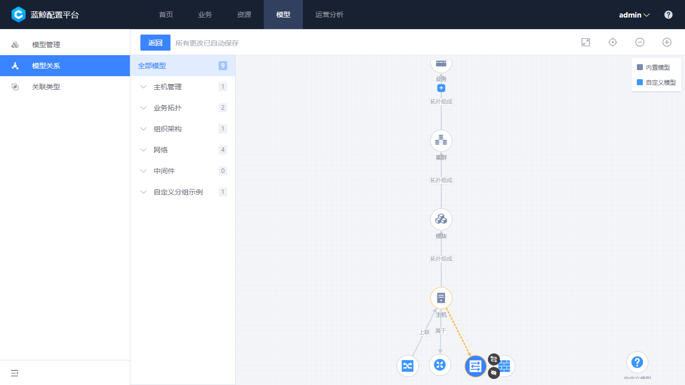
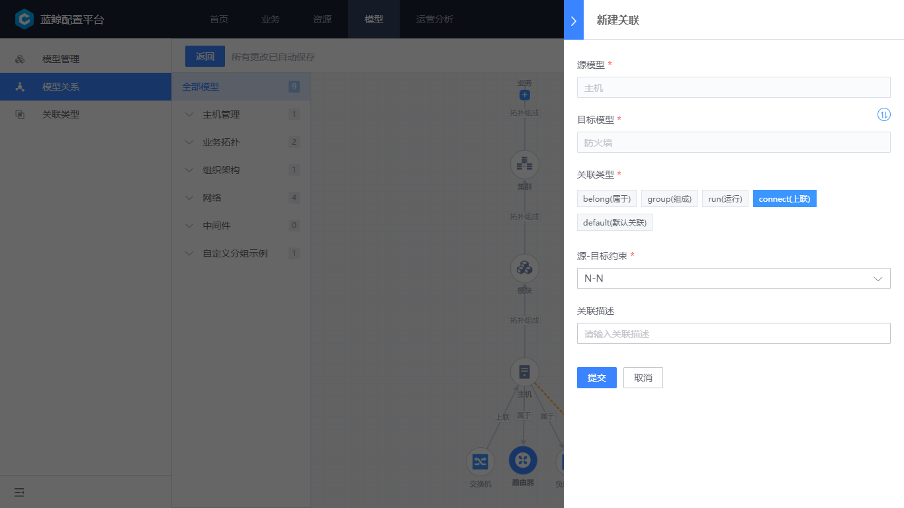
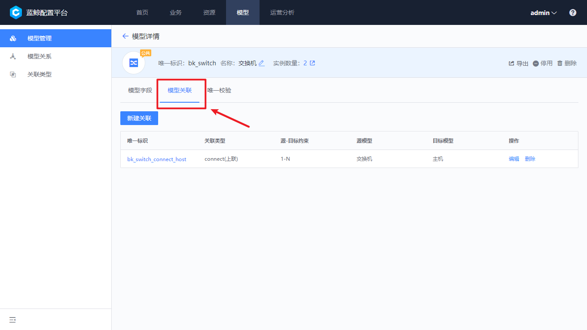

# 模型关系

在真实的 CMDB 管理中，数据之间天然存在关系。模型关系功能可以定义模型之间是如何关联。

图1.模型关系视图

## 基础视图操作

进入到“模型-模型关系”功能，默认会显示当前 CMDB 所有的模型和关系配置图，点击左侧分组列表可以快速聚焦到当前分组下的模型。

图2.切换到分组视图

点击模型或模型分组的后的隐藏按钮，可以隐藏部分不常用的模型。

图3.隐藏模型分组

## 新建模型关系

进入到“模型-模型关系”功能，点击“编辑拓扑”按钮进入编辑模式，此时鼠标悬停在模型上会出现创建关联关系功能，选中另外一个模型以后出现新建关联对话框。选择合适的关联类型和约束方式即可创建一组模型关联。相关描述如下：

- 源模型-目标模型：模型之间的关系有方向属性，视图上以箭头方向区分。默认情况下指针从源模型指向目标模型。您也可以在关联类型中调整指向方式
- 关联类型：系统自带常见的几种关联类型“属于”、“组成”、“运行”、“上联”、“默认”
- 目标约束：默认为 N-N，一个源实例可以关联多个目标实例，任意一个目标实例也可以被多个源实例关联。1-N 约束含义是一个源实例可以关联任意多个目标实例，但目标实例如果已经被源关联后，不可以再关联其他源实例。1-1 约束含义是一个源实例只可以关联一个目标实例，一个目标实例也只可以关联一个源实例。
- 关联描述：当前关系的别名，以便用户识别。

图4.编辑模式

图5.可视化创建关联

图6.新建关联确认

## 删除建模型关系

在编辑模式下，再次点击关联关系，可以查看或删除当前关联。

需要注意的是，为了保障系统的基础功能，部分内置关联不可以删除和修改。

## 模型管理中创建关系

当模型数量过多，视图中并不便于操作的时候，您可以在“模型-模型管理”找到对应模型，切换到模型关系标签创建关联。

图7.新建关联确认

