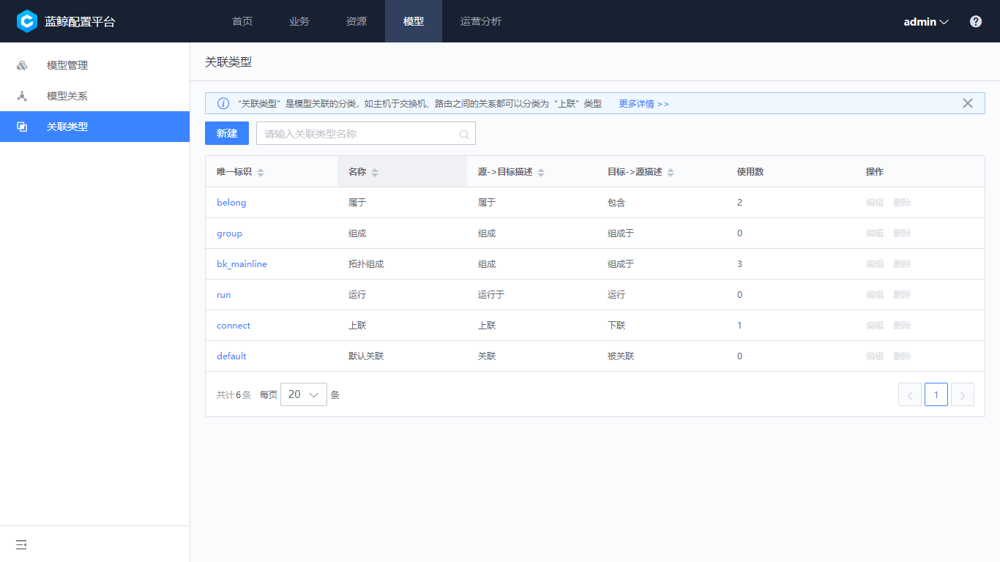
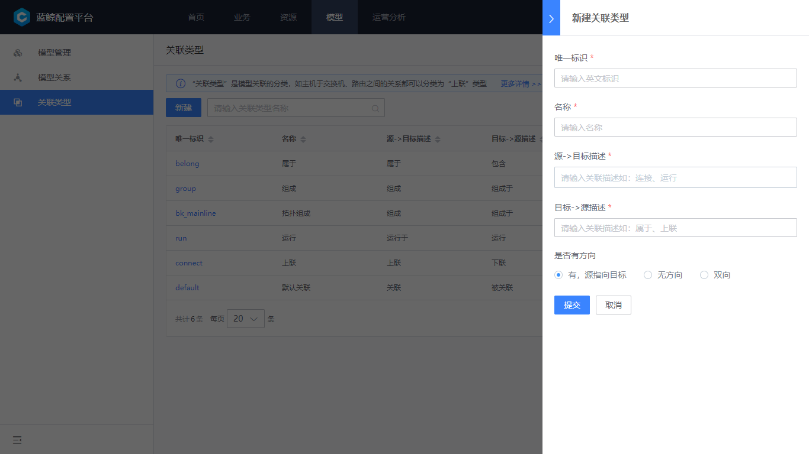

# 关联类型

在通常情况下，企业中的模型关联可以进行分类，例如网络设备与主机之间的关系为关联。对关联进行分类以后，能够更加便捷创建修改模型关联、查询同类关联。

出厂默认自带几种关联类型：

- 属于：常用与组织或管理层级的连接
- 组成：设备部件和整体之间的连接
- 拓扑组成：系统内置类型，仅用于业务拓扑的节点关系，仅限系统使用
- 运行：程序与操作系统之间的连接
- 上联：常用与网络设备之间的连接
- 默认关联：从早于3.2升级上来的关联会自动对应到默认关联

图1.关联类型

## 新建关联类型

进入到“模型-关联类型”功能点击“新建”按钮，在对话框中填入关联类型相关信息：

- 唯一标识：英文字符建议尽可能简短可识别，在关联的导入、API 的查询中需要使用此标识
- 名称：呈现给用户的名称
- 源->目标描述：在源实例查看关系的时候，显示的描述
- 目标->源描述：在目标实例查看关系的时候，显示的描述
- 是否有方向：视图中是否显示方向，默认为源指向目标

图2.新建关联类型

