# 场景案例

## 如何使用构建机

构建机功能为不同开发语言、不同开发风格的团队提供了一个个性化定义的扩展功能，理论上只要代码可以在某一台物理机或虚拟机上进行程序的编译构建，就可以接入到 CICDKit 的流水线中。构建机的接入步骤大致如下：

- 准备一台可以独立完成构建任务的构建服务器，该服务器应该包括编译构建程序的必要环境配置和组件，比如 Java 项目至少需要包括 JDK、Maven/Gradle 等编译工具，并且该服务器应该与蓝鲸平台相关服务器保持网路畅通；
- 在 CICDKit 构建机管理中，新增一个构建机；
- 在新增完的构建机列表右侧的点击激活按钮，下载 agent.jar 并放到构建服务器上；

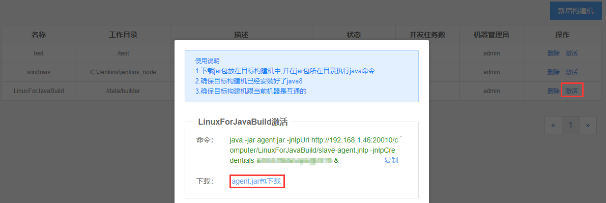

- 在构建服务器上安装 JDK（如果已安装过 JDK 则跳过此步骤）；
- 拷贝激活页面的命令，到构建服务器上 agent.jar 所在目录运行；

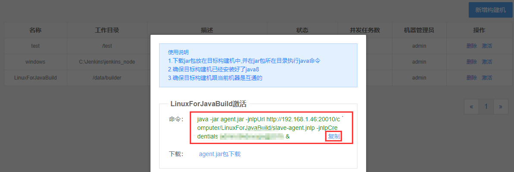

- 成功运行后构建机会处于在线状态，然后就可以在流水线定义中使用。

## 场景示例

新建流水线并修改流水线名称：

点击全局设置，选择容器构建，并选择 Java 构建镜像：

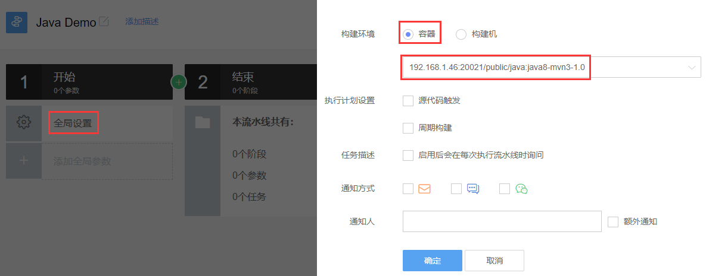

新增一个阶段，选择串行：

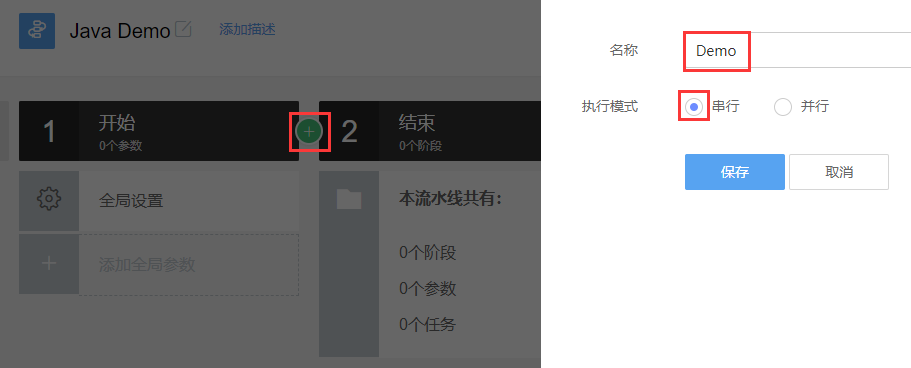

新增一个任务，选择源代码，并添加一个代码仓库：

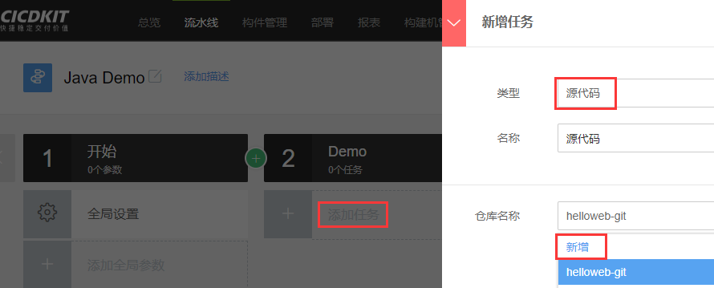

填写代码仓库的配置信息（这里请填写一个 Java Maven 项目的真实信息）：

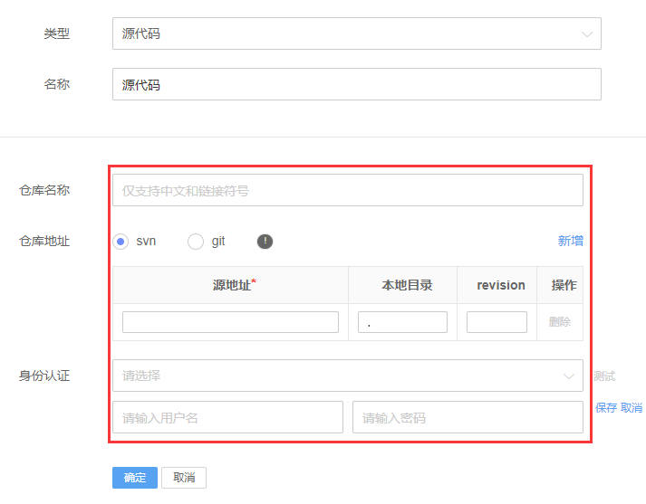

添加一个脚本节点，选择 shell 类型，并输入编译 Java Maven 项目的指令：mvn clean package

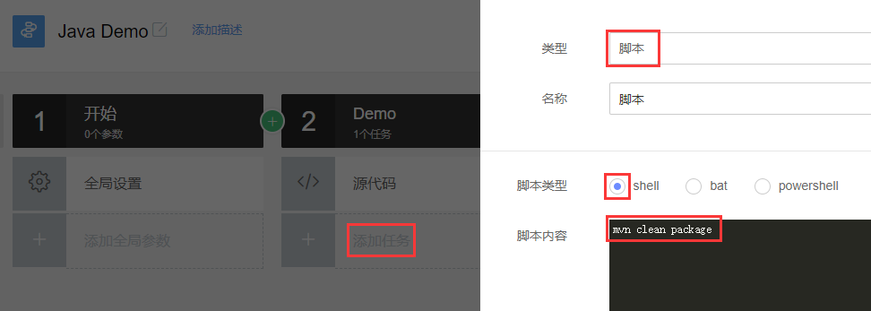

添加一个归档节点，填写归档路径（即构件仓库中的相对路径）、版本号、归档项目（项目名称）、归档文件类型（保持跟编译后的程序包类型一致）、归档分类（可自定义，比如 snapshot、release 等）、源文件路径（即编译产出的程序包路径，可用相对路径）：

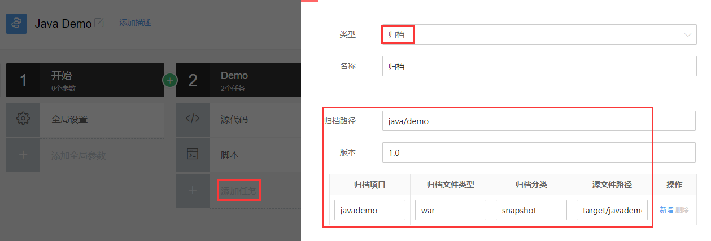

保存并执行流水线，先检查测试一下是否正常。

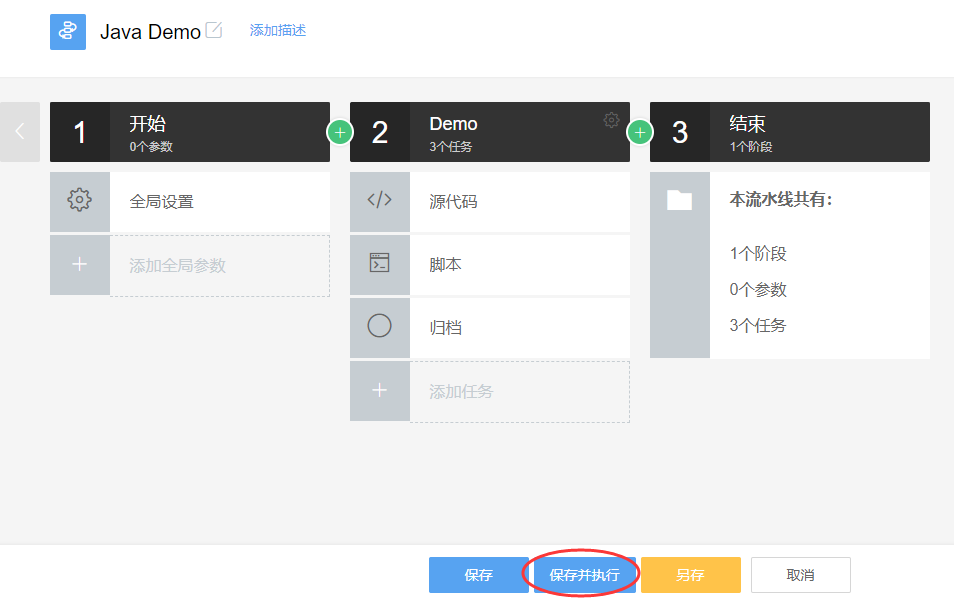
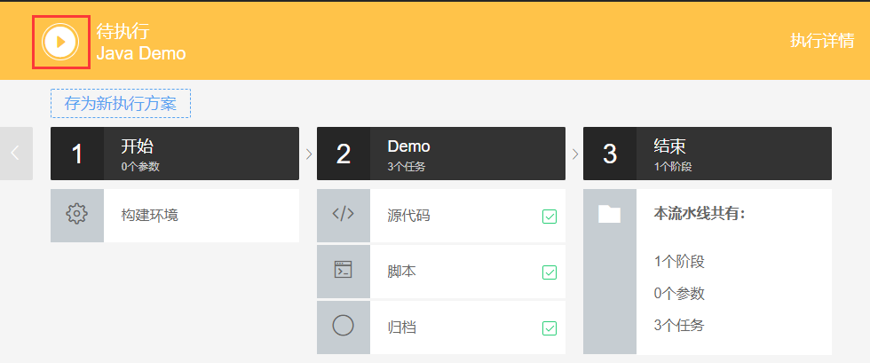

若执行没有报错，到构件管理栏目中找一下刚才归档的文件，复制链接可以获取到该程序包的下载地址：

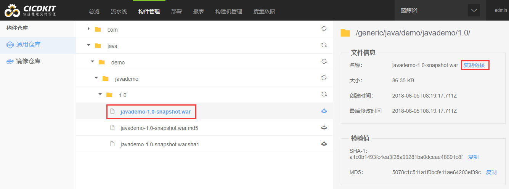

到部署栏目新增一个单节点快速执行脚本的简单的流程，脚本内容包括下载程序包（即 wget 代码仓库中的程序包下载地址）、启动程序（如果是 SpringBoot 项目可直接 java -jar 启动，如果是传统项目则需准备 Tomcat 之类的服务器）等步骤，并填写部署的目标服务器 IP、用户等信息：
（该步骤更多细节请参考[标准运维](5.1/标准运维/快速入门/Guide1.md)相关产品介绍）

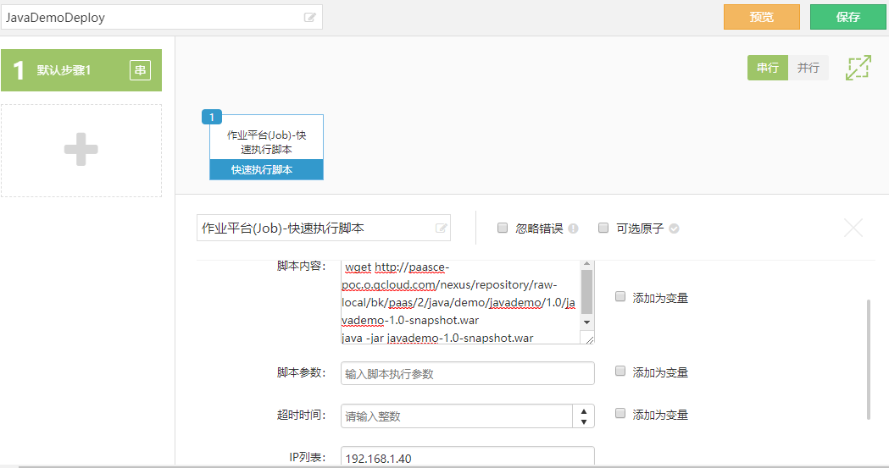

回到流水线编辑界面，增加一个部署节点，并选择刚刚创建的部署流程：

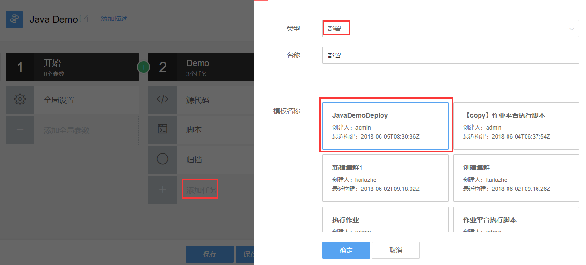

保存后再次执行流水线，即可完成一个项目的简单 CI、CD 过程，更多功能节点可按需进行配置和使用：

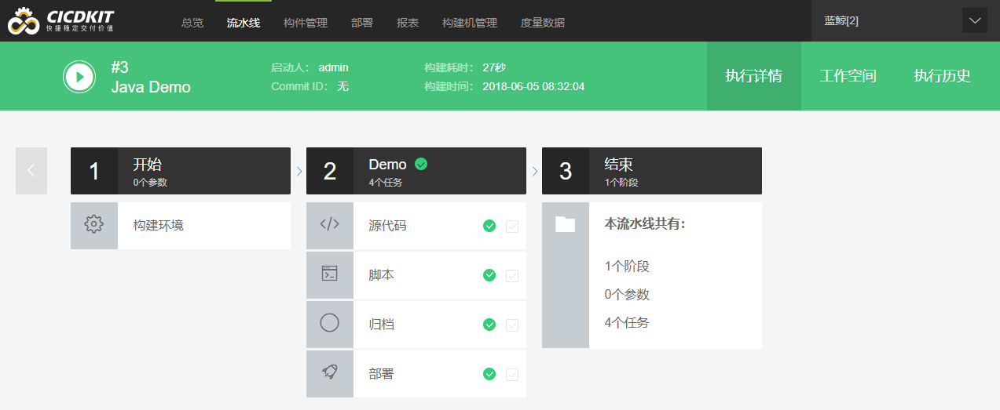
