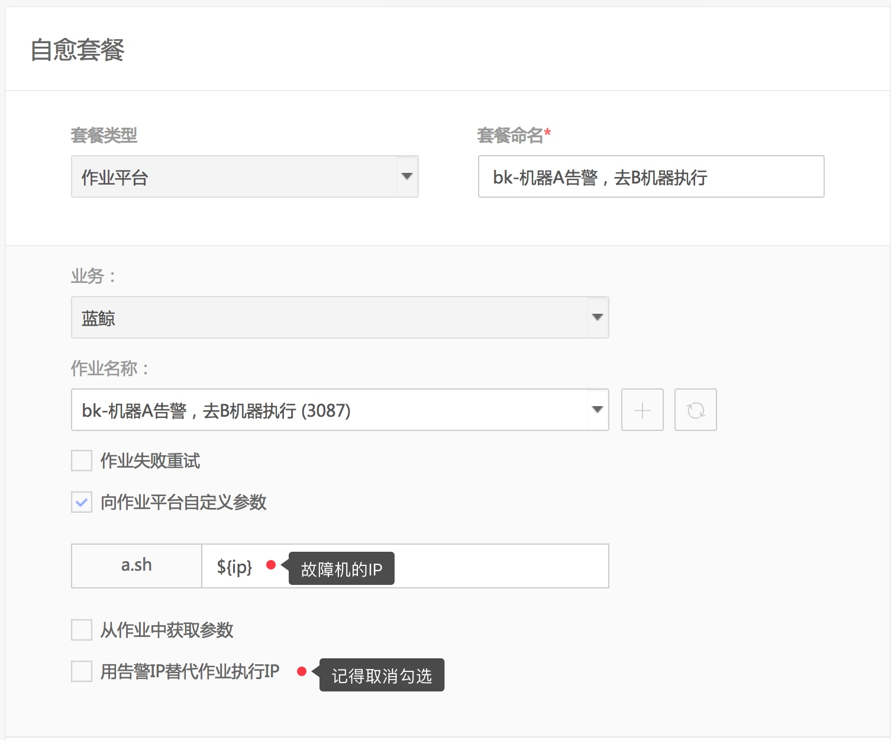

# 套餐内置变量
自愈的很多套餐里都需要传入参数，但有些参数是套餐执行时根据故障机信息进行动态获取的。

目前自愈里很多套餐类型都支持了这种变量参数，比如通知审批等。

## 场景示例

B 机器是 VMM 的管理端，A 机器是 VMM 中的应用服务器。当 A 机器上发生告警时，可以通过调用 B 机器上管理端的接口来完成自愈

图 1. 套餐中引用变量

## 1. 目前可选的变量有(可能为空)

- ${ip}：告警的 IP
- ${raw}：告警的字符内容
- ${alarm_type}：告警类型
- ${source_time}：告警时间(格式如 2014-01-01)
- ${cc_biz_id}：CMDB 的业务 ID
- ${operator}：业务负责人的第一个

## 2. CMDB 主机属性和 SET 属性的变量

格式为：${cc|属性名字}，如：

- ${cc|OuterIP}：故障主机的外网 IP
- ${cc|AssetID}：故障主机的固资编号
具体属性名请在 CMDB 上查询。

## 3. CMDB 变量支持五个参数

- all、set、custom、alarm_ci_name、ip_bak

- all：当有多个参数的时候，将返回通过逗号间隔的字符串。如有多个主机名称的时候

- ${cc|HostName|all}：返回"hostname1,hostname2,hostnameN"，不添加默认返回第一个
set：查询 Set 属性。如

- ${cc|SetName|set}：故障主机的 Set 名称
custom：查询自定义属性。如查询一个名为 IDC 的 Set 属性

- ${cc|IDC|set|custom}

- alarm_ci_name：指定查询故障机的 CMDB 属性

- ip_bak：指定查询备机的 CMDB 属性

三个参数能任意组合，如以下两个写法是等价的：

- ${cc|IDC|set|custom|all}
- ${cc|IDC|all|set|custom}

## 4. 故障机替换时备机

故障自愈现在有两种获取备机的 IP，通过获取备机套餐在 CC 中寻找符合要求的机器或者通过作业平台脚本来获取。获取到的备机参数为：${bpm_context|ip_bak}

与 IP 有关的变量有三个：

- ${ip} 当前流程处理的 IP，默认是故障机 IP，可以被替换操作对象的套餐改为备机 IP

- ${bpm_context|ip_bak} 备机 IP

- ${bpm_context|alarm_ci_name} 故障机 IP

## 5. 常见案例

- 1.根据告警传入告警 IP

    - ${ip}

- 2.根据告警 IP 传入外网 IP

    - ${cc|OuterIP}

- 3.根据告警 IP 传入自定义主机属性

    - ${cc|gametype|custom}

- 4.根据告警 IP 传入 set 名称

    - ${cc|SetName|set}

- 5.根据告警 IP 传入自定义 set 属性

    - ${cc|openstate|set|custom}

- 6.跟进告警 IP 传入组合属性(如：1 区_虎啸谷)

    - ${cc|SetWorldID|set}_\${cc|SetChnName|set}

## 6. 注意事项

- 注意大小写
