# 流程管理(后台)

流程管理主要包括流程设计，流程版本，API配置三个功能模块。

## 流程设计

流程设计：即流程模型的配置管理。通过流程引擎进行服务流程的节点设置及日常维护。流程设计列表可以视为流程模板库。

图21. 流程列表

-   新增流程：新建流程的入口。

-   导入流程：可从外部导入 json 格式的流程文件。导入的流程状态将默认为“关闭”。

-   导出流程：将已有流程导出，移植到其他场景。

-   流程状态：草稿，启用，关闭。

-   部署：流程设计完成后为需要部署才可以正式应用到服务项。部署完成后，在“流程版本”中会新增一条对应的版本记录。

-   删除：删除流程模板。模板库中的流程删除，并不会影响到在线已经使用中的流程实例和单据。

>   注：流程模板更新后，必须部署发布完成才可以被应用。

### 新增流程

图22. 新增流程1

>   成功增加一个流程，需要完成3个步骤的设置。

### 填写流程基本信息

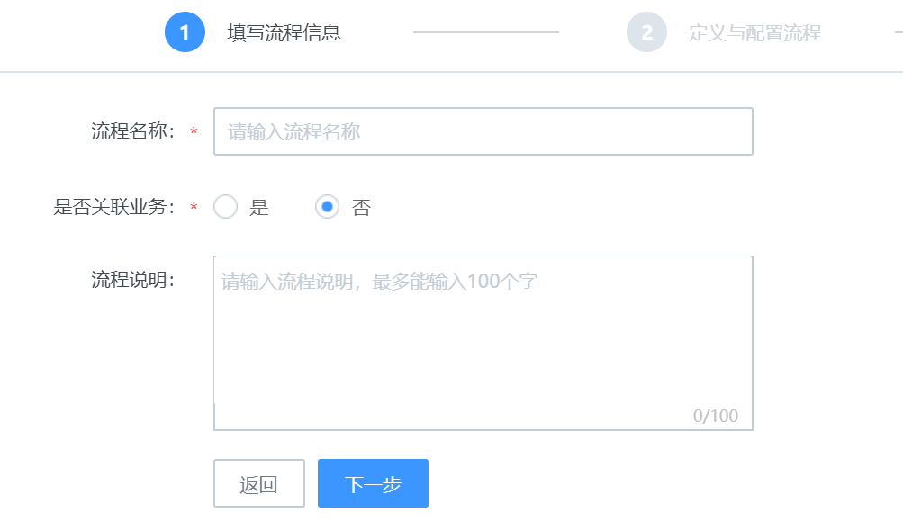

图23. 新增流程2

**字段信息：**

-   流程名称：输入该流程的名字。

-   流程说明：对该流程的说明描述

-   是否和业务关联：该字段的配置将影响到流程后续节点的处理角色选择。

    -   是：表明该流程和业务系统强关联。比如申请变更某个业务系统或者应用系统下的服务器配置信息时，只有负责该业务系统的对应人员才能提单或者处理。则对此类流程进行设计配置时，就需要通过业务权限来进行鉴权和操作限制。勾选后，在设置该流程的节点信息时，处理角色的下拉列表中将出现“CMDB 业务角色”选项。

    -   否：表明当该条流程属于一般公共性服务，不与业务应用关联。例如，安全网络的策略开通，账号开通等。

### 定义与配置流程节点

>   当填写完成基本流程信息后，会进入到流程节点的定义和配置步骤。
>
>   该部分可以自行决定整体流程的长短，增删节点，节点类型，以及设置每个节点的字段信息。
>
>   说明：每个流程的默认起点环节为“提单”。

图24. 流程节点配置界面1

(1) 增加节点

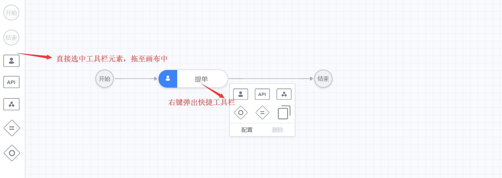

图25. 流程节点配置界面2

>   目前节点类型分为：手动节点，API 节点，标准运维节点。
>
>   手动节点：该节点为人工手动进行处理反馈。
>
>   API 节点：该节点为 API 自动处理节点。
>
>   标准运维节点：可调用蓝鲸平台中标准运维中对应的流程/插件。

- 新增手动节点

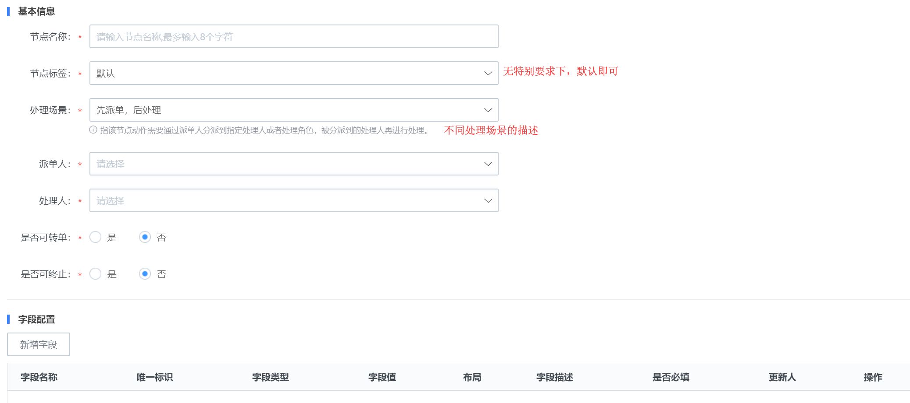

图27. 手动节点配置界面

**基本信息**

- 节点名称：自定义该节点的名字，建议简单明了。

- **处理场景：**

    - 先派单，后处理：指该节点动作需要通过派单人分派到指定处理人或者处理角色，被分派到的处理人再进行处理。

    - 直接处理：单据直接流入到配置好的处理人/角色处理。当有多个处理人时，任何一位处理完成即可流入下个环节。

    - 先认领，后处理：指配置好的处理人/角色人员需要主动认领任务。当处理人只有1位时，会自动认领。处理人有2人及以上时，需要主动认领至自己的待办任务中。

    - 先派单，后认领：单据需要派单人进行指派到组或者多人，然后被指派对象进行主动认领。认领完成后才会到自己的待办任务列表中。

- 操作角色：选择指定角色后，该角色下的所有人员均拥有该节点的处理权限。

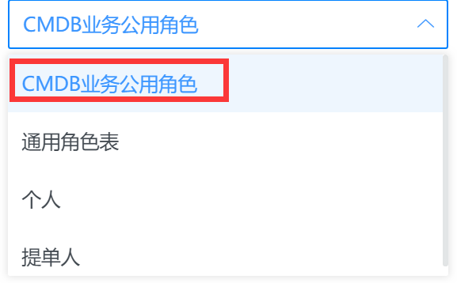

图28. 流程节点配置界面6

- CMDB 业务公用角色：存放在 CMDB 业务列表中的业务公用角色。比如业务运维人员，产品人员，测试人员，开发人员。

- 通用角色表：“角色配置”后台中“通用角色”中的角色。

- 个人：指定具体的人员，可同时指定多人。

- 提单人：指提交单据的人。

>   备注：只有该流程的基本信息中，流程与业务关联时，各节点的操作角色下拉框中才会出现“CMDB 公用角色”选项。

- 派单人指定：不预设环节处理人，由特殊的派单人来进行指定。

- 不限：指该节点任何用户都可以进行操作。目前仅“提单”环节的操作角色有“不限”选择。

- 是否可转单：指该节点的处理人是否可以转给其他人处理。勾选“是”，则在前台的处理页面，会出现“转单”按钮。

- 是否可终止：指该节点的处理人是否可以直接终止单据流程。勾选“是”，在前台操作页面会出现“终止”按钮。

**字段配置**

- 字段设置：自定义该节点中需要用户提交的信息。

>   系统有内置部分字段，用户可根据需要进行删减。点击“新增字段”按钮进行其他字段的自定义配置。

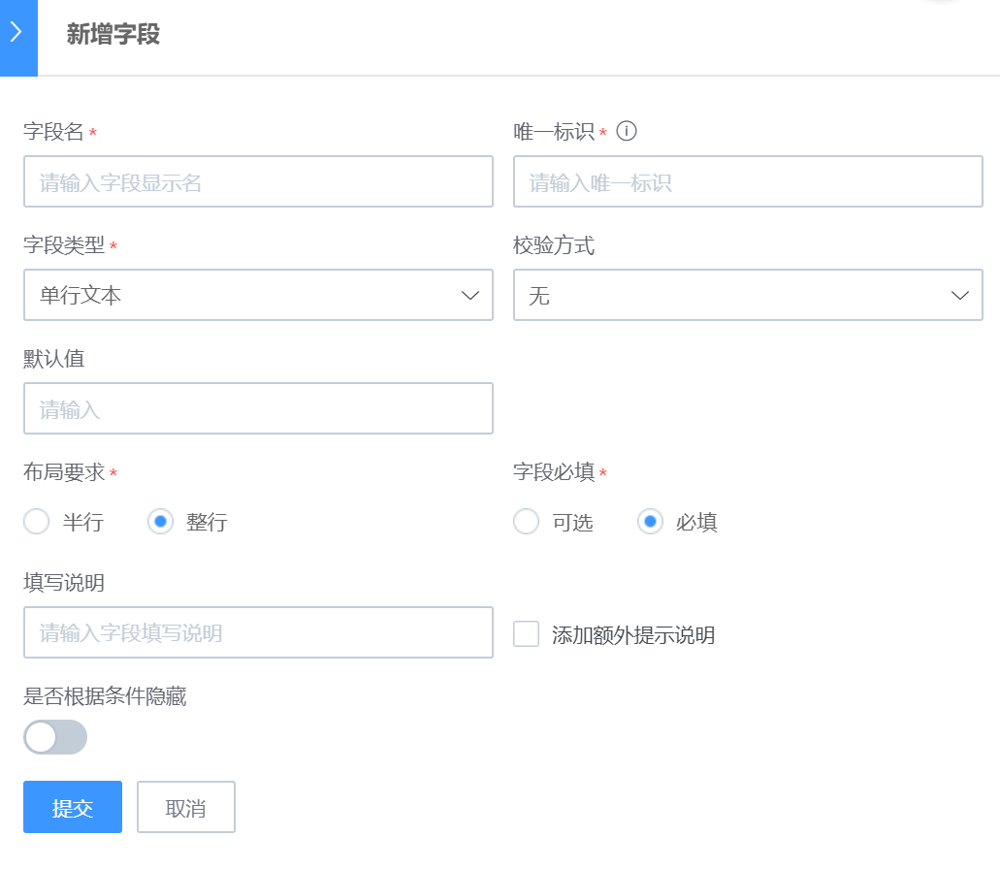

图28. 手动节点字段配置1

>   目前支持的字段类型有：
>
>   单行文本，多行文本，数字，日期，时间，表格，单选下拉框，多选下拉框，复选框，单选框，多选人员选择，富文本，附件上传，自定义表格，树形选择。
>   其中，“附件上传”类型，可以在后台上传附件模板，供用户在前台提单时下载参考查看。“树形选择”类型，目前暂仅支持从数据字典获取数据源。

图29. 手动节点字段配置2

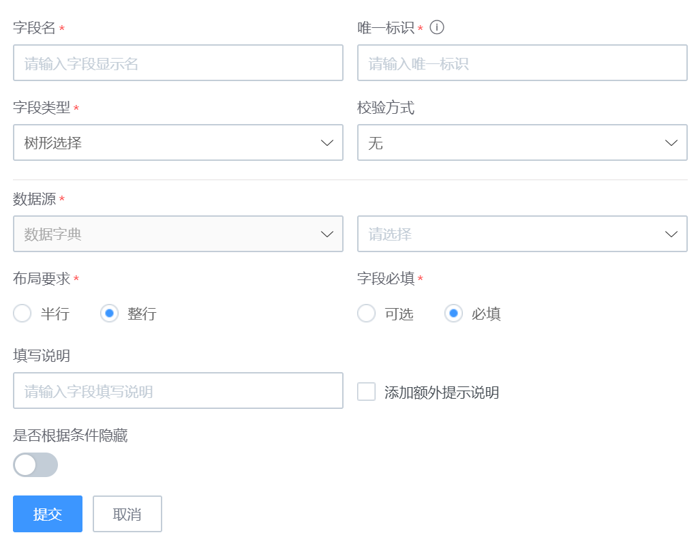

图30. 手动节点字段配置3

- 字段排序及字段预览

可通过拖拽管理字段顺序。并通过“字段预览”来查看应用到前台页面时的显示。

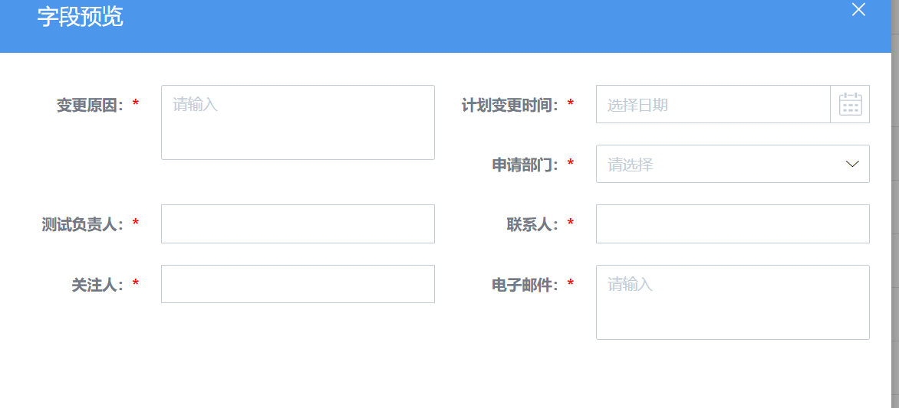

图31. 手动节点字段预览

- 新增API节点

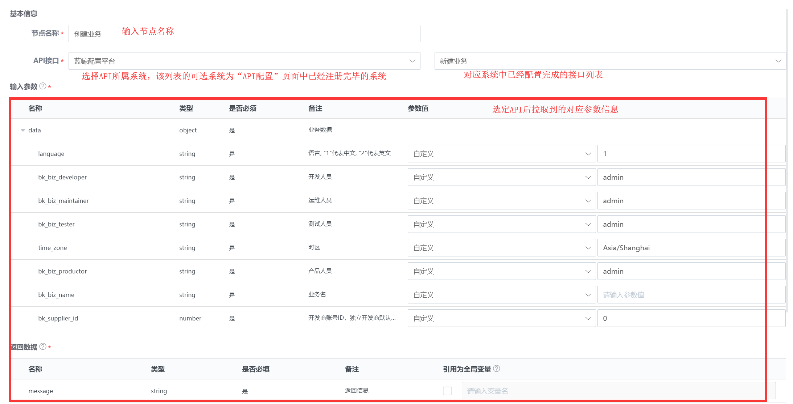

图32. API节点配置界面

- 新增标准运维节点(标准运维节点的配置及应用仅支持企业版2.5及以上版本)

图33. 标准运维节点配置界面1

(2) 流转条件设置

添加并设置完成各节点后，节点间的流转逻辑可以通过线条的配置来实现。当前后节点不需要特别条件自动流转时，线条保持系统默认即可。如果前后节点需要满足特定条件时才可以流转，则可以在线条中进行配置。目前接受按指定字段/字段组的条件设置来实现需要的节点流转逻辑。

图34. 标准运维节点配置界面2

-   设置关系

>   线条名称，线条流转逻辑，字段及字段组的条件配置。
>
>   \*利用字段值作为流转条件时，只能选择包括前置节点在内的所有前置节点中已存在的字段。线条名称将会显示在流程图中。

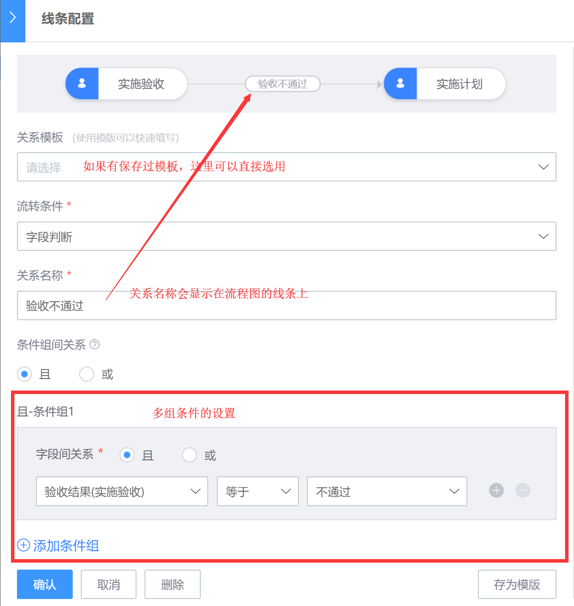

图35. 流转条件配置界面

-   流程预览

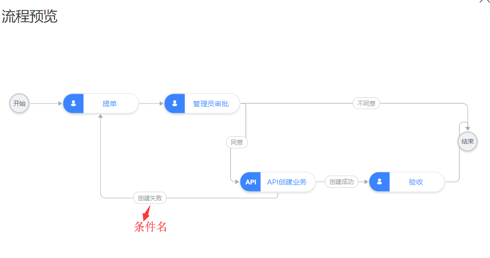

图36. 流程预览

### 流程启用设置

在未进行流程启用设置之前，流程会以“草稿”状态保存在流程列表中。流程启用按钮打开以后，该流程才会正式生效供前台应用。

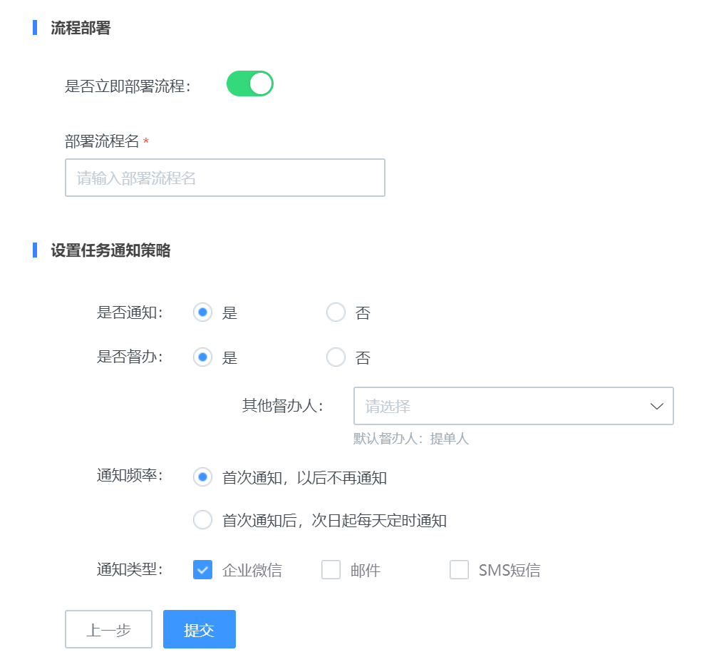

图37. 流程节点启用设置界面

是否督办：是指该流程是否需要指定人在任务过程中进行督办提醒操作。“提单人”为默认督办人。在流程未结束之前，可以随时对处理人进行督办提醒。当设置后，在前台单据流转过程中，会出现“督办”按钮。

> 说明：ITSM 中的通知方式是直接调用 ESB 的通知组件服务，在使用该服务之前，请确保在蓝鲸的开发者中心里面完成各渠道的配置工作。

配置路径：蓝鲸\>开发者中心\>API网关\>通道管理\>[CMSI]蓝鲸消息管理

图38. 蓝鲸消息管理API配置入口

## 流程版本

流程版本：流程模板的版本管理。流程模板设计完成后，要部署后才可以为服务项关联，进而在前台用户提单时可视可选。考虑到模板的维护频率，以及服务项对流程的更新决策，通过流程版本将模板的维护场景和服务实例隔离，保证还未确定或者在梳理中的流程并不会影响线上流程实例。

同个流程模板会对应多个流程版本。版本号会记录版本发布的具体时间。管理员在进行服务项和流程版本关联时，可以选择适合的版本号来进行关联。

>   注：新的版本发布后，使用之前版本的服务项并不会自动更新到新版本。需要管理员决定是否关联到新版本。

图39. 流程版本列表

-   预览：查看流程。

-   还原：可以将该版本应用的模板还原至流程模板库中。主要适用于原有模板已经删除又不想手动重建的场景。

-   删除：删除流程版本。当流程版本被关联服务应用后，将无法删除。从所有关联的服务项中解绑之后方可删除。

## API配置

当你在流程中需要引用第三方系统来进行自动处理，或者需要引用第三方系统中的某些数据作为流程中的必要信息时，可以通过 API 配置功能对第三方系统的接口进行管理。配置完成后，在流程节点设置过程中，可以直接引用这些 API。

ITSM 中内置了部分蓝鲸体系内的系统 API，可以根据需要自行取用或维护。

>   \*API 配置模块具有一定门槛，需要管理员对 API 间的调用协议有比较充分的了解。

1\. 新增API

新增 API 之前，需要先接入系统。接入系统后，可以添加 API 至该系统下。

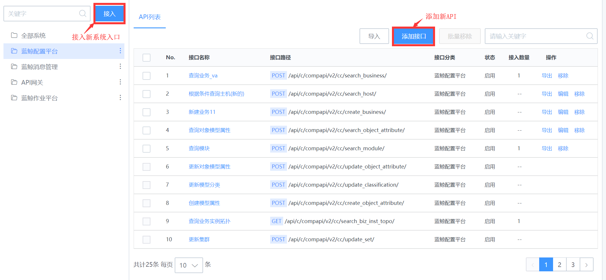

图40. API配置页面

2\. API使用

-   API节点

 在设计流程时，可以通过拖拽 API 节点来直接选择合适的 API。选定之后，通过相应的字段参数关联设置，在流程应用后，单据流转到该节点时，自动调用相应 API 进行处理及流转。

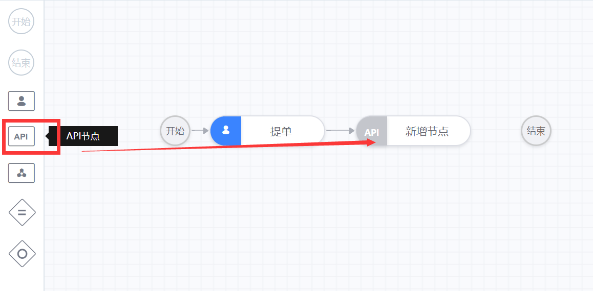

图41. 添加API节点

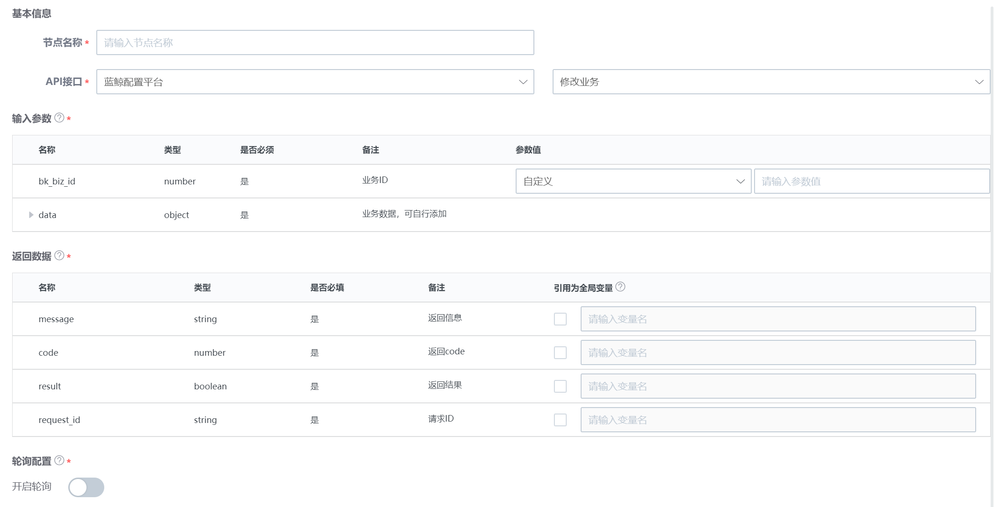

图42. API节点配置页面

-   API字段

在对流程节点的字段进行管理时，如果字段值需要从第三方系统调用或引用，则设置该字段值时，可以将其数据来源设置为从 API 获取。

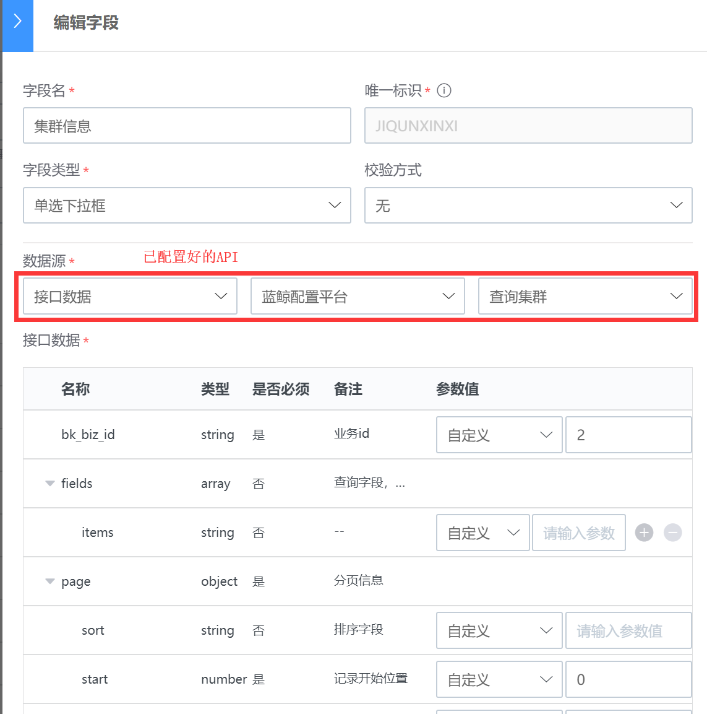

图43. API字段配置列表

