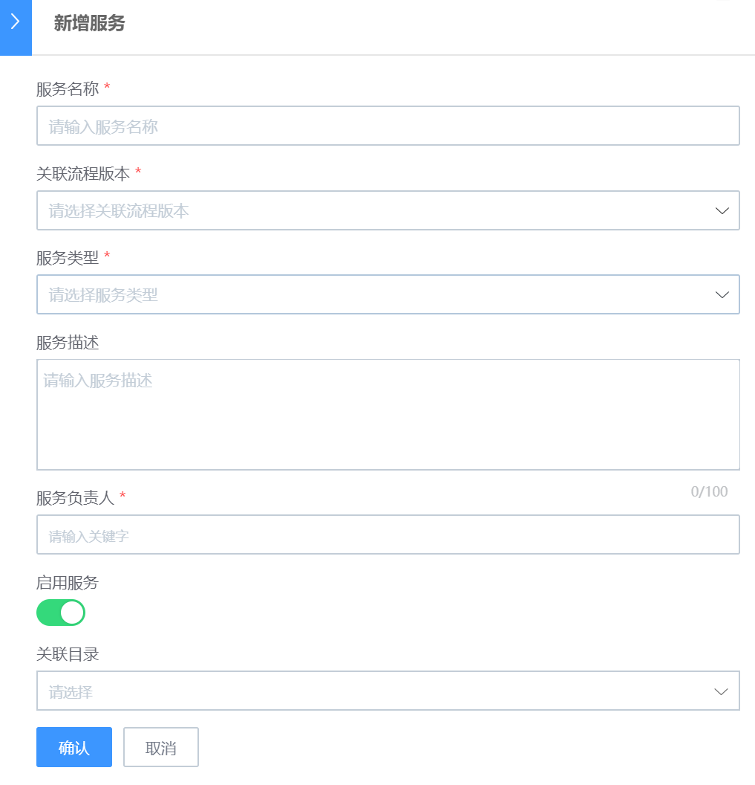
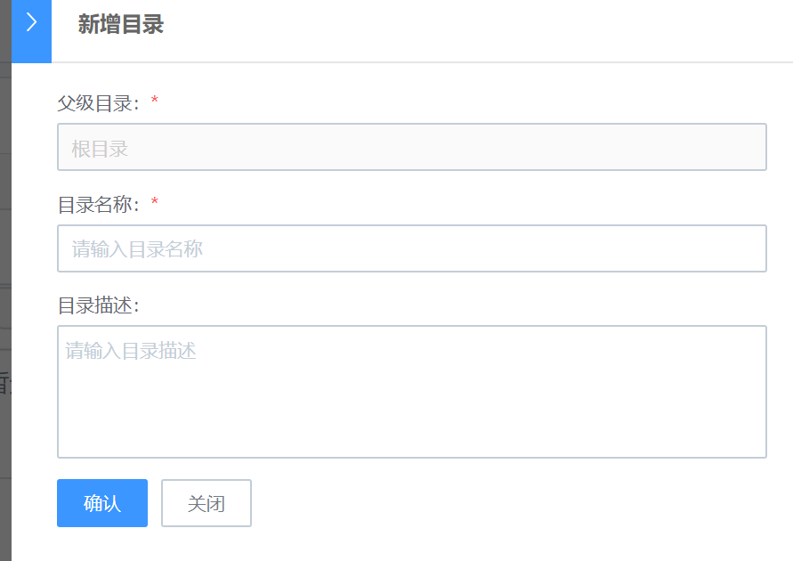
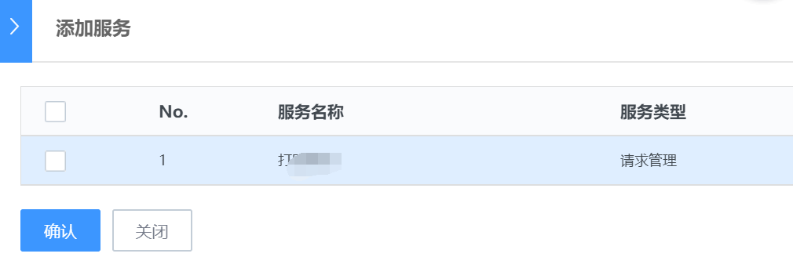
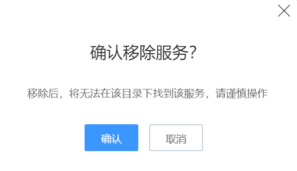

# 服务管理(后台)

>   将整体 IT 的服务场景通过服务目录以及服务的方式进行统一管理及更新，便于为客户/用户提供的服务管理。同时，服务项管理时会和流程版本关联，以将服务流程应用到具体的服务中。

## 服务

>   服务是服务场景的最小单元。管理员进行服务梳理时，可以从上至下，即从梳理大的服务目录，再细化服务目录下的服务。也可以先将具体服务梳理完成后再进行目录类别划分。可视自己企业自身情况而定。

图15. 服务项列表

>   服务列表除显示服务的基本属性，还会显示其归属的服务目录，以及服务的更新时间。

>   可对服务进行新增，编辑，删除操作。

>   注：当服务有关联目录时，该服务不能删除。在服务目录移除该服务之后，方可删除。

图16. 新增服务

-   服务名称：服务名称，便于了解服务基本内容。

-   关联流程版本：该服务启用后会根据指定的流程模板进行服务流转和处理。关联的流程是指已经正式发布的流程版本，可根据版本号辨认版本更新时间，方便管理员选择更新。

-   服务类型：指该服务属于哪种服务类型模块。系统内置了请求，事件，变更，问题四种服务类型。如管理员需要对服务类型进行修改，可以在系统配置的“数据字典”进行修改。

-   服务描述：对服务内容的具体描述。非必填，但合理的描述更易于用户提单时更好了解服务内容。

-   服务负责人：该服务的负责人。在服务实例应用中出现异常时，系统会通知到该负责人。

-   启用服务：服务启用开关。

-   关联目录：服务关联的服务目录。该项为服务的应用快捷入口。

##  服务目录

>   服务目录为整体IT服务内容的管理视图及入口。

图17. 服务目录列表

>   可对服务目录进行新增，编辑，删除等日常操作。选中服务目录后可以进行拖拽排序。服务目录下的服务列表也支持拖拽排序。

>   注：当服务目录下有子目录时，父级目录将无法删除。将子目录删除后方可删除。

图18. 新增服务目录

>   服务目录下可以管理多个服务。通过添加或移除来进行服务目录下的服务管理。

图19. 服务添加至服务目录

图20. 将服务从服务目录移除

>   服务的移除仅代表从该服务目录移除，对服务本身没有影响。从该服务目录移除后，用户在前台的提单入口，选择原服务目录后，将看不到被移除的服务。
