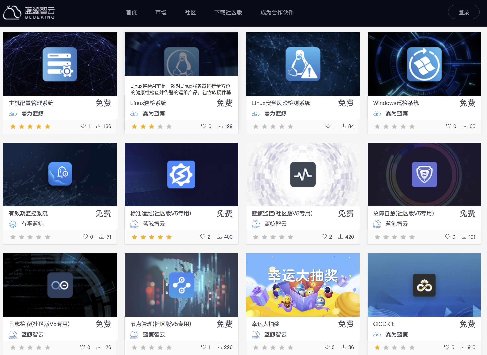
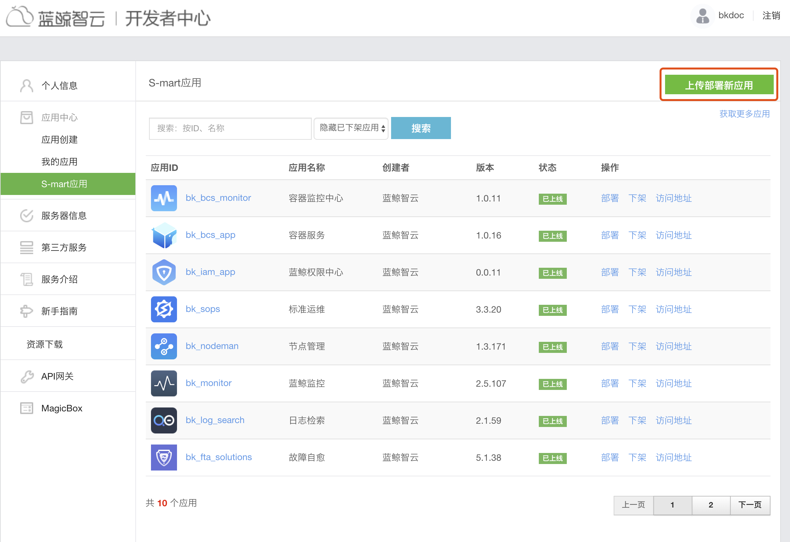
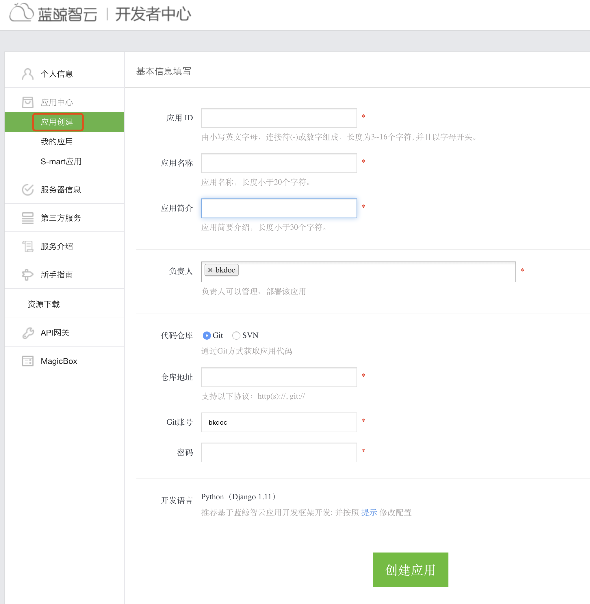
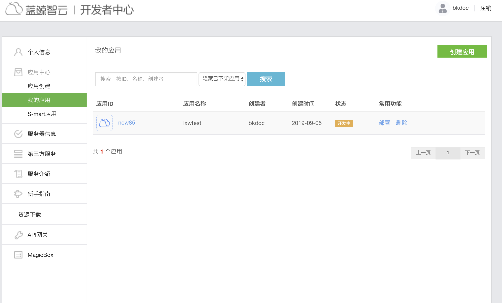
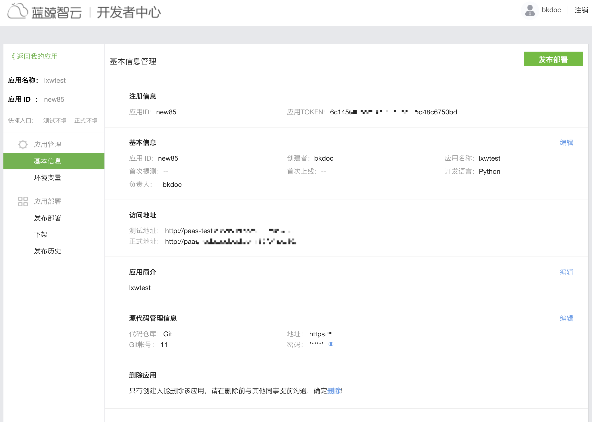
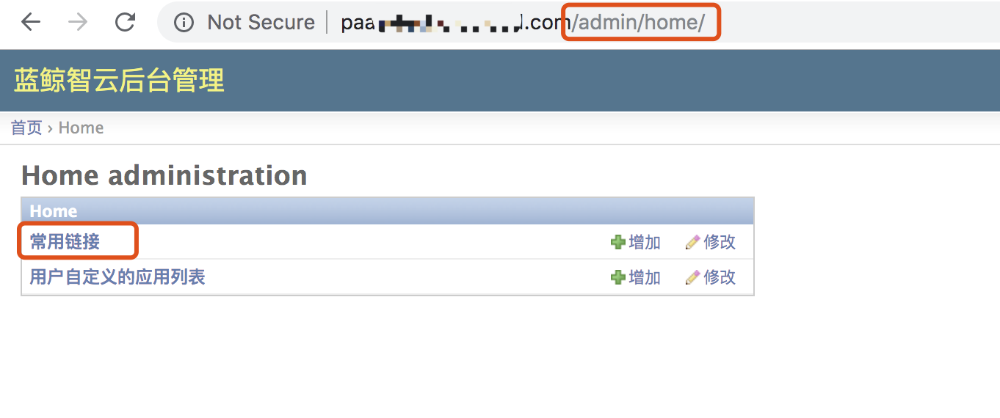
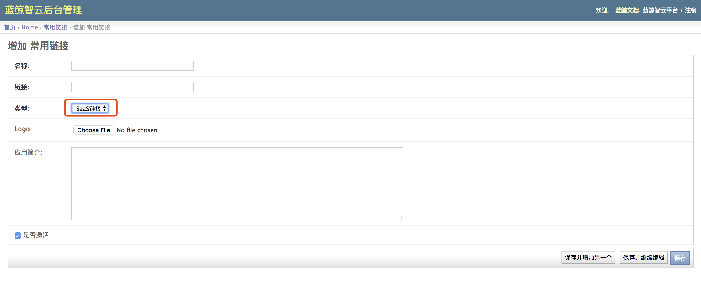
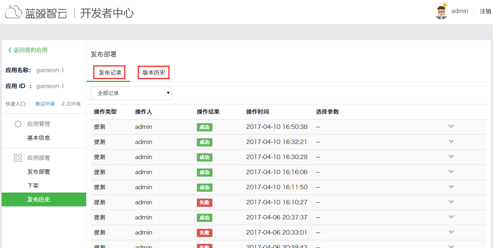

# 应用管理

蓝鲸 PaaS 平台承载着众多 SaaS，根据 SaaS 部署方式分为 3 种：

第一种：S-mart 应用，通过“下载 SaaS 包 -> 上传部署(正式环境)-> 配置后台服务(可选)-> 工作台进入”的方式来使用；

第二种：我的应用，属于开发者/用户自己研发的 SaaS 应用，按照“创建应用 -> 研发 -> 测试环境部署 -> 正式环境部署”的方式自研工具/系统。

当应用创建完成后，可以在“我的应用”中看到，并对指定的应用进行基本操作。

第三种：外链应用，在社区版中没有放到“开发者中心”进行添加，而是通过 PaaS 平台的后台管理进行操作。

> “常用链接” 的类型有 3 种：
- 普通链接：添加后，显示在“个人工作台”的右侧，作为“常用链接”；
- SaaS 链接：添加后，显示在“个人工作台”的面板中，跟其它两类的应用并无差异；
- 轻应用：将“标准运维”生成单一操作的流程应用，通过接口自动注册到 PaaS 中，用户无需处理。

说明：“S-mart 应用”、“外链应用” 属于管理员操作，“我的应用”开发者即可进行操作。

这种 “可插拔式” 的 SaaS 应用模式，给用户提供了更多的选择性，也方便管理员对应用进行管理，包括应用的 “部署”、“下架” 等操作。

为了保证 SaaS 的正常使用，严格记录每一次发布变更的操作信息，不论是测试环境，还是正式环境。

