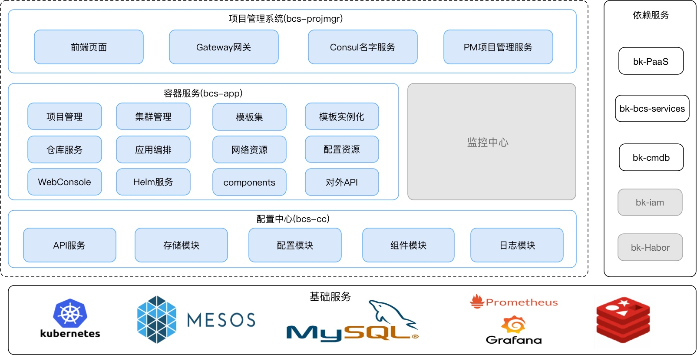
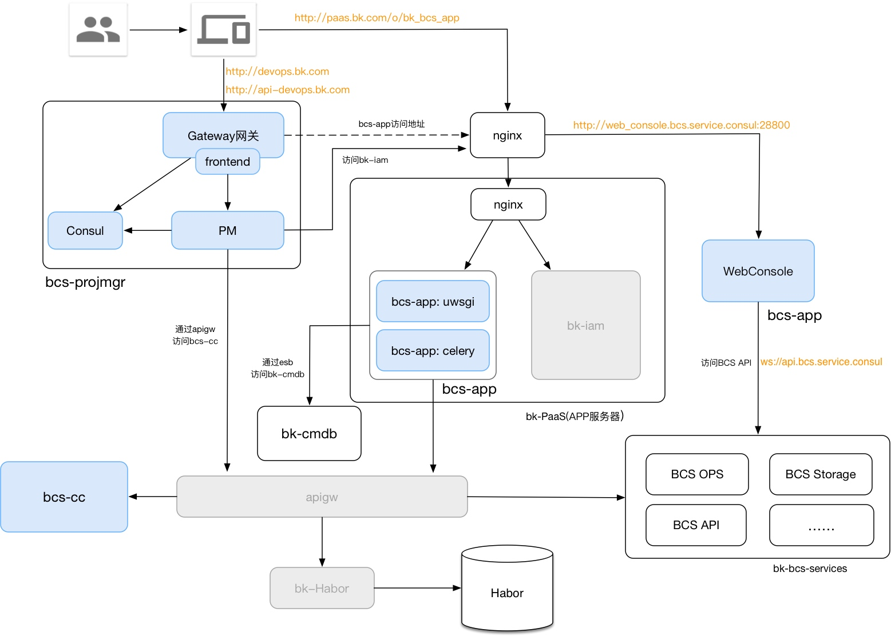
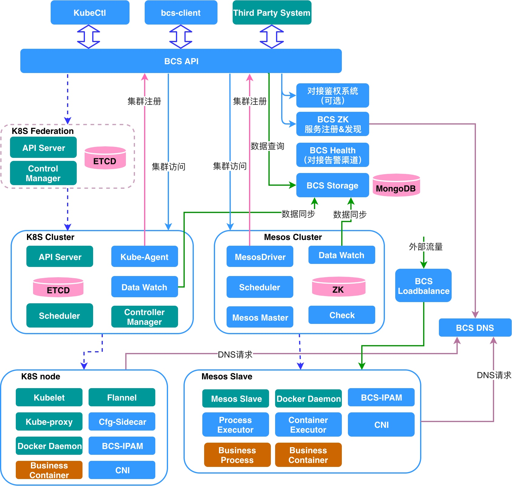

# 产品架构图

BCS 是统一的容器部署管理解决方案，为了适应不同业务场景的需要，BCS 内部同时支持基于 Mesos 和基于 K8S 的两种不同的实现。

BCS 在蓝鲸中的位置

## BCS（容器管理平台）架构图

BCS 由 **BCS SaaS** 和 **BCS 后台** 组成，以下为对应的架构图。

### BCS SaaS 架构图

#### BCS SaaS 功能结构图
BCS SaaS 作为 BCS 的上层产品，包含已开源的项目管理系统（bcs-projmgr）、容器服务产品层主体功能模块（bcs-app）、底层的配置中心模块（bcs-cc）以及未开源的监控中心，同时它依赖蓝鲸体系下的其他产品服务（如 PaaS、CMDB 等）。

SaaS 依赖的服务介绍：
- [bk-PaaS](https://github.com/Tencent/bk-PaaS): 为 BCS SaaS 提供了 4 大服务(统一登录、开发者中心、ESB 和应用引擎)，其中 bcs-app 由应用引擎托管

- [bk-bcs-services](https://github.com/Tencent/bk-bcs): BCS 底层服务。作为后台服务，bk-bcs-services 给 bcs-app 提供了集群搭建，应用编排等丰富的底层接口，更多详见下 *BCS 后台架构图* 。

- [bk-cmdb](https://github.com/Tencent/bk-cmdb): 蓝鲸配置平台。bcs-app 的集群管理功能涉及的业务和主机信息来源于配置平台

- bk-iam: 蓝鲸权限中心，BCS SaaS 基于 bk-iam，实现了用户与平台资源之间的权限控制

- bk-Habor: 蓝鲸容器管理平台镜像仓库服务。bcs-app 使用 bk-Habor 提供的 API，实现了业务镜像的查询与配置功能

#### BCS SaaS 部署拓扑图
SaaS 包含 bcs-projmgr, bcs-app, bcs-cc 三个模块。

SaaS 依赖的后端服务 bk-bcs-services 也已开源，bk-iam 等灰色标注的系统暂未开源，需要依托蓝鲸独立部署版本进行搭建。

### BCS 后台架构图

下图为 BCS 以及 Mesos 集群的整体架构图：BCS Client 或者业务 SaaS 服务通过 API 接入，API 根据访问的集群将请求路由到 BCS 下的 Mesos 集群或者 K8S 集群。

Kubenetes 容器编排的说明：
* BCS 支持原生 K8S 的使用方式。
* K8S 集群运行的 Agent（bcs-k8s-agent） 向 BCS API 服务进行集群注册。
* K8S 集群运行的 Data Watch 负责将该集群的数据同步到 BCS Storage。

Mesos 编排的具体说明：
* Mesos 自身包括 Mesos Master 和 Mesos Slave 两大部分，其中 Master 为中心管理节点，负责集群资源调度管理和任务管理；Slave 运行在业务主机上，负责宿主机资源和任务管理。
* Mesos 为二级调度机制，Mesos 本身只负责资源的调度，业务服务的调度需要通过实现调度器（图中 Scheduler）来支持，同时需实现执行器 Executor（Mesos 自身也自带有 Executor）来负责容器或者进程的起停和状态检测上报等工作。
* Mesos（Master 和 Slave）将集群当前可以的资源以 offer（包括可用 CPU、MEMORY、DISK、端口以及定义的属性键值对）的方式上报给 Scheduler，Scheduler 根据当前部署任务来决定是否接受 Offer，如果接受 Offer，则下发指令给 Mesos，Mesos 调用 Executor 来运行容器。
* Mesos 集群数据存储在 ZooKeeper，通过 Datawatch 负责将集群动态数据同步到 BCS 数据中心。
* Mesos Driver 负责集群接口转换。
* 所有中心服务多实例部署实现高可用：Mesos driver 为 Master-Master 运行模式，其他模块为 Master-Slave 运行模式。服务通过 ZooKeeper 实现状态同步和服务发现。
