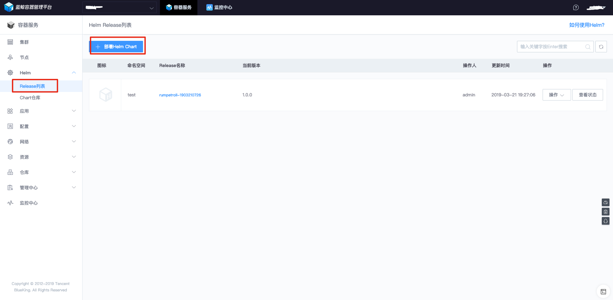
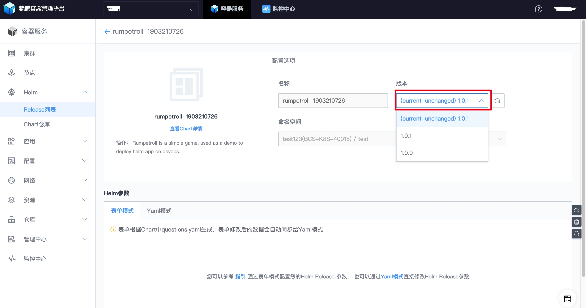

# 使用 Helm 发布应用

## 1. 使用蓝鲸容器服务 Helm 部署 Chart
参考上一步推送完 Chart 之后，您就可以在`项目仓库`栏目中看到新推送的 Chart，如果没有可以点击`同步仓库`进行同步。

- 创建入口
    + `容器服务`/`Helm`/`Release列表`菜单，点击`部署Helm Chart`
    + `容器服务`/`Helm`/`Chart仓库`菜单，选择目标 Chart 点击`部署`

图 1.Helm Release 创建人口 - 从`Helm`/`Release列表`菜单进入

 

图 2.Helm Release创建入口 - 从`Helm`/`Chart 仓库` 菜单进入

- 参数填写
    + 名称：只能输入字母, 数字或者 `-`
    + Chart 版本：Chart 版本
    + 命名空间：需要实例化的目标集群+命名空间
    + 用于实例化 Helm Release 的参数，包括直接编辑 yaml 和表单两种方式：
        - yaml 文本编辑，相当于给`helm template`命令传递`-f, --values`参数
        - 表单，主要为了提升输入体验和参数校验，只有在 Chart 中定义了`questions.yaml`文件时，创建 Helm Release 页面才会生成根据`questions.yaml`内容生成表单页面。

 

图 3.Helm Release创建参数页面

- Helm Release 预览
    + 在真正创建 Helm Release 之前，可以通过 “预览” 功能查看，将要生成的 k8s 资源配置是否符合预期。

 

图 4.Helm Release创建`预览`入口

 

图 5.Helm Release创建预览页面示例

- Helm Release 升级-对比查看功能
    + 相比于创建，针对更新的场景，蓝鲸容器服务提供了对比的功能，可以确认变更内容之后，再执行更新

 

图 6.Helm Release升级-对比查看功能

- 回滚
    + 针对您对 Helm Release 的变更，蓝鲸容器服务还提供了回滚功能，在 Helm Release 列表中，选中需要回滚 Helm Release 的`回滚`操作按钮。即可以看到回滚页面，选中会要回滚的版本，确认回滚操作的变更内容即可执行回滚。

 

图 7.Helm Release回滚入口

 

图 8.Helm Release回滚版本选择

 

图 9.Helm Release回滚对比预览页面

## 2. 检查 Helm Release 状态
- 通过 Helm Release 列表页面查看
    + 在`容器服务`/`Helm`/`Release列表`页面中，选中`查看状态`即可查看资源的状态信息。

 

图 10.Helm Release状态查看入口

 

图 11.Helm Release状态效果图

- 使用蓝鲸容器服务 WebConsole 功能
    + 使用蓝鲸容器服务的 WebConsole 功能，您可以不用登录跳板机，直接使用 kubectl 命令查看业务容器的状态。

 

图 12.WebConsole 入口

 

图 13.WebConsole 使用效果图

## 3. Helm Release 的升级的版本
通过蓝鲸容器服务对 Helm Release 做升级时，有个默认选中的版本，也就是当前版本，在当前版本的版本号左边有个备注，备注的作用用于说明，Release 所使用的版本，是否发生过变化，或者已经被删除。如下图所示，蓝鲸小游戏 rumpetroll 当前版本是 1.0.0，标记的是 `unchanged` , 表示当前版本自上一次被当前 Helm Release 使用之后未发生过变化。

- [开源 Helm Chart](https://github.com/helm/charts)
