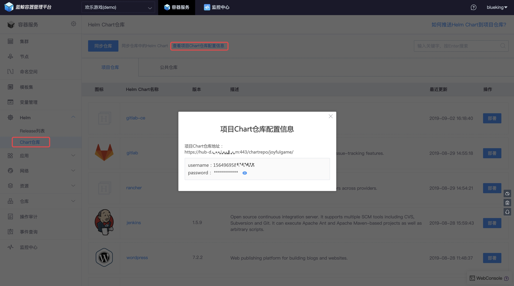
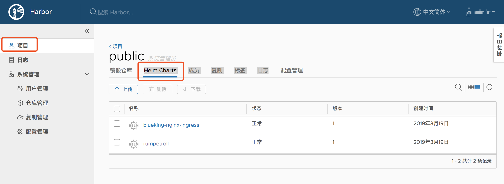
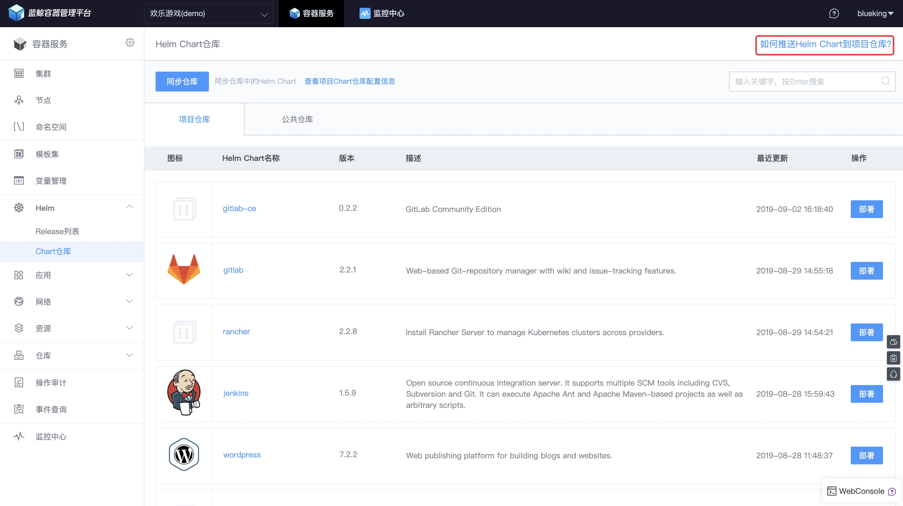
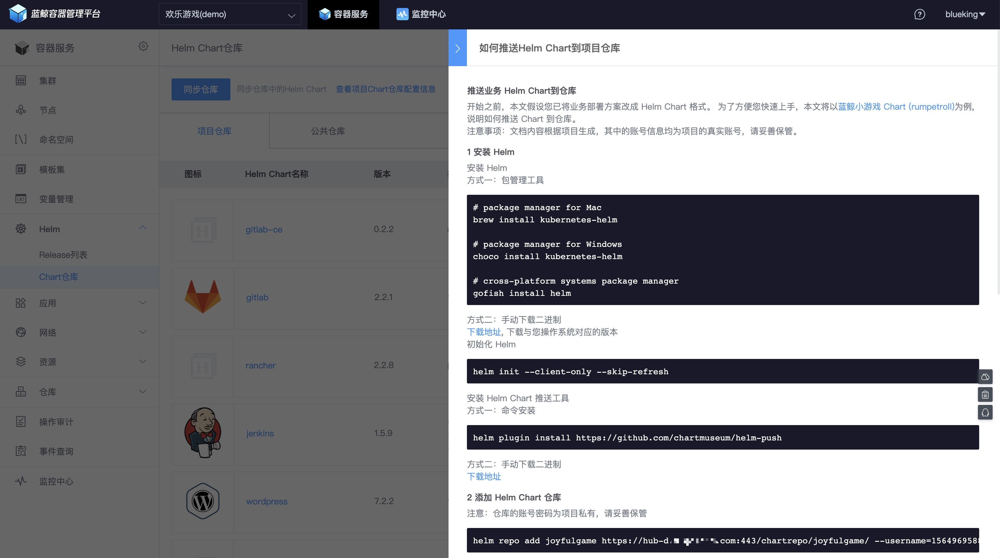

# 业务接入 Helm

本文先简单介绍什么是 Helm，以及蓝鲸容器服务（BCS）提供的 Helm 与标准 Helm 的差异，然后以蓝鲸小游戏为例，介绍如何使用蓝鲸容器服务部署您的 Helm Release。

## 什么是 Helm
Helm 是 Kubernetes 的一个包管理工具，用来简化 Kubernetes 应用的部署和管理。可以把 Helm 比作 CentOS 的 yum 工具。

使用 Helm 可以完成以下事情：

- 管理 Kubernetes manifest files
- 管理 Helm 安装包 Charts
- 基于 Chart 的 Kubernetes 应用分发

如果您希望进一步了解 Helm，可以阅读 [Helm, Kubernetes 的包管理工具](https://www.kubernetes.org.cn/3435.html) 这篇文章。

> 蓝鲸容器服务 Helm 中使用了 `helm template` 生成 Kubernetes YAML, 但是部署没有使用 Helm Tiller，而是直接使用的 `kubectl apply`。

## Helm Chart 仓库

系统会给项目分配 Helm Chart 仓库，用于存放项目的 Chart，仓库的读写操作均需要密码；另外，所有项目只读共享一个公共仓库，用于共享公共资源，比如社区中常用开源组件的部署方案，所有项目对公共仓库享有只读权限。

如果您有 Chart 需要推送到公共仓库，可以在 Harbor 的页面的 `public` 项目下的 `Helm Charts` 上传。

## 推送业务 Helm Chart 到仓库
推送 Chart 到项目仓库请移步到蓝鲸容器服务的，`容器服务`/`Helm`/`Chart 仓库` 页面，点击右上角 `如何推送 Helm Chart 到项目仓库` 指引，系统为您的项目生成了对应的 Chart 推送命令，可直接复制使用。

建议参照指引完成 Helm Chart 的推送。

