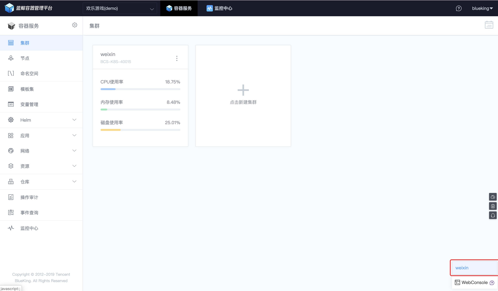
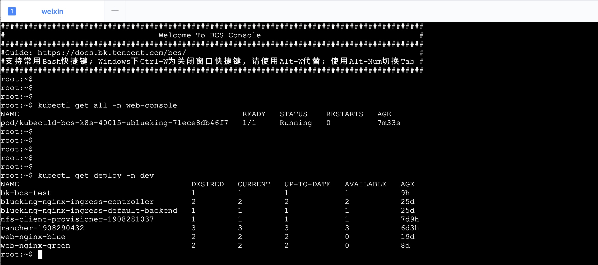

# WebConsole 说明

## WebConsole 简介
WebConsole 是容器服务提供快捷查看集群状态的命令行服务

kubectl 是 K8S 官方的命令行工具，用于管理 K8S 集群，用户添加完节点，部署完 Deployments, Helm 等，都可以通过 WebConsole 内的 kubectl 命令工具查看节点，Deployment 等信息

注意： `WebConsole 目前只支持K8S集群`

## WebConsole 使用
进入容器服务，在任意页面右下角，选择对应集群进入 WebConsole。




大概 1 秒钟打开 WebConsole ，背后实际是启动了一个 WebConsole 的 Pod。

在 WebConsole 中可以使用 kubectl 命令操作集群。




## kubectl 常用命令介绍

### 查询集群信息

```bash
kubectl cluster-info
```

### Kubectl Get

**获取 K8S 集群资源列表**，包含 Nodes、Namespaces、Pods、Deployment、Services 等。

- 查询 Node 节点信息

```bash
kubectl get nodes
```

- 获取 NameSpace 信息

```bash
kubectl get namespace
```

- 查询 Pods 列表

```bash
kubectl get pods
```

- 以 JSON 格式输出 Pod 的详细信息

```bash
kubectl get pod <podname> -o json
```

- 查询打印 DEBUG 信息

```bash
kubectl get pods -v=11
```

### Kubectl Describe

获取**集群资源的详情**，在排查故障的非常有用，例如某一个 Pod 无法启动。

```bash
kubectl describe pod <podname>
```

### Help 查看帮助

```bash
kubectl --help
```
kubectl 的帮助信息、示例相当详细，而且简单易懂。

更多 kubectl 使用说明请参照 [Kubectl 操作手册](https://kubernetes.io/docs/reference/generated/kubectl/kubectl-commands)。
