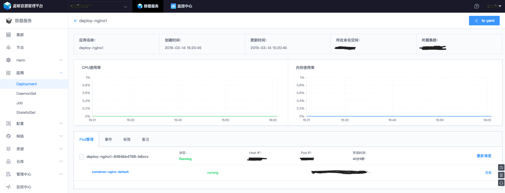
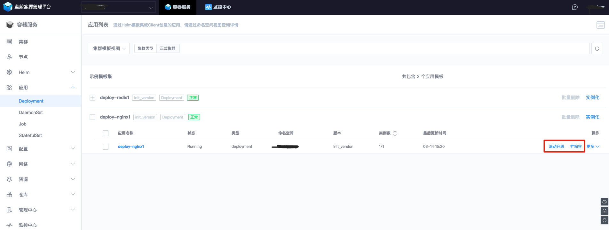

# 快速入门


此外，场景案例中的 [如何构建 Nginx 集群](../Scenes/Bcs_deploy_nginx_cluster.md) 也可以实现快速上手 BCS。

## 登录蓝鲸容器服务控制台

登录蓝鲸容器服务控制台。

## 创建项目（也可选择已有项目）
- 创建新项目：进入项目管理页面，点击“创建新项目”按钮，完成项目创建操作
- 获取已有项目权限：进入蓝鲸权限中心，申请加入已有项目用户组来获取项目使用权限

**关键项说明：**
- 当您选择使用蓝鲸容器服务部署业务，创建项目后，进入容器服务，还需要关联“蓝鲸配置平台（CMDB）”上的某个业务，该项目集群节点将从该业务机器资源池中拉取
- 您可以根据业务情况，选择使用容器编排类型为 Kubernetes 或 Mesos（注意：一旦创建集群后，容器编排类型将不可更改）

**项目管理：**
您可以在项目管理页面管理您的项目基础信息。

## 创建集群

在容器服务左侧导航中点击“集群”进入集群管理页面，点击“创建集群”按钮。

**关键项说明：**
- 集群 Master 节点为奇数个，最少 1 个，最多 7 个
- 创建集群，系统将对主机做以下初始化操作：
    - 机器前置检查
    - 安装蓝鲸容器服务初始化包
    - 安装蓝鲸容器服务基础组件
- Master 要求：
    - 机器配置：至少 CPU/内存为 4 核/8G
    - 系统版本：CentOS 7 及以上系统（内核版本 3.10.0-693 及以上），推荐 CentOS 7.4

## 添加集群节点

集群创建成功后，您可以进入集群节点列表，为集群增加节点。

**关键项说明：**
- Node 要求：
    - 系统版本：CentOS 7 及以上系统（内核版本 3.10.0-693 及以上），推荐 CentOS 7.4
    - NAT 模块：确认 NAT 模块已安装

## 创建命名空间

在容器服务左侧导航中点击“配置”—》“命名空间”，点击“新建命名空间”按钮，创建指定集群的命名空间信息（创建服务实例将以集群命名空间维度创建）。

`注意: 创建命名空间后，名称不允许修改`

## 创建服务实例
新建项目，系统将初始“示例模板集”到您的项目模板集库中，您可以直接使用该模板集体验操作。

示例模板集：
- 是蓝鲸提供的《吃豆小游戏》模板配置，您可以查看该模板配置详情，对模板的使用有一个初步概念
- 模板集中使用了镜像仓库提供的公共镜像，您可以在容器服务左侧导航中点击“仓库”查看，并推送您的项目镜像到项目私有镜像仓库

创建服务应用实例：
- 进入“示例模板集”，点击“实例化”按钮进入实例化页面
- 选择模板集，选择集群命名空间
- 点击“创建”按钮

## 确认完成

《吃豆小游戏》已经部署完成，您可以在容器服务左侧导航中点击“应用”，查看小游戏服务应用实例。



接下来，您可以体验吃豆小游戏：

- 在`deploy-nginx`应用详情页面查看`Host IP`，也就是接入层的 IP
- 将链接 `http://HOST_IP/rumpetroll/?openid=is__superuser&token=tPp5GwAmMPIrzXhyyA8X` 中的 `HOST_IP`替换为接入层 IP(如下图红框部分)，访问即可体验



您可以尝试：
- 在线滚动升级小游戏
- 在线扩缩容小游戏服务实例
- 在线删除或重建小游戏服务实例

## 小游戏使用说明

部署完成后，用户可以登入小游戏试玩使用

注意：下面 token 默认为`tPp5GwAmMPIrzXhyyA8X`

### PC 登入地址

> `http://{domain}/rumpetroll/?openid=is__superuser&token={token}`

PC 登入可以显示倒计时页面，管理员或者投放到大屏使用

### 玩家登入地址

> `http://{domain}/rumpetroll/`

普通玩家使用上面地址登入游戏

### 游戏开启和关闭

默认情况下，游戏是关闭的，可以调用 API 开启，关闭游戏


```bash
# 开启游戏
curl -X POST -H 'Content-Type: application/x-www-form-urlencoded' -d 'func_code=is_start&enabled=1' 'http://{domain}/rumpetroll/api/func_controller/?token={token}'

# 关闭游戏
curl -X POST -H 'Content-Type: application/x-www-form-urlencoded' -d 'func_code=is_start&enabled=0' 'http://{domain}/rumpetroll/api/func_controller/?token={token}'

# 获取开关状态
curl -X GET 'http://{domain}/rumpetroll/api/func_controller/?token={token}&func_code=is_start'
```

### 发送豆子

可以调用 API 发送豆子，用户角色吃掉豆子后，体型有变大效果

```bash
# 发送豆子, num 是发送豆子数量
curl -X GET 'http://{domain}/rumpetroll/api/gold/?token={token}&num={num}'
```

注意：发送完成后，PC 端会自动进入倒计时，默认 3 分钟

### 游戏统计地址

- 在线统计:  http://{domain}/rumpetroll/api/stat/?token={token}&meter=online
- 吃豆排名统计:  http://{domain}/rumpetroll/api/stat/?token={token}&meter=online
- 豆子剩余数量：http://{domain}/rumpetroll/api/stat/?token={token}&meter=golds

### 重置数据

使用 `web-console` 登入到 redis 所在 pod 中，清空 redis 数据即可

```bash
redis-cli flushall
```
