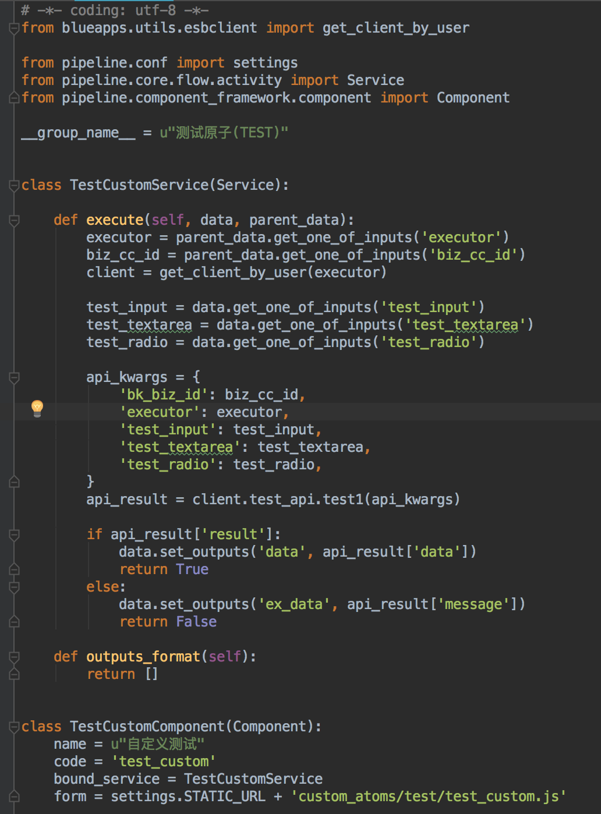
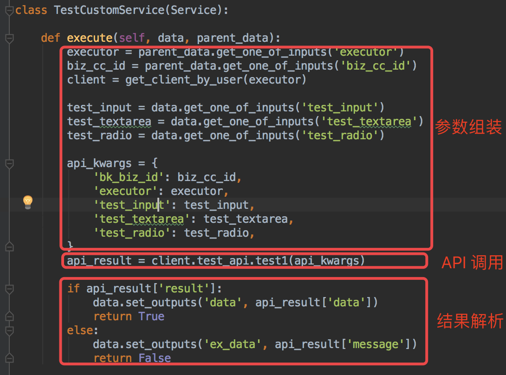
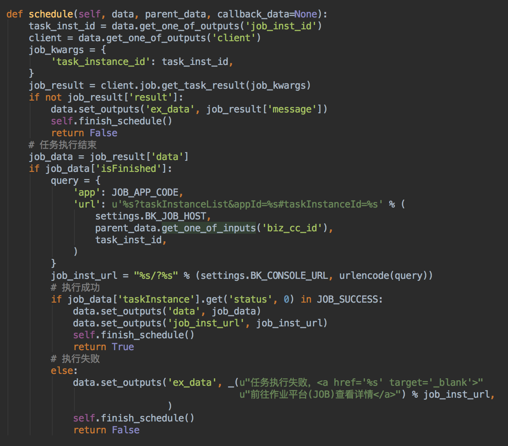
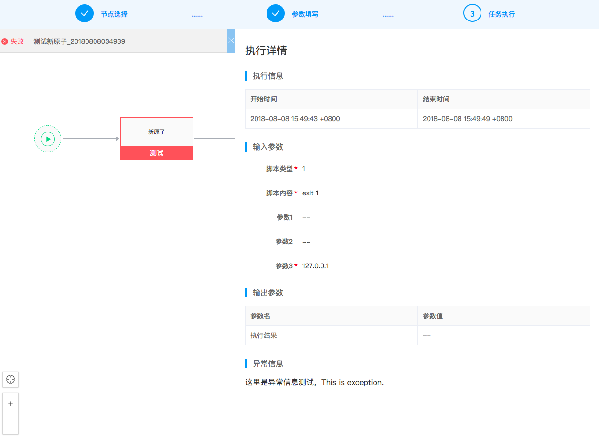

# 开发标准运维插件，集成内部 IT 系统

# 情景
标准运维内置了蓝鲸体系内作业平台、配置平台等系统的原子，但应用交付过程中还包含了部分企业内部的 ITIL 系统，例如`DB变更`、`监控`、`工单`，需要开发标准运维的标准插件，将应用交付过程中，使用到的能力或接口集成到标准运维中。

# 前提条件

- 掌握 [蓝鲸 SaaS 开发](5.1/开发指南/SaaS开发/新手入门/macOS.md)，打开 [腾讯运维开发实战课](https://cloud.tencent.com/edu/learning/major-100008) 马上学习
- 掌握 [蓝鲸 API 网关开发](5.1/开发指南/扩展开发/API网关/README.md)

# 步骤
- 梳理逻辑
- 开发环境初始化
- 蓝鲸 API 网关开发
- 标准插件后台开发
- 标准插件前端开发
- 标准插件测试

## 1. 梳理逻辑

标准运维要调用 IT 系统的功能特性，比如`执行 DB 变更`或`告警屏蔽`，需要将对应 API 对接至蓝鲸 ESB 中，然后再开发标准运维的标准插件。

以下为标准插件的调用逻辑图。

> 注：建议 IT 系统的功能特性和标准运维解耦，标准运维不包含功能逻辑，仅负责转发。

## 2. 开发环境初始化

在开始开发之前，先把 [蓝鲸 SaaS 的开发环境](5.1/开发指南/SaaS开发/新手入门/macOS.md)准备好。

然后在 **标准运维项目根目录** 下执行 `Django-admin startapp custom_atoms` ，接着新建`components/collections` 和 `static/custom_atoms` 目录。

打开`conf/settings_custom.py`文件，找到`INSTALL_APPS_CUSTOM`，加入`custom_atoms`。

## 3. 接入 ESB API

参照 [蓝鲸 API 网关开发指南](5.1/开发指南/扩展开发/API网关/README.md)完成 ESB 接入，然后更新标准运维`bluking/component`下的文件。

## 4. 标准插件后台开发

在`custom_atoms/components/collections`目录下创建 `test.py` 文件，其中需要定义的属性和类如下所示。

**test.py 属性详解**：

- `__group_name__` ：标准插件所属分类（一般是对应 API 的系统简称，如配置平台(CMDB)）
- `class TestCustomService(Service)` ：标准插件后台执行逻辑
- `__need_schedule__` = True：是否是异步执行，默认为 False
- `interval = StaticIntervalGenerator(5)` ：异步标准插件的轮询策略
- `def execute` ：前端参数获取、API 参数组装、结果解析、结果输出
- `def schedule` ：轮询逻辑、结果输出
- `def outputs_format` ：输出参数格式化
- `class TestCustomComponent(Component)` ：标准插件定义
- `name` ： 标准插件名称
- `code` ：唯一编码
- `bound_service` ：绑定后台服务
- `form` ：前端表单定义文件路径

**TestCustomService 中 execute 函数详解**：
- 可以是任何 Python 代码，如果对应于 ESB API 调用，一般分为参数组装、API 调用、结果解析。
- `data` 是标准插件前端数据，对应于前端的表单，可以用 get_one_of_inputs 获取某一个参数；执行完成可以使用 set_outputs 写入返回值和异常信息(ex_data)。
- `parent_data` 是任务的公共参数，包括 excutor—执行者，operator—操作员，biz_cc_id—所属业务 ID。详细请查看 gcloud/taskflow3/utils.py。
- 返回 True 表示标准插件执行成功，False 表示执行失败

`TestCustomService` 中 `execute` 函数详解：
- 返回列表格式。
- 列表格式的每一项定义一个返回字段，是 execute 函数中的 set_outputs 输出的字段的子集；key—输出字段标识，name—输出字段含义，type—输出字段类型（str、int 等 python 数据结构）。

`TestCustomService` 中 `shedule` 函数详解：
- 由 `interval` 控制调用策略，如 pipeline.core.flow.activity.StaticIntervalGenerator（每隔多少秒轮询一次）、DefaultIntervalGenerator（每次轮询间隔时间是上一次的两倍）。
- 使用 `self.finish_schedule` 结束轮询。
- 返回 `True` 表示标准插件执行成功，`False` 表示执行失败。

## 5. 标准插件前端开发

在 `custom_atoms/static/custom_atoms` 目录下创建 `test` 目录，并创建 `test_custom.js` 文件，注意文件路径和标准插件后台定义的 form 保持一致。通过 `$.atoms` 注册标准插件前端配置，其中各项含义是：
- `test_custom` ：标准插件后台定义的 code。
- `tag_code` ：参数 code，请保持全局唯一，命名规范为“系统名_参数名”
- `type` ：前端表单类型，可选 input、textarea、radio、checkbox、select、datetime、datatable、upload、combine 等
- `attrs` ：对应 type 的属性设置，如 name、validation

## 6. 标准插件测试

创建流程模板，新增标准插件节点，标准插件类型选择新开发的标准插件，展示的输入参数和前端配置项一致，输出参数和后台 `outputs_format` 一致，其中执行结果是系统默认，值是`True` 或 `False` ，表示节点执行结果是成功还是失败。

根据上一步创建的流程模板，新建任务执行后查看结果。

如果标准插件执行出错，请先查看节点执行详情，确定是否是代码逻辑异常。

接着查看 APP 组件类型日志，确定是都是 ESB API 调用异常。

## 提交代码

执行 `python manage.py collectstatic –noinput`，然后就可以提交代码并打包发布了。

# 标准插件开发规范 

- 分组命名规则是“系统名(系统英文缩写)”，如“作业平台(JOB)”。
- 标准插件编码(code)使用下划线方式，规则是“系统名_接口名”，如 job_execute_task。
- 后台类名使用驼峰式，规则是“标准插件编码+继承类名”，如 JobExecuteTaskService。
- 前端 JS 文件目录保持和系统名缩写一致，JS 文件名保持和标准插件编码一致。
- 参数 `tag_code` 命名规则是“系统名_参数名”，这样可以保证全局唯一；长度不要超过 20 个字符。
