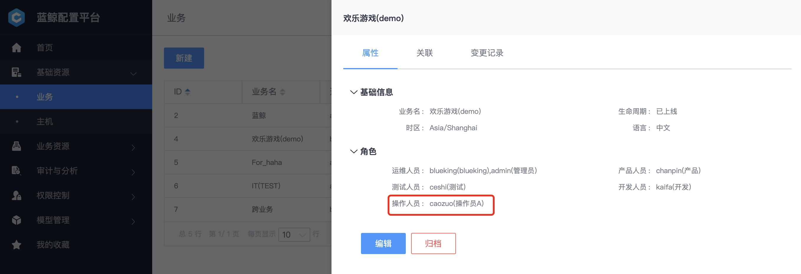
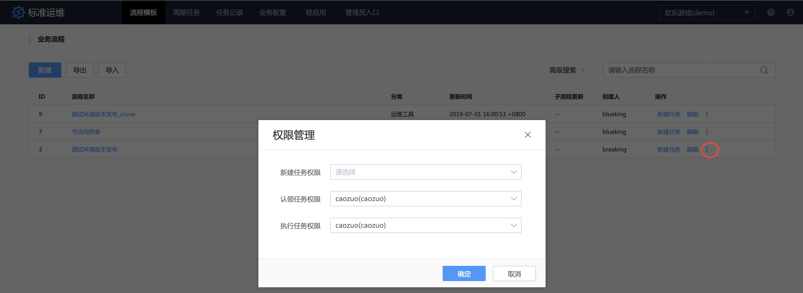
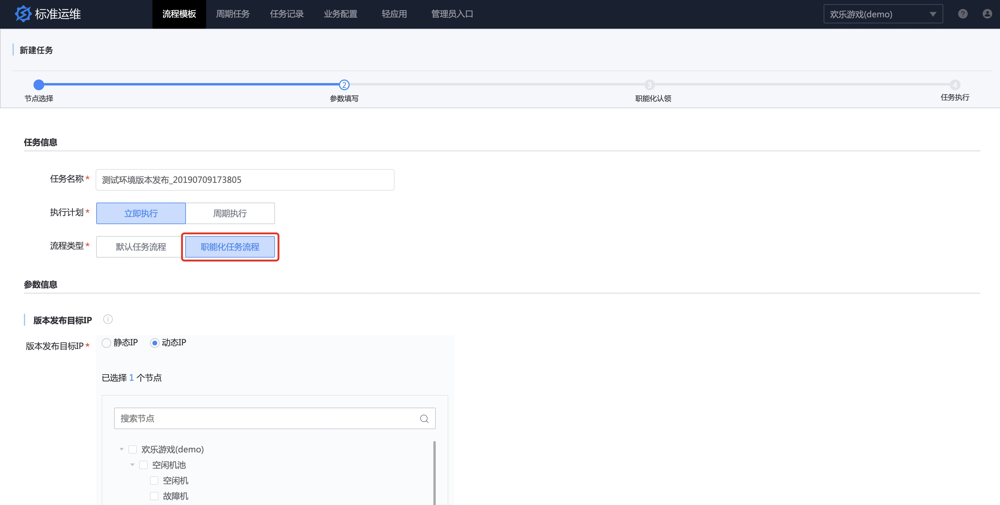
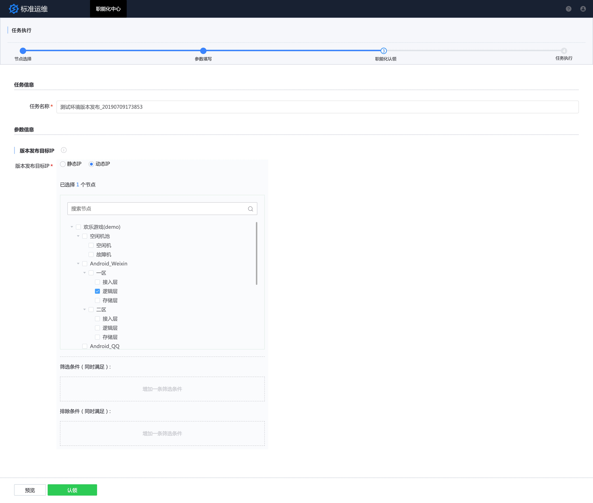
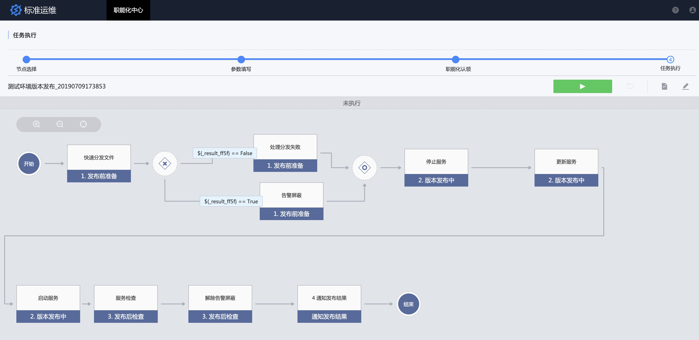

# 操作员做应用交付，让运维更专注

## 情景

应用交付虽然做到了自动化，但运维仍需和周边团队跟进流程，耗费大量时间，此时通过 [标准运维](5.1/标准运维/产品简介/README.md) `职能化` 的能力将应用交付的流程，转移给操作员执行。

运维 `blueking` 提交一个应用发布的职能化任务给到 `caozuo(操作员A）`，`caozuo(操作员A)` 执行任务，跟进任务执行的进展。

## 前提条件
- 在标准运维中 [建立一个流程](5.1/标准运维/产品功能/flow.md)
- 准备两个角色：`运维` 和  [职能化(操作员)](5.1/PaaS平台/产品功能/系统管理/UserManage.md)

## 操作步骤
- 准备职能化角色
- 运维发起职能化任务流程
- 职能化认领任务

### 准备职能化角色

在`用户管理`中新增`职能化账户`，如`操作员A`

将其添加至业务的`操作人员`角色中

在标准运维的`业务流程`中给`职能化`授权

### 运维发起职能化任务流程

运维选择一个应用发布流程，点击`新建任务`，选择`职能化任务流程`

### 职能化认领任务
用`操作员A`的角色访问标准运维，在`职能化中心`中认领刚才新建的`职能化任务`

如果不需要修改参数，点击`认领`即可

点击`执行`按钮

可以看到任务执行的状态
media/stag_delivery.mp4

在`职能化中心`可以看到任务已经执行完成。

对应运维视角，也可以看到任务已执行完成。

如此，运维可以把日常的应用发布需求提交给操作员执行，释放自己，把精力多放在`运维服务目录输出`以及`业务优化`上。

## 扩展阅读: 设置任务执行者

操作员执行任务流程时，标准运维从`任务执行者`字段获取运维人员列表，如果不填，则为该业务的随机运维人员。

