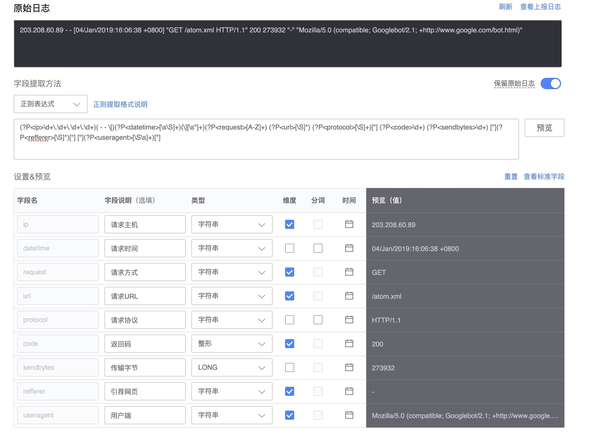

# 正则提取参考

[在线正则调试地址](https://www.debuggex.com/)

## Nginx日志正则提取参考 

原始日志

```
10.0.1.10 - - [30/Nov/2019:20:57:54 +0800] "POST /api/v3/auth/verify HTTP/1.0" "200" 1184 "https://cmdbee-dev.bktencent.com/" "Mozilla/5.0 (Macintosh; Intel Mac OS X 10_14_6) AppleWebKit/537.36 (KHTML, like Gecko) Chrome/78.0.3904.108 Safari/537.36" "14.17.22.33" "-" 0.017 1421 1224
```

```
(?P<request_ip>\d+\.\d+\.\d+\.\d+) - - \[(?P<datetime>[\s\S]+)\][\s"]+(?P<request>[A-Z]+) (?P<url>[\S]*) (?P<protocol>[\S]+)["] ["](?P<code>\d+)["] (?P<sendbytes>\d+) ["](?P<refferer>[\S]*)["] ["](?P<useragent>[\S\s]+)["]
```

效果: 




正则参考语法样例: 

```
([^\s]*)              #匹配 $http_host
(\d+\.\d+\.\d+\.\d+)  #匹配 $server_addr,$remote_addr
(\"\d+\.\d+\.\d+\.\d+\,\s\d+\.\d+\.\d+\.\d+\"|\"\d+\.\d+\.\d+\.\d+\") #匹配 "$http_x_forwarded_for"
(\[[^\[\]]+\])     #匹配[$time_local]
(\"(?:[^"]|\")+|-\")   #匹配"$request","$http_referer"，"$http_user_agent"
(\d{3})            #匹配$status 
(\d+|-)            #匹配$body_bytes_sent
(\d*\.\d*|\-)      #匹配$request_time,$upstream_response_time'
^                  #匹配每行数据的开头
$                  #匹配每行数据的结局
```

## json正则提取

原始日志

```
2020-01-20T09:02:22,723 INFO [qtp1677319673-193] org.apache.druid.java.util.emitter.core.LoggingEmitter - {"feed":"metrics","timestamp":"2020-01-20T09:02:22.723Z","service":"druid/broker","host":"druid-public-broker-01:8082","version":"0.16.0-incubating","metric":"sqlQuery/time","value":558,"dataSource":"[]","id":"0454b907-f313-430a-b509-5b1ee065d020","nativeQueryIds":"[]","remoteAddress":"9.146.99.169","success":"true"}
```

获取json中的字段 timestamp service host version metric value 

```
.*timestamp":"(?P<datetime>[^"]+).*service":"(?P<service>[^"]+).*host":"(?P<host>[^"]+).*version":"(?P<version>[^"]+).*metric":"(?P<metric_name>[^"]+).*value":(?P<metric_value>\d+)
```

## 正则小语法 


