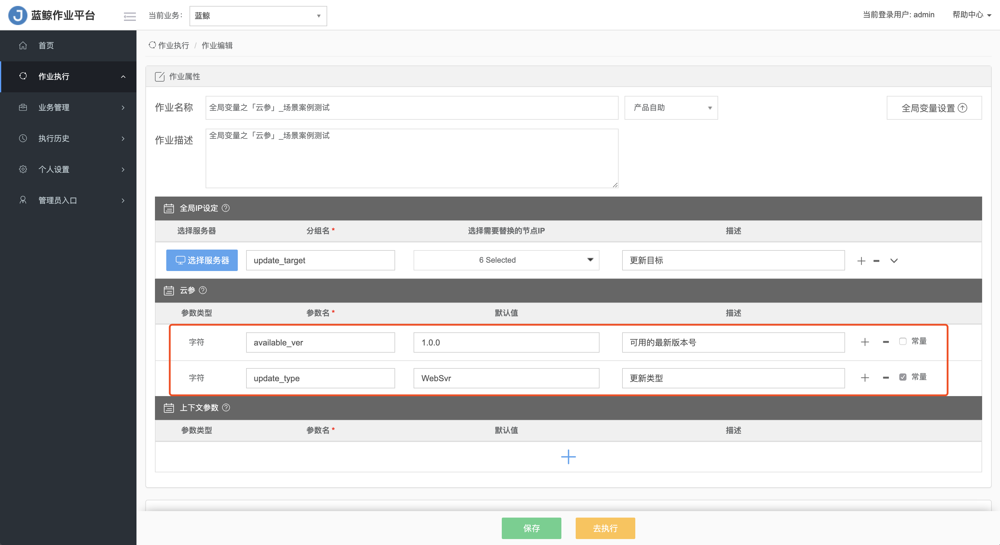
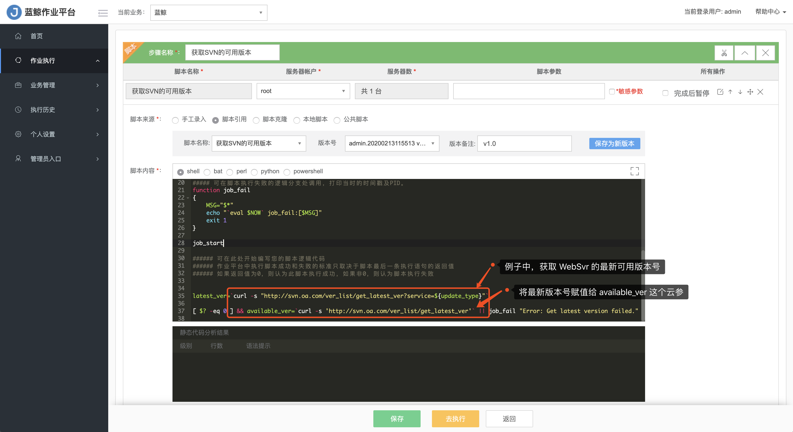
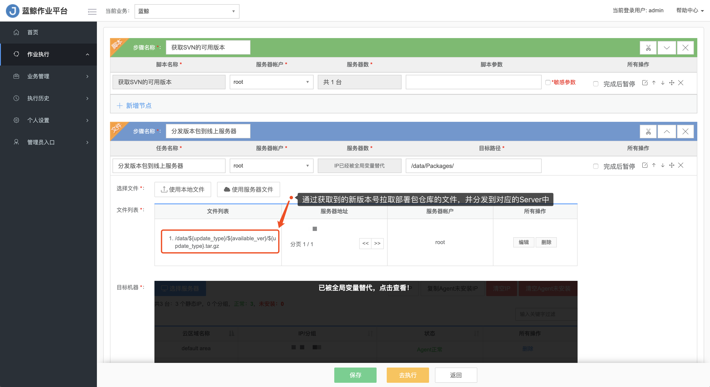
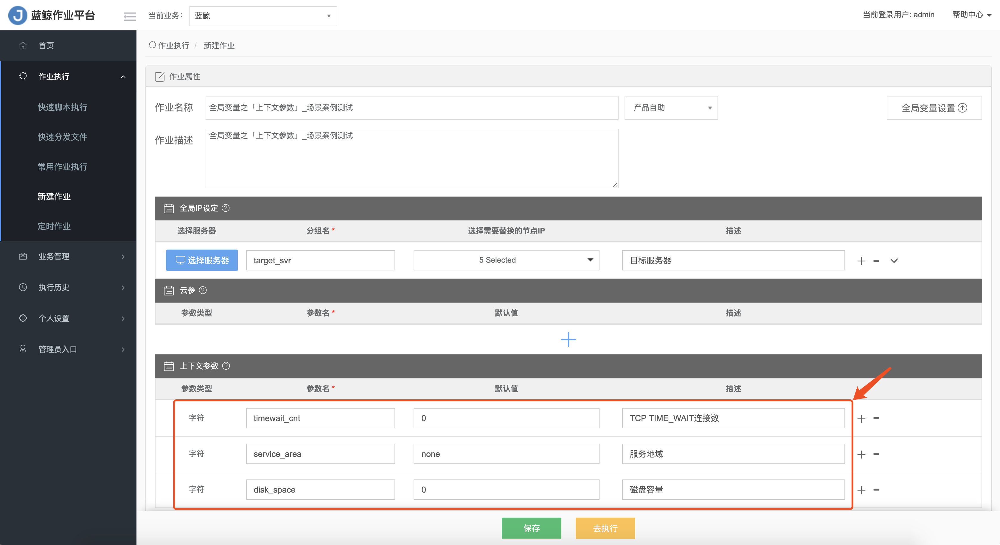
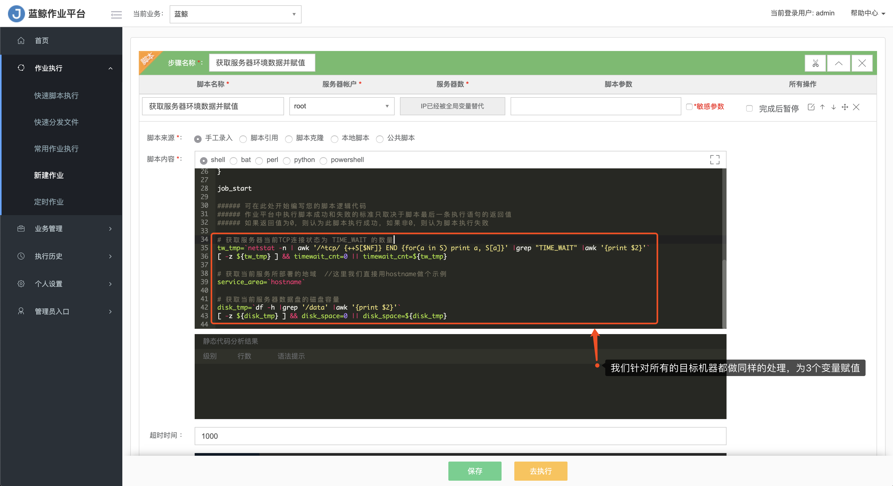
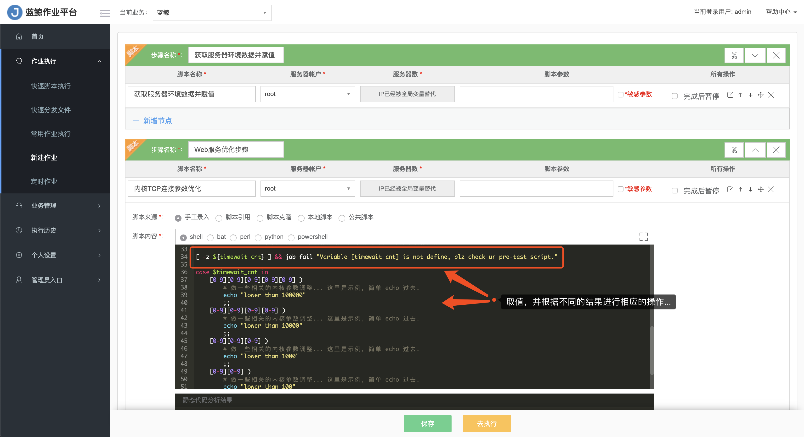
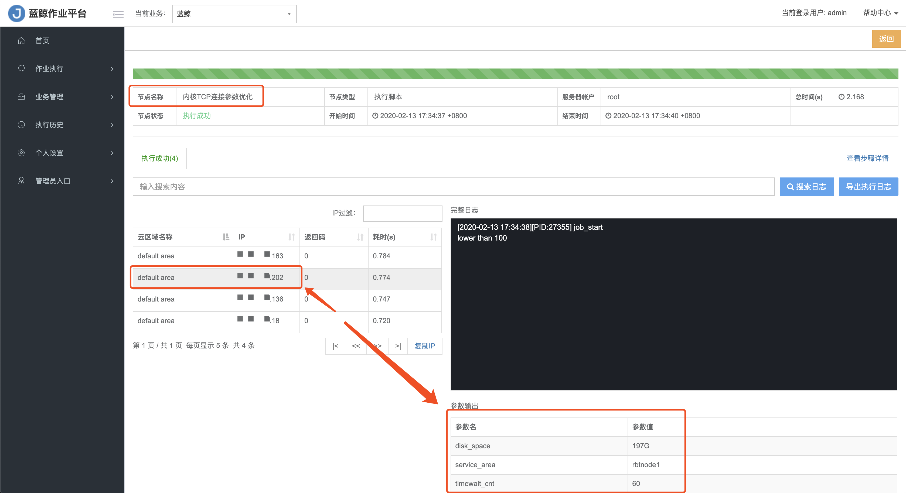

# 如何在不同步骤或主机间传递参数

## 背景

在日常运维场景操作中，我们经常会碰到几种参数传递的需求：

- 当一个任务有多个脚本协同处理时，需要将上一个脚本处理的结果传递给下一个脚本作为参数值
- 不同主机在每个步骤中获取的值不同，且需要将值带到下一个步骤进行处理

如果是传统脚本的处理方式，我们可能会在调用第二个脚本时以参数的方式传递，或者将全局的变量值写到一个公共的文件，提供给其他脚本获取；接下来我们一同来了解一下，蓝鲸作业平台是如何解决这种场景需求的。

## 场景示例

### 根据最新版本号拉取程序发布包，并分发到线上服务器进行更新

在一次正常的 CI -> CD 的交付环节中，我们可能会使用如下的步骤：

```shell
1. 读取SVN的最新可用版本号并拉取版本包
2. 分发版本包到线上服务器
3. 校验版本包的MD5码是否正确匹配
4. 更新版本并上线
5. ....省略后续正常的版本发布流程
```

此时，我们在第2步需要根据第1步得到的版本包名称或版本号进行文件分发，这时就可以使用全局变量**『云参』**进行处理：

```shell
功能说明：
	「云参」的用途是设置公共变量（类似Shell的环境变量），提供给整个作业在任一步骤中都可使用；变量值可以在初始就赋予默认值，也可以在作业运行过程中赋予新的值。

字段说明：
	- 参数类型
	  支持三种数据结构：字符、索引数组、关联数组
	- 参数名
	  定义参数的名称
	- 默认值
  	可给参数设置一个默认值（非必填）
	- 描述
  	用于简单描述该参数的用途
	- 是否常量
  	常量，意指“不会产生变化的变量”；如果设置为常量，那么该参数一旦被赋值，后续在整个作业执行过程中都不会被改变！
```



我们设置了 `update_type` 用于区分每次发布的不同模块类型， `available_ver` 为每次更新的版本号；在第1个步骤「获取SVN的可用版本」中，查询代码库里的最新版本号，并将版本号赋值到 `available_ver` 这个变量：



然后，在第2步文件分发步骤中，通过第1步获取到的版本号拉取部署包仓库的版本文件，分发到相应的服务器去：



后续的示例步骤中使用方式同上，就不再一一讲解了；「云参」是一个全局变量，它的值可以在作业任何步骤中使用，当它被设置为「常量」时，一旦被赋值，后续将不可覆盖。

### 根据服务器环境不同，进行差异化处理

在对提供同一类型服务的服务器进行调优处理时，我们需要根据服务器的环境不同进行差异化处理；举一个常规的Apache Web服务的优化作业示例：

```shell
1. 根据不同地域 Web服务的负荷优化内核的TCP连接参数
2. 根据磁盘容量调整 Web服务的访问日志文件存储策略
3. 根据不同地域 检查时间同步服务器配置
4. 根据不同地域 调整公告发布时间
5. ....省略其他的优化脚本步骤
```

有别于「云参」所有步骤/服务器共用一个参数值的情况，由于这次不同的服务器所获取的指标值不一样，所以我们需要用到 **上下文参数** 的进行处理：

```shell
功能说明：
	「上下文传参」的用途主要表现在为每个服务器对象提供独立的变量命名空间（目前仅支持Shell语言），支持不同服务器对同一个变量赋于不同的值。

字段说明：
	- 参数类型
	  目前仅支持「字符」型的数据
	- 参数名
	  定义参数的名称
	- 默认值
  	可给参数设置一个默认值（非必填）
	- 描述
  	用于简单描述该参数的用途
```



在本次示例中，我们设置了3个上下文参数 `timewait_cnt` `service_area` 和 `disk_space` ；首先我们先在所有的服务器上通过脚本进行处理，获取到各自的数据并赋值给这3个参数：



然后我们可以在后面的优化脚本步骤中，对同一个参数进行条件判断处理：



从执行结果中可以看到每一台服务器获取到的参数值是不同的：




综上所述，**上下文参数** 适用于不同服务器对同一个变量需要有各自的取值存储空间；这样既能使整个作业对全局变量的管理更清晰统一，又能让不同服务器对象有各自的表达。

## 总结

- 云参：类似公共的环境变量，整个作业所有步骤或服务器都可以获取到统一的值
- 上下文参数：面向各服务器对象的私有变量，满足对同一变量进行管理的同时各服务器之间取值不同的需求
