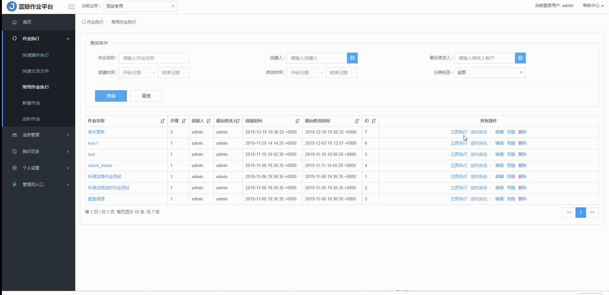

# 核心优势

## 传输文件更灵活、快速

作业平台的任务执行和文件传输都是基于 Agent 触发的，Agent 使用 BT（BitTorrent） 方案应对大文件传输，使得文件拉取和传输更加高速、效率。

## 更清晰的 web 化脚本管理

云化脚本管理模式，帮助运维团队协作管理更清晰；多个协作者可借助平台进行脚本共享使用，除了脚本单独执行外，也可将多个脚本或文件传输流程串接组合成作业任务。

## 万级并发，让批量执行更高效

## 流程式管理，一切皆 “作业”

面对特定的版本发布或变更的特性场景下，我们往往需要执行多个步骤；例如，停进程、拉取版本文件、分发版本文件到各个节点机器，最后再拉起进程正式对外服务；这就需要很多个步骤执行动作，你也可以选择将所有步骤封装成一个大脚本，但这太低效了，并且维护成本会很高。

作业平台的作业管理模块很好的解决了这个问题，用户只需要将某一个特定业务场景的脚本或文件传输操作，按照顺序组装定制成一个作业任务，以后便可一键完成整套操作，即方便又便于管理。

## “秒级定时”，任务执行 Timing 更精准

突破了传统 Linux 系统自带的分钟级定时任务，作业平台能够支持到以秒为最小时间粒度的定时任务计划；且每个定时任务执行过程都会被记录日志，让一切操作都可追溯。

## 开放 API 接口，以原子形态连接一切

作业平台还开放了 API 接口，以原子节点的形态开放提供给其它系统或平台进行调度，真正意义上的 “连接一切”。
