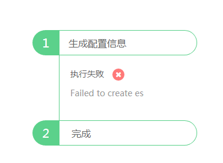

# 日志检索常见问题

## 通用问题

- 日志检索下发失败
- 查询不到日志日志检索下发失败
- 查询不到日志
- 日志占满磁盘空间

```bash
检查用户 kafka 的机器是不是磁盘满了 df -lh
如果是的话，检查是否是 kafka 的数据日志满了 du -sh /data/bkce/public/kafka
如果是的话，看下用户的 /data/bkce/service/kafka/config/server.properties 里面是否有 log.retention.bytes 配置，如果没有的话加上 log.retention.bytes=21474836480
停掉 kafka
启动 kafka，去磁盘满的机器看是否磁盘空间释放了(这里可能要等 Kafka 启动后一段时间才启动，刚才操作大约10分钟)
```

## 环境问题

如果用户的蓝鲸后台机器上也部署了 zabbix agent 时，在使用日志检索时，可能会遇到如下截图的错误：



这个问题一般是 bkdata 模块的 databus_es 进程监听的 10050 端口和该机器上 zabbix agent 的端口冲突。

解决方法如下：

1. 修改中控机的 /data/install/ports.env 中下面两行配置的 10050 端口为 10049，避开冲突
    ```bash
    export DATABUS_ES_PORT=10050
    export CONNECTOR_ES_PORT=10050
    ```
2. ./bkcec sync common
3. ./bkcec render bkdata
4. ./bkcec stop bkdata databus
5. ./bkcec start bkdata databus
6. ./bkcec stop bkdata dataapi
7. ./bkcec start bkdata dataapi

### 内存问题

/data/bkce/logs/bkdata/databus_es.log 日志报错 memory is low  提示内存不足，但是分配了足够的内存


```bash
 vim /data/bkce/bkdata/databus/conf/es.cluster.properties
#  启动 jvm 是最大分配内存
deploy.cluster.memory.max=2G
```


重启 databus_es
```bash
supervisorctl -c /data/bkce/etc/supervisor-bkdata-databus.conf restart databus_es
```
